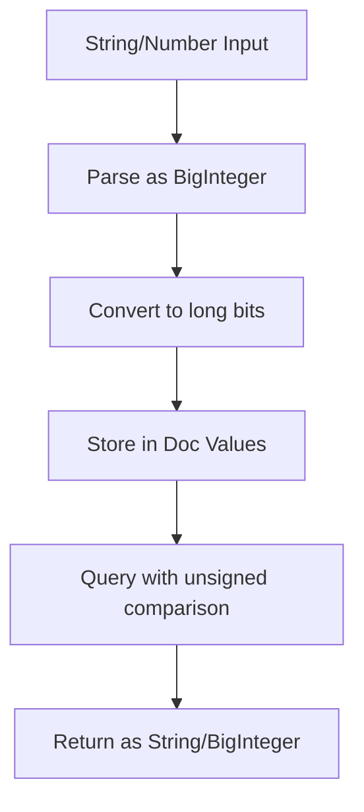

---
tags:
  - indexing
  - search
---

# Unsigned Long Field Type

## Summary

The `unsigned_long` field type is a numeric field type that represents an unsigned 64-bit integer with a minimum value of 0 and a maximum value of 2⁶⁴ − 1 (18446744073709551615). This field type was introduced in OpenSearch 2.8 to support use cases requiring values larger than the signed `long` type can represent.

## Details

### Architecture

```mermaid
graph TB
    subgraph "Unsigned Long Processing"
        A[Document with unsigned_long field] --> B[Field Mapper]
        B --> C[SortedUnsignedLongDocValuesSetQuery]
        C --> D[UnsignedLongHashSet]
        D --> E[Doc Values Storage]
    end
    
    subgraph "Query Processing"
        F[Terms Query] --> G[NumberFieldMapper]
        G --> H[termsQuery method]
        H --> I[SortedUnsignedLongDocValuesSetQuery]
        I --> J[UnsignedLongHashSet]
        J --> K[Query Results]
    end
```



### Data Flow



### Components

| Component | Description |
|-----------|-------------|
| `NumberFieldMapper.NumberType.UNSIGNED_LONG` | Field type definition for unsigned_long |
| `SortedUnsignedLongDocValuesSetQuery` | Query implementation for terms queries on unsigned_long |
| `UnsignedLongHashSet` | Hash set with proper unsigned long comparison for doc values |
| `Numbers` | Utility class with unsigned long constants and conversion methods |

### Configuration

| Setting | Description | Default |
|---------|-------------|---------|
| `type` | Field type | `unsigned_long` |
| `store` | Store field value separately | `false` |
| `index` | Index the field for searching | `true` |
| `doc_values` | Enable doc values for sorting/aggregations | `true` |
| `null_value` | Value to use for null fields | `null` |
| `ignore_malformed` | Ignore malformed values | `false` |

### Usage Example

#### Index Mapping

```json
PUT my_index
{
  "mappings": {
    "properties": {
      "counter": {
        "type": "unsigned_long"
      }
    }
  }
}
```

#### Indexing Documents

```json
PUT my_index/_doc/1
{
  "counter": 10223372036854775807
}
```

#### Terms Query

```json
POST my_index/_search
{
  "query": {
    "terms": {
      "counter": [
        "9223372036854775814",
        "9223372036854775812",
        "1"
      ]
    }
  }
}
```

#### Range Query

```json
POST my_index/_search
{
  "query": {
    "range": {
      "counter": {
        "gte": 10223372036854775807
      }
    }
  }
}
```

#### Aggregations

```json
POST my_index/_search
{
  "aggs": {
    "counter_terms": {
      "terms": {
        "field": "counter"
      }
    }
  }
}
```

#### Scripting

In scripts, `unsigned_long` fields are returned as `BigInteger`:

```json
POST my_index/_search
{
  "query": {
    "bool": {
      "filter": {
        "script": {
          "script": "BigInteger amount = doc['counter'].value; return amount.compareTo(BigInteger.ZERO) > 0;"
        }
      }
    }
  }
}
```

## Limitations

- Cannot be used as an index sort field (in `sort.field` index setting)
- When aggregations are performed across different numeric types and one is `unsigned_long`, values are converted to `double` with potential precision loss
- Stored fields are returned as strings
- Decimal parts are truncated if supplied

## Change History

- **v3.0.0** (2025-03-05): Fixed bug where terms queries on unsigned_long fields with values > Long.MAX_VALUE caused assertion errors. Introduced `UnsignedLongHashSet` class with proper unsigned comparison.
- **v2.8.0**: Initial implementation of unsigned_long field type.

## References

### Documentation
- [Unsigned Long Documentation](https://docs.opensearch.org/3.0/field-types/supported-field-types/unsigned-long/): Official documentation
- [Numeric Field Types](https://docs.opensearch.org/3.0/field-types/supported-field-types/numeric/): Overview of all numeric types

### Pull Requests
| Version | PR | Description | Related Issue |
|---------|-----|-------------|---------------|
| v3.0.0 | [#17207](https://github.com/opensearch-project/OpenSearch/pull/17207) | Fix unsigned long sorting assertion in LongHashSet | [#17206](https://github.com/opensearch-project/OpenSearch/issues/17206) |
| v2.8.0 | - | Initial implementation of unsigned_long field type |   |

### Issues (Design / RFC)
- [Issue #17206](https://github.com/opensearch-project/OpenSearch/issues/17206): Bug report for LongHashSet assertion error
