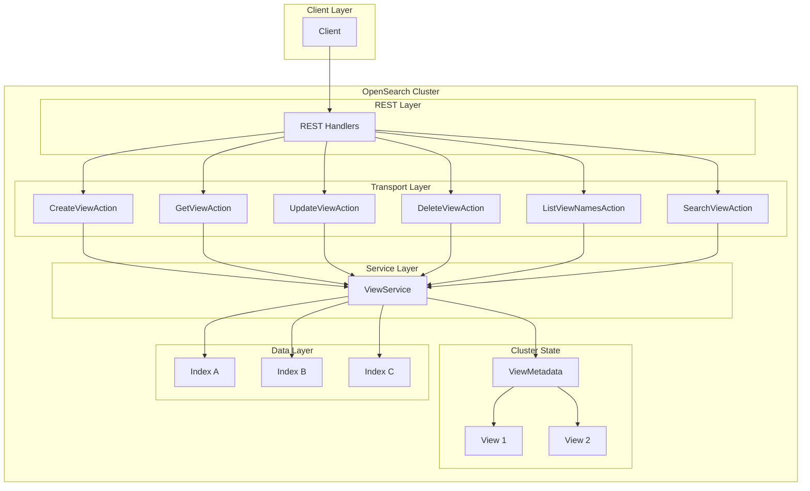
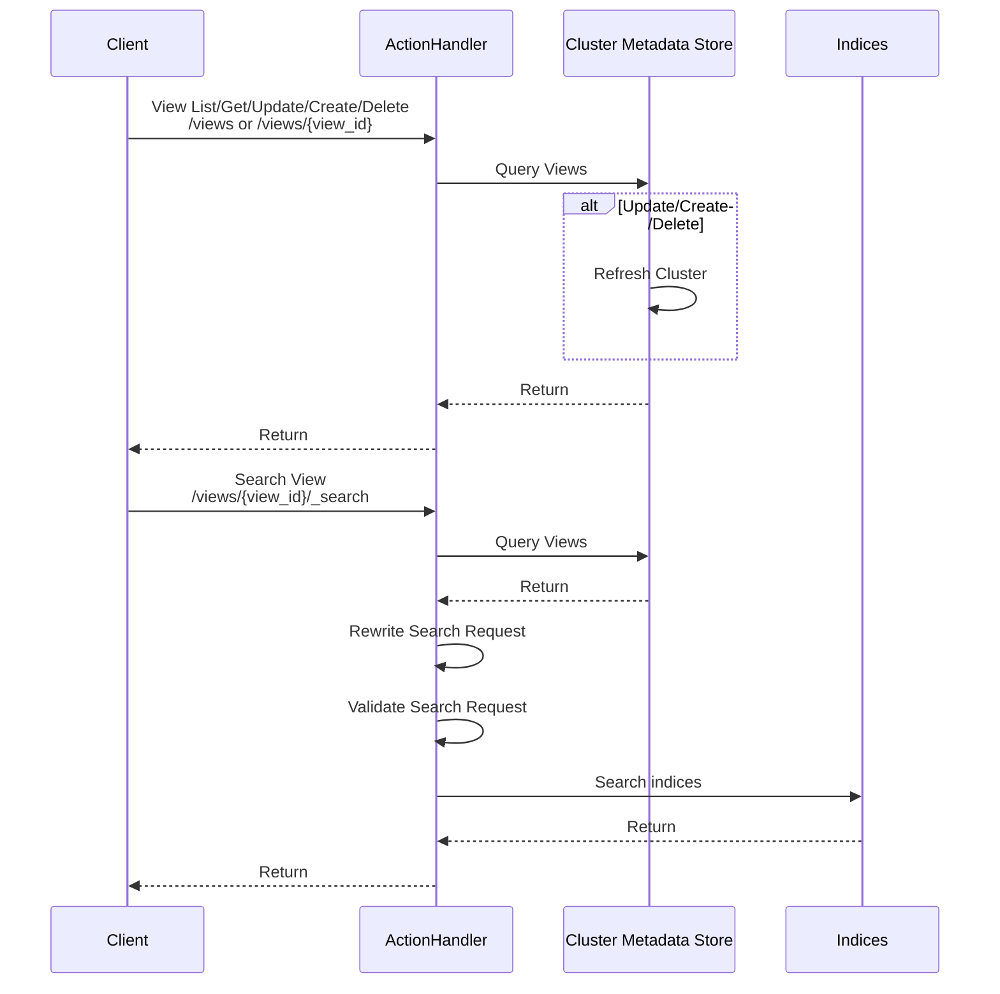

---
tags:
  - indexing
  - search
  - sql
---

# Views

## Summary

Views is a feature that provides a virtual layer over one or more indices in OpenSearch, simplifying data access and manipulation. Similar to SQL views, OpenSearch Views allow users to create named projections that abstract the physical storage structure from search operations, enabling logical groupings of indices that can be queried as a single entity.

Key benefits:
- **Simplified access**: Query multiple indices through a single named endpoint
- **Abstraction**: Separate data usage from physical storage structure
- **Centralized management**: Define and manage index patterns in one place
- **Flexibility**: Update view targets without changing client code

## Details

### Architecture



### Data Flow



### Components

| Component | Description |
|-----------|-------------|
| `View` | Core metadata class representing a view with name, description, timestamps, and targets |
| `View.Target` | Represents a single index pattern target within a view |
| `ViewMetadata` | Cluster metadata custom type for persisting views across the cluster |
| `ViewService` | Central service handling all view operations (CRUD and search) |
| `CreateViewAction` | Transport action for creating new views |
| `DeleteViewAction` | Transport action for removing views |
| `GetViewAction` | Transport action for retrieving view details |
| `UpdateViewAction` | Transport action for modifying existing views |
| `ListViewNamesAction` | Transport action for listing all view names |
| `SearchViewAction` | Transport action for executing searches through views |
| `RestViewAction` | Collection of REST handlers for all view endpoints |
| `ViewNotFoundException` | Exception thrown when a requested view does not exist |
| `ViewAlreadyExistsException` | Exception thrown when creating a view that already exists |

### Configuration

| Setting | Description | Default | Limits |
|---------|-------------|---------|--------|
| `name` | Unique identifier for the view | Required | Max 64 characters |
| `description` | Optional description of the view | Empty string | Max 256 characters |
| `targets` | List of index pattern targets | Required | Max 25 targets |
| `targets[].indexPattern` | Index pattern for a target | Required | Max 64 characters |

### REST API

| Endpoint | Method | Description |
|----------|--------|-------------|
| `/views` | POST | Create a new view |
| `/views/` | GET | List all view names |
| `/views/{view_name}` | GET | Get view details |
| `/views/{view_name}` | PUT | Update a view |
| `/views/{view_name}` | DELETE | Delete a view |
| `/views/{view_name}/_search` | GET/POST | Search through a view |

### Usage Example

#### Creating a View

```json
POST /views
{
  "name": "application-logs",
  "description": "All application log indices",
  "targets": [
    { "indexPattern": "app-logs-*" },
    { "indexPattern": "service-logs-*" }
  ]
}
```

Response:
```json
{
  "view": {
    "name": "application-logs",
    "description": "All application log indices",
    "createdAt": 1704067200000,
    "modifiedAt": 1704067200000,
    "targets": [
      { "indexPattern": "app-logs-*" },
      { "indexPattern": "service-logs-*" }
    ]
  }
}
```

#### Searching Through a View

```json
POST /views/application-logs/_search
{
  "query": {
    "bool": {
      "must": [
        { "match": { "level": "ERROR" } }
      ],
      "filter": [
        { "range": { "@timestamp": { "gte": "now-1h" } } }
      ]
    }
  },
  "size": 100
}
```

#### Listing Views

```json
GET /views/
```

Response:
```json
{
  "views": ["application-logs", "security-events", "metrics"]
}
```

#### Updating a View

```json
PUT /views/application-logs
{
  "description": "Updated: All application and service logs",
  "targets": [
    { "indexPattern": "app-logs-2024-*" },
    { "indexPattern": "app-logs-2025-*" },
    { "indexPattern": "service-logs-*" }
  ]
}
```

## Limitations

- **Experimental API**: Views are marked as `@ExperimentalApi` and the API may change in future releases
- **No scroll support**: Scroll queries are not supported when searching through views
- **Read-only operations**: Views support search operations only; indexing must target indices directly
- **No security integration**: Views do not currently integrate with document-level security (DLS) or field-level security (FLS)
- **Target limits**: Maximum of 25 targets per view
- **Name length**: View names limited to 64 characters
- **Index pattern length**: Each target index pattern limited to 64 characters
- **Description length**: View descriptions limited to 256 characters

## Change History

- **v3.0.0** (2024-02-20): Initial implementation of Views feature with CRUD operations and search support

## References

### Pull Requests
| Version | PR | Description | Related Issue |
|---------|-----|-------------|---------------|
| v3.0.0 | [#11957](https://github.com/opensearch-project/OpenSearch/pull/11957) | Projected Views - Initial implementation | [#3888](https://github.com/opensearch-project/OpenSearch/issues/3888) |

### Issues (Design / RFC)
- [Issue #6181](https://github.com/opensearch-project/OpenSearch/issues/6181): RFC - Data projection with views
- [Issue #3888](https://github.com/opensearch-project/security/issues/3888): Related security plugin issue for view-based access control
