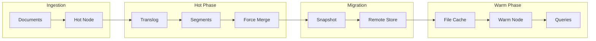

# Warm Storage Tiering

## Summary

Warm Storage Tiering in OpenSearch provides a cost-effective way to manage data lifecycle by automatically moving less frequently accessed data from hot nodes (fast, expensive storage) to warm nodes (slower, cheaper storage backed by remote repositories like S3). This feature enables organizations to maintain searchability of historical data while optimizing storage costs through intelligent shard allocation and automated segment optimization.

## Details

### Architecture


### Data Flow



### Components

| Component | Description |
|-----------|-------------|
| `WarmDiskThresholdDecider` | Allocation decider that manages shard placement on warm nodes based on remote addressable space and file cache capacity |
| `AutoForceMergeManager` | Background service that automatically triggers force merge operations on eligible shards before warm migration |
| `ForceMergeManagerSettings` | Configuration management for auto force merge behavior |
| `ConfigurationValidator` | Validates node meets requirements (data node role, remote store enabled) |
| `NodeValidator` | Monitors node resources (CPU, JVM, disk) to determine merge eligibility |
| `ShardValidator` | Evaluates shard conditions (segment count, translog age) for merge candidacy |
| `FileCacheSettings` | Manages file cache configuration including remote data ratio |

### Configuration

#### Cluster-Level Settings

| Setting | Description | Default |
|---------|-------------|---------|
| `cluster.routing.allocation.disk.warm_threshold_enabled` | Enable/disable warm disk threshold allocation decider | `true` |
| `cluster.auto_force_merge.enabled` | Enable/disable automatic force merge feature | `false` |
| `cluster.filecache.remote_data_ratio` | Maximum ratio of remote data to local cache size | `5` |

#### Node-Level Settings

| Setting | Description | Default |
|---------|-------------|---------|
| `node.search.cache.size` | File cache size for warm nodes | 80% of available storage (dedicated warm nodes) |
| `node.auto_force_merge.scheduler.interval` | Interval between force merge scheduling checks | `30m` |
| `node.auto_force_merge.translog.age` | Minimum translog age before considering force merge | `30m` |
| `node.auto_force_merge.segment.count` | Target segment count after force merge | `1` |
| `node.auto_force_merge.merge_delay` | Delay between consecutive shard merges | `15s` |
| `node.auto_force_merge.cpu.threshold` | CPU usage threshold to pause merge operations | `75%` |
| `node.auto_force_merge.disk.threshold` | Disk usage threshold to pause merge operations | `85%` |
| `node.auto_force_merge.jvm.threshold` | JVM heap usage threshold to pause merge operations | `75%` |
| `node.auto_force_merge.threads.concurrency_multiplier` | Multiplier for concurrent merge threads | `2` |

#### Index-Level Settings

| Setting | Description | Default |
|---------|-------------|---------|
| `index.auto_force_merge.enabled` | Enable/disable auto force merge for specific index | `true` |

### Usage Example

#### Configure a Warm Node

```yaml
# opensearch.yml
node.name: warm-node-1
node.roles: [ warm ]
node.search.cache.size: 100gb
```

#### Enable Auto Force Merge

```json
PUT _cluster/settings
{
  "persistent": {
    "cluster.auto_force_merge.enabled": true,
    "node.auto_force_merge.scheduler.interval": "15m",
    "node.auto_force_merge.translog.age": "1h",
    "node.auto_force_merge.segment.count": 1
  }
}
```

#### Create Searchable Snapshot Index

```json
POST /_snapshot/my-repository/my-snapshot/_restore
{
  "storage_type": "remote_snapshot",
  "indices": "my-index"
}
```

#### ISM Policy for Hot-to-Warm Migration

```json
PUT _plugins/_ism/policies/hot-warm-policy
{
  "policy": {
    "description": "Hot to warm tiering policy",
    "default_state": "hot",
    "states": [
      {
        "name": "hot",
        "actions": [],
        "transitions": [
          {
            "state_name": "warm",
            "conditions": {
              "min_index_age": "7d"
            }
          }
        ]
      },
      {
        "name": "warm",
        "actions": [
          {
            "allocation": {
              "require": { "data": "warm" }
            }
          }
        ],
        "transitions": []
      }
    ]
  }
}
```

## Limitations

- Warm nodes require remote store to be enabled at the cluster level
- Searchable snapshot indexes are read-only; write operations will fail
- Search latency on warm tier is higher than hot tier due to remote data fetching
- Auto force merge only operates on primary shards
- Force merge operations are resource-intensive and may temporarily impact cluster performance
- Remote object stores may incur per-request retrieval costs
- Recommended to maintain a remote data to cache ratio of 5:1 or less for optimal performance

## Related PRs

| Version | PR | Description |
|---------|-----|-------------|
| v3.2.0 | [#18666](https://github.com/opensearch-project/OpenSearch/pull/18666) | Replaced CPU load average with AverageTracker classes, adjusted default thresholds |
| v3.1.0 | [#18082](https://github.com/opensearch-project/OpenSearch/pull/18082) | Add Warm Disk Threshold Allocation Decider for Warm shards |
| v3.1.0 | [#18229](https://github.com/opensearch-project/OpenSearch/pull/18229) | Added Auto Force Merge Manager to enhance hot to warm migration |

## References

- [Issue #8535](https://github.com/opensearch-project/OpenSearch/issues/8535): Add support for a FileCacheDecider
- [Searchable Snapshots Documentation](https://docs.opensearch.org/3.1/tuning-your-cluster/availability-and-recovery/snapshots/searchable_snapshot/)
- [Creating a Cluster - Hot and Warm Nodes](https://docs.opensearch.org/3.1/tuning-your-cluster/)
- [ISM Policies](https://docs.opensearch.org/3.1/im-plugin/ism/policies/)

## Change History

- **v3.2.0** (2025-07-09): Improved resource monitoring with AverageTracker classes for CPU and JVM; adjusted default thresholds (CPU: 75%, Disk: 85%, Merge delay: 15s)
- **v3.1.0** (2025-06-10): Added WarmDiskThresholdDecider for intelligent warm shard allocation and AutoForceMergeManager for automated segment optimization during hot-to-warm migration
