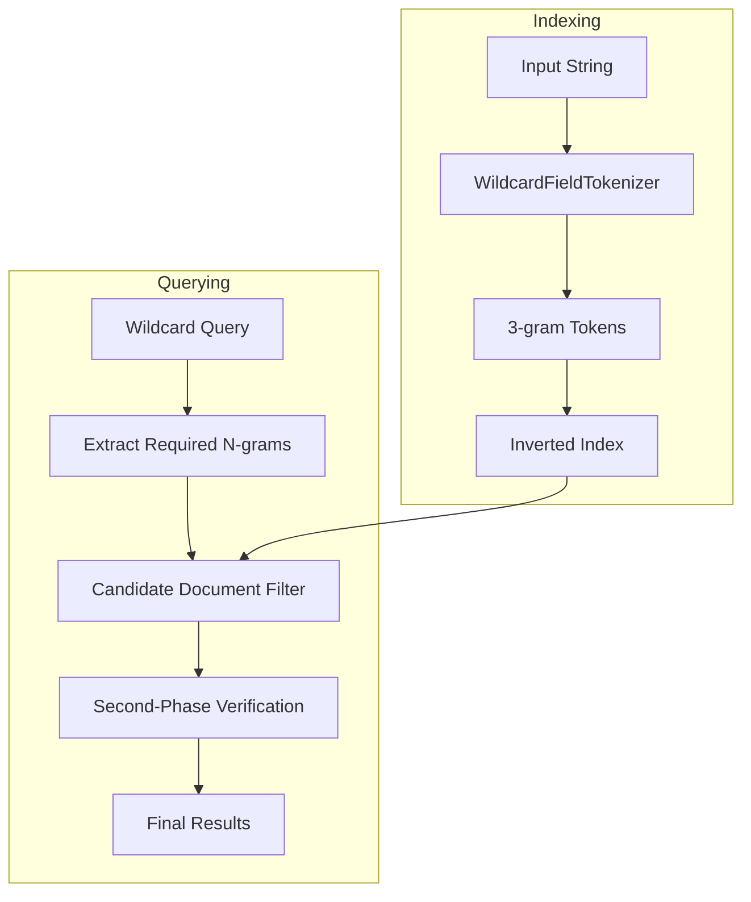
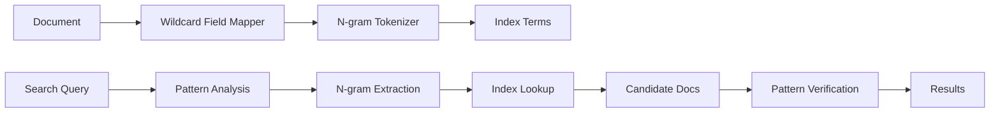

# Wildcard Field

## Summary

The wildcard field type is a specialized string field designed for efficient wildcard (`*`), prefix, and regular expression queries on arbitrary substrings. Unlike standard `text` fields that tokenize content, wildcard fields use n-gram indexing to enable fast pattern matching without token boundaries, making them ideal for log analysis, code search, and other use cases where substring matching is required.

## Details

### Architecture



### Data Flow



### Components

| Component | Description |
|-----------|-------------|
| `WildcardFieldMapper` | Main field mapper that handles indexing and query building |
| `WildcardFieldTokenizer` | Custom tokenizer that generates 3-gram tokens with anchors |
| `WildcardFieldType` | Field type implementation with query methods |
| `WildcardMatchingQuery` | Two-phase query with approximation and verification |

### How It Works

1. **Indexing**: Input strings are split into overlapping 3-character sequences (trigrams) with special anchor characters (null bytes) marking string boundaries
2. **Query Processing**: Search patterns are analyzed to extract required n-grams
3. **Two-Phase Search**: 
   - First phase: Fast index lookup for candidate documents containing required n-grams
   - Second phase: Exact pattern matching against source values to filter false positives

### Configuration

| Setting | Description | Default |
|---------|-------------|---------|
| `doc_values` | Enable doc values for aggregations/sorting | `false` |
| `ignore_above` | Maximum string length to index | `2147483647` |
| `normalizer` | Normalizer for preprocessing (e.g., `lowercase`) | none |
| `null_value` | Value to use for null fields | `null` |

### Usage Example

Create an index with a wildcard field:

```json
PUT logs
{
  "mappings": {
    "properties": {
      "log_line": {
        "type": "wildcard",
        "fields": {
          "lower": {
            "type": "wildcard",
            "normalizer": "lowercase"
          }
        }
      }
    }
  }
}
```

Index documents:

```json
POST logs/_bulk
{"index": {"_id": 1}}
{"log_line": "org.opensearch.transport.NodeDisconnectedException: [node_s0] disconnected"}
{"index": {"_id": 2}}
{"log_line": "[2024-06-08T06:31:37,443][INFO] cluster-manager node failed"}
```

Search with wildcard patterns:

```json
GET logs/_search
{
  "query": {
    "wildcard": {
      "log_line": {
        "value": "*Exception*disconnected*"
      }
    }
  }
}
```

Case-insensitive search using the normalized sub-field:

```json
GET logs/_search
{
  "query": {
    "wildcard": {
      "log_line.lower": {
        "value": "*exception*"
      }
    }
  }
}
```

## Limitations

- **Exact match queries**: `term` and `terms` queries are less efficient on wildcard fields compared to `keyword` fields
- **Short patterns**: Patterns with fewer than 3 consecutive non-wildcard characters may result in broader index scans
- **Storage overhead**: While optimized in v3.0.0, wildcard fields still require more storage than keyword fields due to n-gram indexing
- **Not for full-text search**: Wildcard fields don't support full-text analysis; use `text` fields for natural language content

## Related PRs

| Version | PR | Description |
|---------|-----|-------------|
| v3.0.0 | [#17349](https://github.com/opensearch-project/OpenSearch/pull/17349) | Optimize to 3-gram only indexing |
| v2.15.0 | Initial | Wildcard field type introduction |

## References

- [Wildcard Field Documentation](https://docs.opensearch.org/3.0/field-types/supported-field-types/wildcard/): Official documentation
- [Issue #17099](https://github.com/opensearch-project/OpenSearch/issues/17099): 3-gram optimization feature request with benchmarks
- [OpenSearch 2.15 Blog](https://opensearch.org/blog/diving-into-opensearch-2-15/): Initial feature announcement

## Change History

- **v3.0.0** (2025): Changed indexing strategy from 1-3 gram to 3-gram only, reducing index size by ~20% and improving write throughput by 5-30%
- **v2.15.0** (2024): Initial introduction of wildcard field type with 1-3 gram indexing
