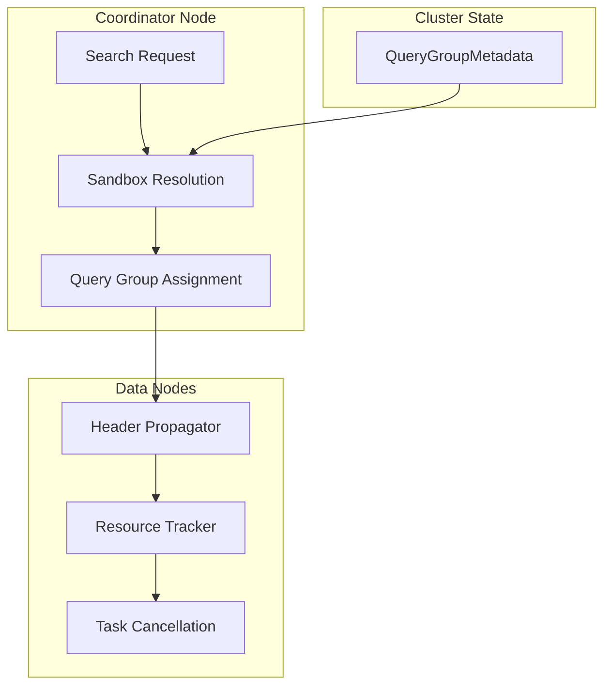

---
tags:
  - opensearch
---
# Workload Management

## Summary

Workload Management is a feature for organizing search requests into Query Groups with configurable resource limits, enabling node-level resiliency and fair resource allocation across tenants. It allows administrators to define resource thresholds and enforcement policies for different workload categories.

## Details

### Architecture



### Components

| Component | Description |
|-----------|-------------|
| `QueryGroup` | Schema defining resource limits and resiliency mode |
| `QueryGroupMetadata` | Cluster metadata storing all Query Groups |
| `QueryGroupThreadContextStatePropagator` | Propagates queryGroupId across requests and nodes |
| `ResourceType` | Enum for resource types (CPU, MEMORY) |

### QueryGroup Schema

```json
{
    "_id": "<uuid>",
    "name": "<name>",
    "resiliency_mode": "<soft|enforced|monitor>",
    "resourceLimits": {
        "cpu": 0.3,
        "memory": 0.4
    },
    "updatedAt": 1720047207
}
```

### Configuration

| Setting | Description | Default |
|---------|-------------|---------|
| `name` | Query group name | Required |
| `resiliency_mode` | Enforcement mode | Required |
| `resourceLimits` | Resource thresholds (0.0-1.0) | At least one required |

### Resiliency Modes

| Mode | Description |
|------|-------------|
| `soft` | Can exceed limits when node is not under duress |
| `enforced` | Strictly enforces limits; cancels tasks immediately |
| `monitor` | Logs violations without cancellation |

### Resource Types

| Type | Description |
|------|-------------|
| `cpu` | CPU usage threshold |
| `memory` | Heap memory usage threshold |

## Limitations

- Experimental feature (`@ExperimentalApi`)
- Query Group CRUD APIs not yet available (v2.16.0)
- Resource monitoring framework in development

## Change History

- **v2.16.0** (2024-07-23): Initial implementation with QueryGroup schema and header propagation

## References

### Documentation

- [RFC: Search Query Sandboxing](https://github.com/opensearch-project/OpenSearch/issues/12342)

### Pull Requests

| Version | PR | Description |
|---------|-----|-------------|
| v2.16.0 | [#13669](https://github.com/opensearch-project/OpenSearch/pull/13669) | Add QueryGroup schema |
| v2.16.0 | [#14614](https://github.com/opensearch-project/OpenSearch/pull/14614) | Add queryGroupId header propagator |
