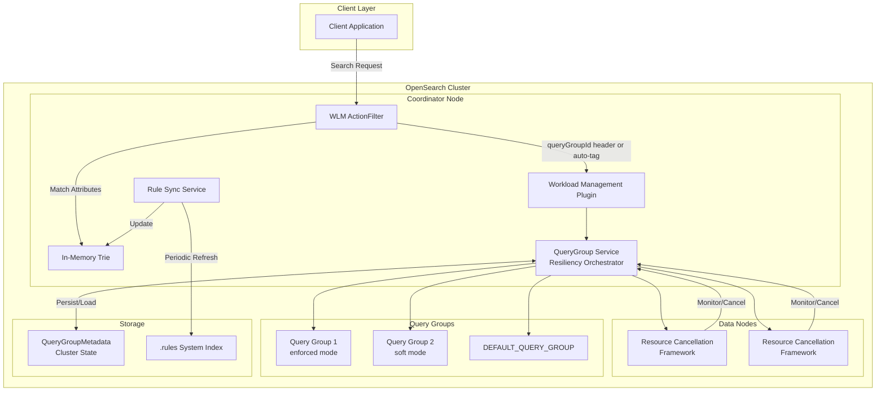
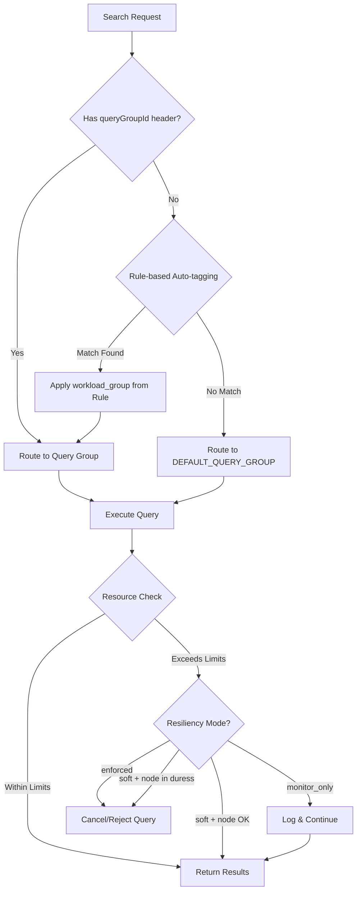

# Workload Management

## Summary

Workload Management (WLM) is a feature that enables tenant-level admission control and reactive query management in OpenSearch. It allows system administrators to group search traffic into query groups with defined resource limits (CPU, memory), preventing resource overuse by specific requests and ensuring fair resource distribution across the cluster. When resource usage exceeds configured limits, WLM automatically identifies and cancels demanding queries.

## Details

### Architecture



### Data Flow



### Components

| Component | Description |
|-----------|-------------|
| `QueryGroupService` | Core orchestrator for query sandboxing and resource enforcement |
| `QueryGroupMetadata` | Persistable metadata stored in ClusterState for durability |
| `ResourceCancellationFramework` | Node-level framework for canceling queries exceeding limits |
| `WLM Stats API` | Provides per-node query group statistics and metrics |
| `WLM Paginated Stats API` | Scalable paginated endpoint for stats retrieval (v3.1.0+) |
| `WlmPaginationStrategy` | Pagination logic for WLM stats with sorting and token management (v3.1.0+) |
| `Query Group CRUD APIs` | REST APIs for managing query group lifecycle |
| `DEFAULT_QUERY_GROUP` | Built-in query group for requests without explicit group assignment |
| `WlmActionFilter` | Transport layer filter for automatic request tagging (v3.1.0+) |
| `RuleSyncService` | Periodically refreshes in-memory rules from system index (v3.1.0+) |
| `Rule CRUD APIs` | REST APIs for managing auto-tagging rules (v3.1.0+) |

### Configuration

| Setting | Description | Default |
|---------|-------------|---------|
| `wlm.query_group.mode` | Operating mode: `disabled`, `enabled`, `monitor_only` | `monitor_only` |
| `wlm.query_group.duress_streak` | Consecutive checks before node is marked "in duress" | - |
| `wlm.query_group.enforcement_interval` | Interval for resource monitoring checks | - |
| `wlm.query_group.node.memory_rejection_threshold` | Memory threshold triggering request rejection | - |
| `wlm.query_group.node.cpu_rejection_threshold` | CPU threshold triggering request rejection | - |
| `wlm.query_group.node.memory_cancellation_threshold` | Memory threshold for marking node in duress | - |
| `wlm.query_group.node.cpu_cancellation_threshold` | CPU threshold for marking node in duress | - |

### Operating Modes

| Mode | Behavior |
|------|----------|
| `disabled` | Workload management is completely disabled |
| `enabled` | Full enforcement - queries are canceled/rejected when limits exceeded |
| `monitor_only` | Resources monitored but no cancellation/rejection (default) |

### Resiliency Modes

| Mode | Behavior |
|------|----------|
| `enforced` | Strict enforcement - queries canceled when group limits exceeded |
| `soft` | Queries may be rejected only when node is in duress |

### Usage Example

**Install Plugin:**
```bash
./bin/opensearch-plugin install workload-management
```

**Create Query Group:**
```json
PUT _wlm/query_group
{
  "name": "analytics",
  "resiliency_mode": "enforced",
  "resource_limits": {
    "cpu": 0.4,
    "memory": 0.2
  }
}
```

**Response:**
```json
{
  "_id": "preXpc67RbKKeCyka72_Gw",
  "name": "analytics",
  "resiliency_mode": "enforced",
  "resource_limits": {
    "cpu": 0.4,
    "memory": 0.2
  },
  "updated_at": 1726270184642
}
```

**Execute Query with Query Group:**
```
GET testindex/_search
Host: localhost:9200
Content-Type: application/json
queryGroupId: preXpc67RbKKeCyka72_Gw

{
  "query": {
    "match": {
      "field_name": "value"
    }
  }
}
```

**Get Query Group Stats:**
```
GET _wlm/stats
```

**Get Paginated Stats (v3.1.0+):**
```
GET _list/wlm_stats?size=50&sort=node_id&order=asc&v=true
```

**Paginated Stats Response:**
```
NODE_ID | WORKLOAD_GROUP_ID | TOTAL_COMPLETIONS | TOTAL_REJECTIONS | TOTAL_CANCELLATIONS | CPU_USAGE | MEMORY_USAGE
node-1  | analytics         | 1000              | 5                | 2                   | 0.45      | 0.30
node-1  | DEFAULT_WORKLOAD_GROUP | 5000         | 0                | 0                   | 0.10      | 0.05
next_token: <encrypted_token>
```

**Fetch Next Page:**
```
GET _list/wlm_stats?size=50&sort=node_id&order=asc&next_token=<encrypted_token>
```

**Stats Response:**
```json
{
  "_nodes": {
    "total": 1,
    "successful": 1,
    "failed": 0
  },
  "cluster_name": "my-cluster",
  "node_id": {
    "query_groups": {
      "16YGxFlPRdqIO7K4EACJlw": {
        "total_completions": 33570,
        "total_rejections": 0,
        "total_cancellations": 0,
        "cpu": {
          "current_usage": 0.033,
          "cancellations": 0,
          "rejections": 0
        },
        "memory": {
          "current_usage": 0.002,
          "cancellations": 0,
          "rejections": 0
        }
      },
      "DEFAULT_QUERY_GROUP": {
        "total_completions": 42572,
        "total_rejections": 0,
        "total_cancellations": 0,
        "cpu": {
          "current_usage": 0,
          "cancellations": 0,
          "rejections": 0
        },
        "memory": {
          "current_usage": 0,
          "cancellations": 0,
          "rejections": 0
        }
      }
    }
  }
}
```

## Limitations

- Sum of resource limits for a single resource type (CPU or memory) across all query groups must not exceed 1.0
- Rejection threshold should always be lower than cancellation threshold
- Only administrator-level users can create and update query groups
- Requires installing the `workload-management` plugin
- Operates at node level for search workloads

## Related PRs

| Version | PR | Description |
|---------|-----|-------------|
| v3.1.0 | [#17638](https://github.com/opensearch-project/OpenSearch/pull/17638) | Add paginated wlm/stats API |
| v3.1.0 | [#17336](https://github.com/opensearch-project/OpenSearch/pull/17336) | Add Get Rule API for auto-tagging |
| v3.1.0 | [#17791](https://github.com/opensearch-project/OpenSearch/pull/17791) | Add WLM ActionFilter for automatic tagging |
| v3.1.0 | [#17792](https://github.com/opensearch-project/OpenSearch/pull/17792) | Add Create Rule API |
| v3.1.0 | [#17797](https://github.com/opensearch-project/OpenSearch/pull/17797) | Add Update Rule API |
| v3.1.0 | [#18128](https://github.com/opensearch-project/OpenSearch/pull/18128) | Add refresh-based rule synchronization |
| v3.1.0 | [#18184](https://github.com/opensearch-project/OpenSearch/pull/18184) | Add Delete Rule API |
| v3.1.0 | [#18488](https://github.com/opensearch-project/OpenSearch/pull/18488) | Bug fix for update rule API |
| v2.18.0 | [#15651](https://github.com/opensearch-project/OpenSearch/pull/15651) | Add cancellation framework changes in WLM |
| v2.18.0 | [#15777](https://github.com/opensearch-project/OpenSearch/pull/15777) | QueryGroup Stats API logic |
| v2.18.0 | [#15925](https://github.com/opensearch-project/OpenSearch/pull/15925) | Add WLM resiliency orchestrator (QueryGroup Service) |
| v2.18.0 | [#15955](https://github.com/opensearch-project/OpenSearch/pull/15955) | Add integration tests for WLM CRUD APIs |
| v2.18.0 | [#16370](https://github.com/opensearch-project/OpenSearch/pull/16370) | Make QueryGroups durable |
| v2.18.0 | [#16417](https://github.com/opensearch-project/OpenSearch/pull/16417) | Improve rejection logic for WLM |
| v2.18.0 | [#16422](https://github.com/opensearch-project/OpenSearch/pull/16422) | WLM create/update REST API bug fix |

## References

- [RFC #12342](https://github.com/opensearch-project/OpenSearch/issues/12342): Search Query Sandboxing: User Experience
- [Issue #16797](https://github.com/opensearch-project/OpenSearch/issues/16797): RFC for automated labeling of search requests
- [Issue #17592](https://github.com/opensearch-project/OpenSearch/issues/17592): Feature request for paginating _wlm/stats API
- [Workload Management Documentation](https://docs.opensearch.org/3.1/tuning-your-cluster/availability-and-recovery/workload-management/wlm-feature-overview/)
- [Query Group Lifecycle API](https://docs.opensearch.org/3.1/tuning-your-cluster/availability-and-recovery/workload-management/workload-group-lifecycle-api/)
- [Rule-based Auto-tagging Documentation](https://docs.opensearch.org/3.1/tuning-your-cluster/availability-and-recovery/rule-based-autotagging/autotagging/)
- [Rule Lifecycle API](https://docs.opensearch.org/3.1/tuning-your-cluster/availability-and-recovery/rule-based-autotagging/rule-lifecycle-api/)

## Change History

- **v3.1.0** (2026-01-10): Added rule-based auto-tagging with full CRUD API (`/_rules/workload_group`), WLM ActionFilter for automatic request tagging, refresh-based rule synchronization, and paginated `/_list/wlm_stats` API
- **v2.18.0** (2024-10-22): Initial implementation with QueryGroup CRUD APIs, Stats API, resource cancellation framework, resiliency orchestrator, persistence, and enhanced rejection logic
