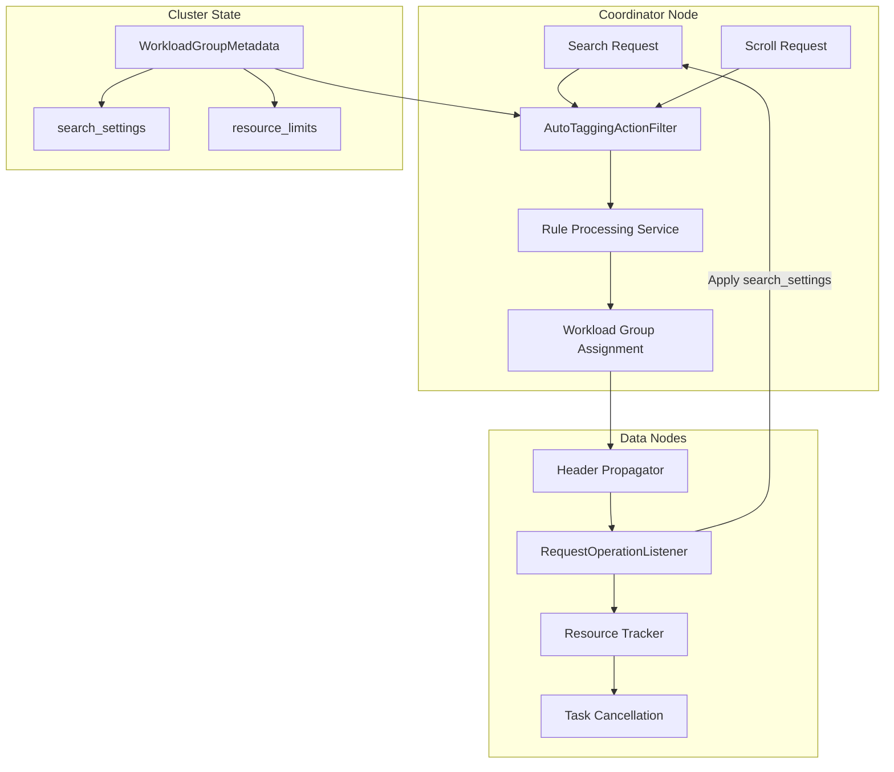

---
tags:
  - opensearch
---
# Workload Management

## Summary

Workload Management (WLM) is a feature for organizing search requests into workload groups with configurable resource limits, enabling node-level resiliency and fair resource allocation across tenants. It allows administrators to define resource thresholds, enforcement policies, and custom search settings for different workload categories. Rule-based autotagging automatically assigns incoming requests to workload groups based on attributes such as index patterns.

## Details

### Architecture


```mermaid
graph TB
    subgraph "Coordinator Node"
        REQ[Search Request] --> FILTER[AutoTaggingActionFilter]
        SCROLL[Scroll Request] --> FILTER
        FILTER --> RULES[Rule Processing Service]
        RULES --> QG[Workload Group Assignment]
    end

    subgraph "Cluster State"
        QGM[WorkloadGroupMetadata]
        QGM --> SETTINGS[search_settings]
        QGM --> LIMITS[resource_limits]
    end

    subgraph "Data Nodes"
        PROP[Header Propagator]
        LISTENER[RequestOperationListener]
        TRACK[Resource Tracker]
        CANCEL[Task Cancellation]
    end

    QG --> PROP
    QGM --> FILTER
    PROP --> LISTENER
    LISTENER --> TRACK
    LISTENER -->|Apply search_settings| REQ
    TRACK --> CANCEL
```

### Components

| Component | Description |
|-----------|-------------|
| `WorkloadGroup` | Schema defining resource limits, resiliency mode, and search settings |
| `WorkloadGroupMetadata` | Cluster metadata storing all workload groups |
| `WorkloadGroupThreadContextStatePropagator` | Propagates workloadGroupId across requests and nodes |
| `AutoTaggingActionFilter` | Action filter that matches requests to workload groups via rules |
| `WorkloadGroupRequestOperationListener` | Applies search settings and tracks resource usage |
| `WorkloadGroupSearchSettings` | Enum-based validation framework for per-group search settings |
| `ResourceType` | Enum for resource types (CPU, MEMORY) |

### WorkloadGroup Schema

```json
{
    "_id": "<uuid>",
    "name": "<name>",
    "resiliency_mode": "<soft|enforced|monitor>",
    "resource_limits": {
        "cpu": 0.3,
        "memory": 0.4
    },
    "search_settings": {
        "timeout": "30s"
    },
    "updated_at": 1720047207
}
```

### Configuration

| Setting | Description | Default |
|---------|-------------|---------|
| `name` | Workload group name | Required |
| `resiliency_mode` | Enforcement mode | Required |
| `resource_limits` | Resource thresholds (0.0-1.0) | At least one required |
| `search_settings` | Per-group search behavior overrides | `{}` (empty) |

### Search Settings

| Setting | Type | Description | Since |
|---------|------|-------------|-------|
| `timeout` | TimeValue | Hard upper bound on search execution time. Only applied when the request has no explicit timeout. | v3.6.0 |

### Resiliency Modes

| Mode | Description |
|------|-------------|
| `soft` | Can exceed limits when node is not under duress |
| `enforced` | Strictly enforces limits; cancels tasks immediately |
| `monitor` | Logs violations without cancellation |

### Resource Types

| Type | Description |
|------|-------------|
| `cpu` | CPU usage threshold |
| `memory` | Heap memory usage threshold |

### Usage Example

```bash
# Create workload group with resource limits and search settings
PUT _wlm/workload_group
{
  "name": "analytics",
  "resiliency_mode": "enforced",
  "resource_limits": {
    "cpu": 0.1,
    "memory": 0.1
  },
  "search_settings": {
    "timeout": "30s"
  }
}

# Update search settings
PUT _wlm/workload_group/analytics
{
  "search_settings": {
    "timeout": "1m"
  }
}
```

## Limitations

- Additional search settings (`cancel_after_time_interval`, `max_concurrent_shard_requests`, `batched_reduce_size`, `phase_took`, `max_buckets`) are planned but not yet available
- Scroll ID format with embedded original indices requires all nodes to be v3.6.0+ for full autotagging support

## Change History

- **v3.6.0**: Added `search_settings` field to workload groups with initial `timeout` setting; added Scroll API support for rule-based autotagging; fixed `updatedAt` clock skew validation bug
- **v2.16.0** (2024-07-23): Initial implementation with QueryGroup schema and header propagation

## References

### Documentation

- [WLM Feature Overview](https://opensearch.org/docs/latest/tuning-your-cluster/availability-and-recovery/workload-management/wlm-feature-overview/)
- [Rule-Based Autotagging](https://docs.opensearch.org/latest/tuning-your-cluster/availability-and-recovery/rule-based-autotagging/autotagging/)
- [RFC: Search Query Sandboxing](https://github.com/opensearch-project/OpenSearch/issues/12342)

### Pull Requests

| Version | PR | Description |
|---------|-----|-------------|
| v3.6.0 | [#20536](https://github.com/opensearch-project/OpenSearch/pull/20536) | Add `search_settings` support with initial `timeout` setting |
| v3.6.0 | [#20151](https://github.com/opensearch-project/OpenSearch/pull/20151) | Add Scroll API support for rule-based autotagging |
| v3.6.0 | [#20486](https://github.com/opensearch-project/OpenSearch/pull/20486) | Relax `updatedAt` validation for workload group creation |
| v2.16.0 | [#13669](https://github.com/opensearch-project/OpenSearch/pull/13669) | Add QueryGroup schema |
| v2.16.0 | [#14614](https://github.com/opensearch-project/OpenSearch/pull/14614) | Add queryGroupId header propagator |
