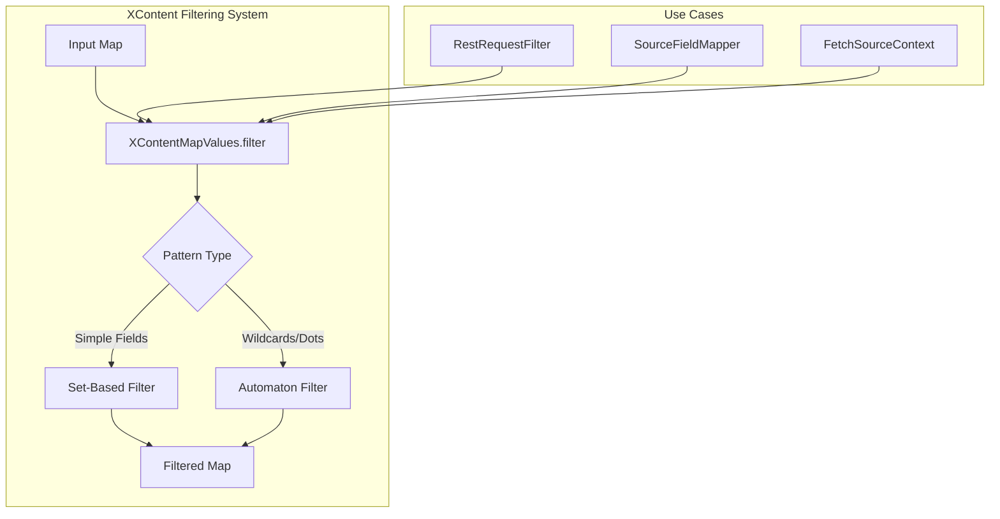
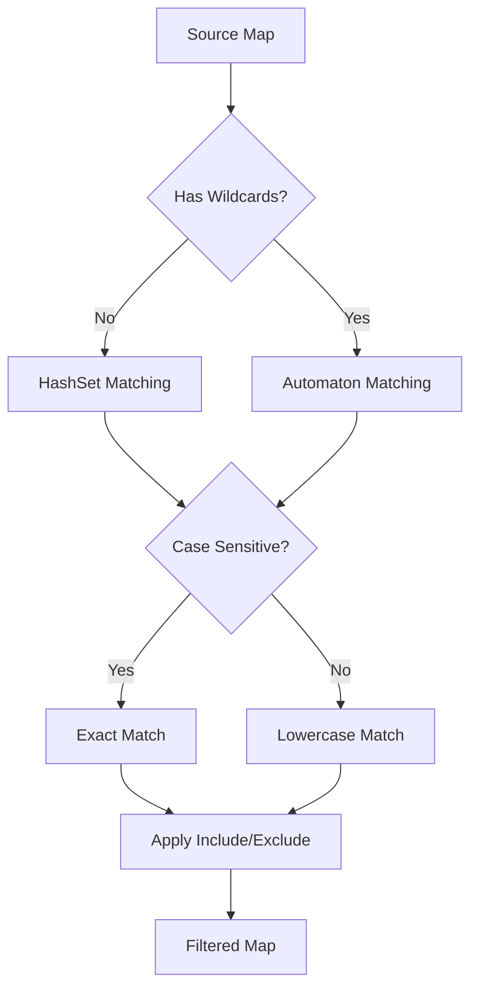

# XContent Filtering

## Summary

XContent Filtering provides utilities for filtering fields from JSON/YAML content maps in OpenSearch. The `XContentMapValues.filter()` method allows including or excluding specific fields from document content, supporting wildcards, nested paths, and case-insensitive matching. This is essential for security features like filtering sensitive data from REST request logs.

## Details

### Architecture



### Data Flow



### Components

| Component | Description |
|-----------|-------------|
| `XContentMapValues` | Core utility class for filtering map content |
| `RestRequestFilter` | Interface for filtering sensitive REST request content |
| `SourceFieldMapper` | Uses filtering for `_source` field includes/excludes |
| `FetchSourceContext` | Applies filtering during search source fetching |

### Configuration

| Setting | Description | Default |
|---------|-------------|---------|
| `caseSensitive` | Whether field matching is case-sensitive | `true` (backward compatible) |
| `includes` | Array of field patterns to include | `null` (include all) |
| `excludes` | Array of field patterns to exclude | `[]` (exclude none) |

### API Methods

```java
// Case-sensitive filtering (original API)
Map<String, Object> filter(Map<String, ?> map, String[] includes, String[] excludes)

// Configurable case sensitivity (v3.4.0+)
Map<String, Object> filter(Map<String, ?> map, String[] includes, String[] excludes, boolean caseSensitive)

// Reusable filter function
Function<Map<String, ?>, Map<String, Object>> filter(String[] includes, String[] excludes, boolean caseSensitive)
```

### Pattern Matching

| Pattern | Example | Matches |
|---------|---------|---------|
| Exact field | `password` | `password` only |
| Nested path | `user.email` | `user.email` field |
| Wildcard | `*.secret` | Any field ending with `.secret` |
| Deep wildcard | `credentials.*` | All fields under `credentials` |

### Usage Example

```java
// Filter sensitive fields from a request body
Map<String, Object> source = Map.of(
    "username", "admin",
    "Password", "secret123",  // Mixed case
    "apiKey", "key-abc"
);

// Case-insensitive exclude
Map<String, Object> filtered = XContentMapValues.filter(
    source,
    null,                           // include all
    new String[]{"password", "apikey"},  // exclude these
    false                           // case-insensitive
);

// Result: {"username": "admin"}
```

### RestRequestFilter Implementation

```java
public interface RestRequestFilter {
    /**
     * Returns fields to filter from request body before logging.
     * Field names are matched case-insensitively.
     */
    Set<String> getFilteredFields();
    
    default RestRequest getFilteredRequest(RestRequest request) {
        Set<String> fields = getFilteredFields();
        if (request.hasContent() && !fields.isEmpty()) {
            // Filter with case-insensitive matching
            Map<String, Object> filtered = XContentMapValues.filter(
                parseContent(request),
                null,
                fields.toArray(new String[0]),
                false  // case-insensitive
            );
            return wrapRequest(request, filtered);
        }
        return request;
    }
}
```

## Limitations

- Filtering creates a new map; does not modify the original
- Wildcard patterns use Lucene automaton matching (may have performance impact for complex patterns)
- Case-insensitive matching uses `Locale.ROOT` (may not handle all Unicode edge cases)
- Nested array filtering preserves array structure but filters contained objects

## Related PRs

| Version | PR | Description |
|---------|-----|-------------|
| v3.4.0 | [#19976](https://github.com/opensearch-project/OpenSearch/pull/19976) | Add case sensitivity as an argument to XContentMapValues.filter |

## References

- [XContentMapValues.java](https://github.com/opensearch-project/OpenSearch/blob/main/server/src/main/java/org/opensearch/common/xcontent/support/XContentMapValues.java): Core implementation
- [RestRequestFilter.java](https://github.com/opensearch-project/OpenSearch/blob/main/server/src/main/java/org/opensearch/rest/RestRequestFilter.java): Extension point for sensitive data filtering
- [ML Commons Connector Documentation](https://docs.opensearch.org/latest/ml-commons-plugin/remote-models/index/#step-2-create-a-connector): Example use case

## Change History

- **v3.4.0** (2025-11-19): Added case-insensitive filtering support via new `caseSensitive` parameter
