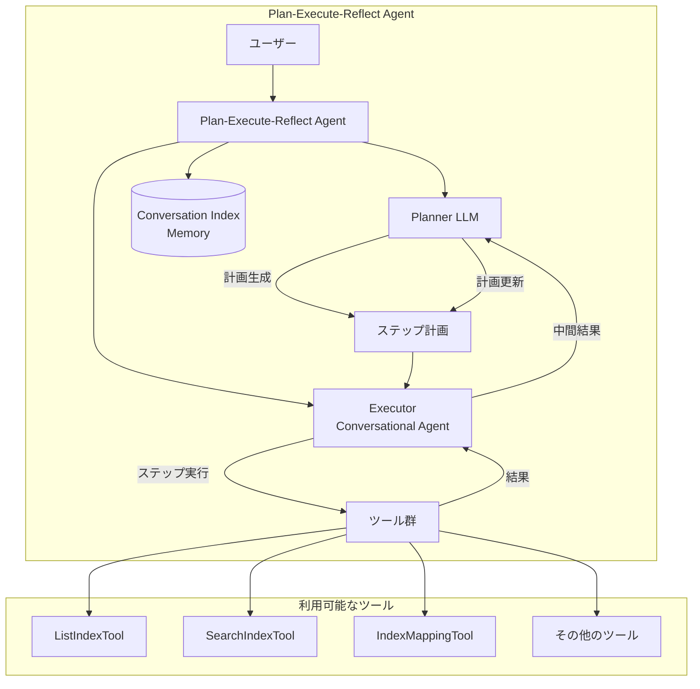
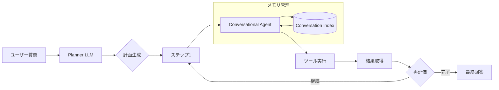

# Plan-Execute-Reflect Agent

## 概要

Plan-Execute-Reflect Agentは、OpenSearch 3.0で導入された新しいエージェントタイプです。複雑なタスクを管理可能なステップに分解し、反復的な改善を通じて自律的な問題解決を実現します。特に複雑なトラブルシューティングシナリオに効果的です。

このエージェントは3つのフェーズで動作します：
- **Planning（計画）**: プランナーLLMが利用可能なツールを使用してステップバイステップの計画を生成
- **Execution（実行）**: 各ステップを組み込みのConversational Agentとツールを使用して順次実行
- **Re-evaluation（再評価）**: 各ステップ実行後、中間結果に基づいて計画を動的に調整

## 詳細

### アーキテクチャ



### データフロー



### コンポーネント

| コンポーネント | 説明 |
|---------------|------|
| `MLPlanExecuteAndReflectAgentRunner` | エージェントのメインランナークラス。計画ループの実行を管理 |
| `MLChatAgentRunner` | 各ステップを実行するConversational Agentのランナー |
| `AgentUtils` | ツール管理、LLM出力パース、プロンプト処理のユーティリティ |
| `PromptTemplate` | プランナー、リフレクション用のプロンプトテンプレート |
| `MLToolSpec` | ツール仕様。`attributes`フィールドが追加され、Function Calling対応 |

### 設定パラメータ

| パラメータ | 説明 | デフォルト値 |
|-----------|------|-------------|
| `_llm_interface` | LLMインターフェース種別 | - |
| `max_steps` | 最大実行ステップ数 | 20 |
| `planner_prompt` | プランナー用プロンプト | 組み込みプロンプト |
| `reflect_prompt` | 再評価用プロンプト | 組み込みプロンプト |
| `system_prompt` | プランナーシステムプロンプト | 組み込みプロンプト |
| `executor_system_prompt` | 実行エージェントシステムプロンプト | 組み込みプロンプト |
| `reAct_agent_id` | 実行用ReActエージェントID | 自動生成 |

### サポートされるLLMインターフェース

| インターフェース | 値 |
|-----------------|-----|
| Amazon Bedrock Claude | `bedrock/converse/claude` |
| OpenAI GPT-4o | `openai/v1/chat/completions` |
| Amazon Bedrock DeepSeek-R1 | `bedrock/converse/deepseek_r1` |

### 使用例

#### エージェント登録

```json
POST /_plugins/_ml/agents/_register
{
  "name": "My Plan Execute Reflect Agent",
  "type": "plan_execute_and_reflect",
  "description": "Agent for dynamic task planning and reasoning",
  "llm": {
    "model_id": "YOUR_LLM_MODEL_ID",
    "parameters": {
      "prompt": "${parameters.question}"
    }
  },
  "memory": {
    "type": "conversation_index"
  },
  "parameters": {
    "_llm_interface": "bedrock/converse/claude"
  },
  "tools": [
    { "type": "ListIndexTool" },
    { "type": "SearchIndexTool" },
    { "type": "IndexMappingTool" }
  ],
  "app_type": "os_chat"
}
```

#### エージェント実行

```json
POST /_plugins/_ml/agents/{agent_id}/_execute
{
  "parameters": {
    "question": "OpenSearchクラスタ内のインデックスを分析し、最も大きいインデックスを特定してください"
  }
}
```

### Function Calling対応

v3.0では、ChatAgentにFunction Callingインターフェースが導入されました。`MLToolSpec`に`attributes`フィールドが追加され、ツールのスキーマ情報を定義できます：

```java
public class MLToolSpec {
    private String type;
    private String name;
    private String description;
    private Map<String, String> parameters;
    private Map<String, String> attributes;  // 新規追加
    // ...
}
```

ツールの`attributes`には`input_schema`と`strict`を設定可能：

```json
{
  "attributes": {
    "input_schema": "{\"type\":\"object\",\"properties\":{\"index\":{\"type\":\"string\"}}}",
    "strict": true
  }
}
```

## 制限事項

- **実験的機能**: 本番環境での使用は推奨されません
- **再評価タイミング**: 現在は各ステップ実行後のみ再評価を実行
- **LLMサポート**: 組み込みサポートは3つのLLMインターフェースのみ
- **最大ステップ数**: デフォルト20ステップで制限（`max_steps`で変更可能）

## 関連PR

| バージョン | PR | 説明 |
|-----------|-----|------|
| v3.0.0 | [#3716](https://github.com/opensearch-project/ml-commons/pull/3716) | Plan-Execute-Reflect Agentの初期実装 |

## 参考資料

- [Plan-execute-reflect agents - OpenSearch Documentation](https://docs.opensearch.org/3.0/ml-commons-plugin/agents-tools/agents/plan-execute-reflect/)
- [Building a plan-execute-reflect agent - Tutorial](https://docs.opensearch.org/3.0/tutorials/gen-ai/agents/build-plan-execute-reflect-agent/)
- [GitHub Issue #3745](https://github.com/opensearch-project/ml-commons/issues/3745): 機能追跡Issue

## 変更履歴

- **v3.0.0**: 初期実装。Plan-Execute-Reflect Agentタイプの追加、Function Callingインターフェースの導入
