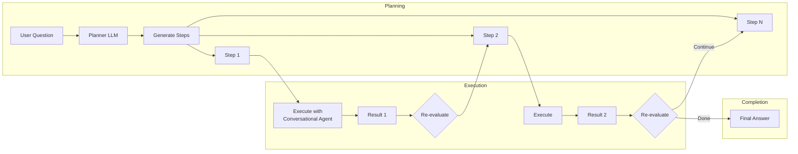

# Plan-Execute-Reflect Agent

## Summary

The Plan-Execute-Reflect agent is a new agent type introduced in OpenSearch v3.0.0 that enables autonomous problem-solving through iterative reasoning. It breaks complex tasks into manageable steps, executes them sequentially using a built-in conversational agent, and dynamically re-evaluates the plan based on intermediate results.

Key benefits:
- **Autonomous task decomposition**: Automatically breaks complex queries into step-by-step plans
- **Iterative improvement**: Re-evaluates and adjusts plans after each step based on results
- **Built-in tool orchestration**: Automatically selects appropriate tools for each step
- **Memory persistence**: Stores execution history for context continuity across sessions

## Details

### Architecture

```mermaid
graph TB
    subgraph "Plan-Execute-Reflect Agent"
        User[User Query] --> Planner[Planner LLM]
        Planner --> Plan[Step-by-Step Plan]
        Plan --> Executor[Executor Agent<br/>Conversational]
        
        subgraph "Execution Loop"
            Executor --> Tool1[Tool 1]
            Executor --> Tool2[Tool 2]
            Executor --> ToolN[Tool N]
            Tool1 --> Result[Step Result]
            Tool2 --> Result
            ToolN --> Result
        end
        
        Result --> Reflect[Re-evaluate Plan]
        Reflect -->|More steps needed| Plan
        Reflect -->|Complete| Final[Final Response]
    end
    
    subgraph "Memory"
        Memory[(Conversation Index)]
        Executor -.-> Memory
        Reflect -.-> Memory
    end
```

### Data Flow



### Components

| Component | Description |
|-----------|-------------|
| MLPlanExecuteAndReflectAgentRunner | Main agent runner implementing the plan-execute-reflect loop |
| Planner LLM | LLM that generates and re-evaluates step-by-step plans |
| Executor Agent | Built-in conversational agent that executes individual steps |
| ConversationIndexMemory | Persists execution history and intermediate results |
| Tool Interface | Supports function calling with tool attributes for schema definition |

### Configuration

| Parameter | Description | Default |
|-----------|-------------|---------|
| `type` | Agent type | `plan_execute_and_reflect` |
| `_llm_interface` | LLM interface type | Required |
| `max_steps` | Maximum steps to execute | `20` |
| `memory.type` | Memory type for persistence | `conversation_index` |
| `planner_prompt` | Custom planner prompt | Built-in |
| `reflect_prompt` | Custom reflection prompt | Built-in |
| `system_prompt` | Planner system prompt | Built-in |
| `executor_system_prompt` | Executor system prompt | Built-in |

### Supported LLM Interfaces

| Interface | Value |
|-----------|-------|
| Anthropic Claude on Amazon Bedrock | `bedrock/converse/claude` |
| OpenAI GPT-4o | `openai/v1/chat/completions` |
| DeepSeek-R1 on Amazon Bedrock | `bedrock/converse/deepseek_r1` |

### Usage Example

```json
POST /_plugins/_ml/agents/_register
{
  "name": "My Plan Execute Reflect Agent",
  "type": "plan_execute_and_reflect",
  "description": "Agent for dynamic task planning and reasoning",
  "llm": {
    "model_id": "YOUR_LLM_MODEL_ID",
    "parameters": {
      "prompt": "${parameters.question}"
    }
  },
  "memory": {
    "type": "conversation_index"
  },
  "parameters": {
    "_llm_interface": "bedrock/converse/claude"
  },
  "tools": [
    { "type": "ListIndexTool" },
    { "type": "SearchIndexTool" },
    { "type": "IndexMappingTool" }
  ]
}
```

### Agent Execution

```json
POST /_plugins/_ml/agents/{agent_id}/_execute
{
  "parameters": {
    "question": "How many flights from Beijing to Seattle?"
  }
}
```

### Key Implementation Details

The agent introduces several new components in the ML Commons codebase:

- **MLAgentType.PLAN_EXECUTE_AND_REFLECT**: New agent type enum value
- **MLToolSpec.attributes**: New field for tool schema definition (input_schema, strict)
- **Tool.getAttributes()/setAttributes()**: Interface methods for tool attribute management
- **Function calling support**: Built-in templates for OpenAI, Bedrock Claude, and DeepSeek-R1

### Automatic ReAct Agent Creation

When registering a Plan-Execute-Reflect agent without specifying a `reAct_agent_id`, the system automatically creates a companion Conversational agent with the same tools and configuration to handle step execution.

## Limitations

- **Experimental feature**: Not recommended for production use
- **Limited LLM support**: Only supports specific LLM interfaces with built-in function calling
- **Sequential execution**: Steps are executed one at a time, not in parallel
- **Re-evaluation only after steps**: Cannot re-evaluate mid-step
- **DeepSeek-R1 requires custom prompt**: Lacks native function calling, needs executor_system_prompt

## Related PRs

| PR | Repository | Description |
|----|------------|-------------|
| [#3716](https://github.com/opensearch-project/ml-commons/pull/3716) | ml-commons | Plan, Execute and Reflect Agent Type |

## References

- [Plan-Execute-Reflect Agents Documentation](https://docs.opensearch.org/3.0/ml-commons-plugin/agents-tools/agents/plan-execute-reflect/)
- [Agents and Tools Overview](https://docs.opensearch.org/3.0/ml-commons-plugin/agents-tools/index/)
- [Building a Plan-Execute-Reflect Agent Tutorial](https://docs.opensearch.org/3.0/tutorials/gen-ai/agents/build-plan-execute-reflect-agent/)
- [Register Agent API](https://docs.opensearch.org/3.0/ml-commons-plugin/api/agent-apis/register-agent/)

## Change History

- **v3.0.0** (2025): Initial experimental release with support for Claude, GPT-4o, and DeepSeek-R1
