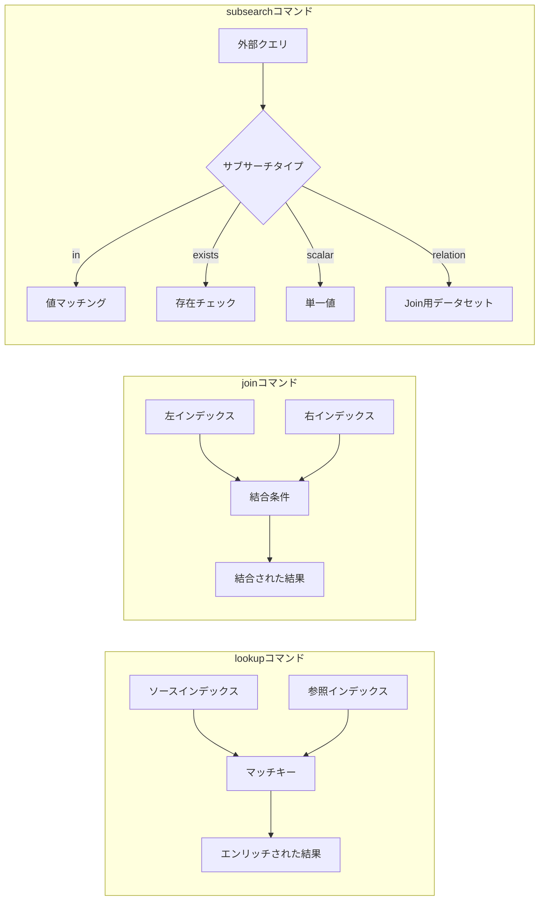

# PPL Lookup、Join、Subsearchコマンド

## 概要

OpenSearch 3.0では、Apache Calcite統合による強力な新しいPPL（Piped Processing Language）コマンド—`lookup`、`join`、`subsearch`—が導入されました。これらのコマンドにより、オブザーバビリティやログ分析のユースケースにおいて、ログの相関分析、データエンリッチメント、動的フィルタリングが可能になります。

主なメリット:
- **ログエンリッチメント**: `lookup`を使用して参照データからコンテキストを追加
- **クロスインデックス相関**: `join`を使用して異なるインデックスのログを結合
- **動的フィルタリング**: `subsearch`を使用してサブクエリ結果に基づくフィルタリング
- **最適化された実行**: Apache Calciteによるクエリプランニングとフィルタプッシュダウン

## 詳細

### アーキテクチャ


### データフロー



### コンポーネント

| コンポーネント | 説明 |
|---------------|------|
| Apache Calcite | クエリプランニング用のSQL解析・最適化フレームワーク |
| RelBuilder | PPL ASTをCalcite RelNodeツリーに変換 |
| CalciteEnumerableIndexScan | フィルタプッシュダウン対応のOpenSearch固有スキャン演算子 |
| Linq4j | 実行可能なJavaコード生成用ブリッジフレームワーク |

### 設定

| 設定 | 説明 | デフォルト |
|------|------|-----------|
| `plugins.calcite.enabled` | PPL用Calciteエンジンを有効化 | `false` |

Calciteを有効化:
```json
PUT /_plugins/_query/settings
{
  "transient": {
    "plugins.calcite.enabled": true
  }
}
```

### コマンド

#### lookup
参照インデックスのデータでログをエンリッチします。

```sql
source=auth_logs | lookup user_info user_id | where status='failed'
```

#### join
結合条件でインデックス間のデータを相関させます。

```sql
source=auth_logs 
| join left=l right=r ON l.user_id = r.user_id app_logs 
| fields timestamp, user_id, action
```

#### subsearch
4種類のサブサーチ式:

| タイプ | 目的 | 構文 |
|--------|------|------|
| `in` | サブクエリ結果に値が存在するかチェック | `where field [not] in [source=...]` |
| `exists` | サブクエリが結果を返すかチェック | `where [not] exists [source=...]` |
| `scalar` | サブクエリから単一値を使用 | `where field = [source=... \| stats max(x)]` |
| `relation` | サブクエリをjoin用データセットとして使用 | `join on condition [source=...]` |

### 使用例

#### lookupでエンリッチ
```sql
source=auth_logs | lookup user_info user_id | where status='failed'
```

#### joinで相関
```sql
source=auth_logs 
| join left=l right=r ON l.user_id = r.user_id AND TIME_TO_SEC(TIMEDIFF(r.timestamp, l.timestamp)) <= 60 app_logs 
| fields timestamp, user_id, action, status
```

#### subsearchでフィルタ
```sql
source=auth_logs 
| where status='failed' AND exists [source=app_logs | where user_id=auth_logs.user_id AND action='login']
```

## 制限事項

- **実験的機能**: `plugins.calcite.enabled=true`が必要
- **メモリ使用量**: Join操作はデータをメモリにロード
- **分散Joinなし**: Joinはコーディネーターノードで実行

## 関連PR

| バージョン | PR | 説明 |
|-----------|-----|------|
| v3.0.0 | [SQL #3364](https://github.com/opensearch-project/sql/pull/3364) | CalciteでPPL joinコマンドを実装 |
| v3.0.0 | [SQL #3371](https://github.com/opensearch-project/sql/pull/3371) | PPL INサブクエリコマンドを実装 |
| v3.0.0 | [SQL #3378](https://github.com/opensearch-project/sql/pull/3378) | PPL relationサブクエリコマンドを実装 |
| v3.0.0 | [SQL #3388](https://github.com/opensearch-project/sql/pull/3388) | PPL existsサブクエリコマンドを実装 |
| v3.0.0 | [SQL #3392](https://github.com/opensearch-project/sql/pull/3392) | PPL scalarサブクエリコマンドを実装 |
| v3.0.0 | [SQL #3419](https://github.com/opensearch-project/sql/pull/3419) | lookupコマンドを実装 |

## 参考資料

- [Subsearchドキュメント](https://docs.opensearch.org/3.0/search-plugins/sql/ppl/subsearch/)
- [PPL設定](https://docs.opensearch.org/3.0/search-plugins/sql/settings/)
- [ブログ: PPLによる強化されたログ分析](https://opensearch.org/blog/enhanced-log-analysis-with-opensearch-ppl-introducing-lookup-join-and-subsearch/)
- [Issue #3356](https://github.com/opensearch-project/sql/issues/3356): Joinコマンド
- [Issue #3358](https://github.com/opensearch-project/sql/issues/3358): Lookupコマンド
- [Issue #3359](https://github.com/opensearch-project/sql/issues/3359): INサブクエリ

## 変更履歴

- **v3.0.0** (2025): Apache Calciteを活用したlookup、join、subsearchコマンドの初回リリース
