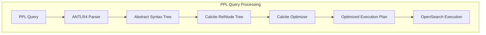
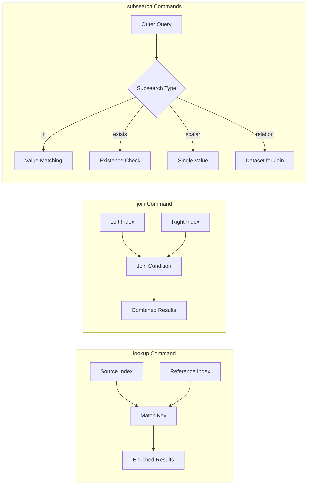

# PPL Lookup, Join, and Subsearch Commands

## Summary

OpenSearch 3.0 introduces powerful new PPL (Piped Processing Language) commands—`lookup`, `join`, and `subsearch`—backed by Apache Calcite integration. These commands enable log correlation, data enrichment, and dynamic filtering for observability and log analytics use cases.

Key benefits:
- **Log enrichment**: Add context from reference data using `lookup`
- **Cross-index correlation**: Combine logs from different indexes using `join`
- **Dynamic filtering**: Filter based on subquery results using `subsearch`
- **Optimized execution**: Apache Calcite provides query planning and filter pushdown

## Details

### Architecture



### Data Flow



### Components

| Component | Description |
|-----------|-------------|
| Apache Calcite | SQL parsing and optimization framework for query planning |
| RelBuilder | Converts PPL AST to Calcite RelNode tree |
| CalciteEnumerableIndexScan | OpenSearch-specific scan operator with filter pushdown |
| Linq4j | Bridge framework for generating executable Java code |

### Configuration

| Setting | Description | Default |
|---------|-------------|---------|
| `plugins.calcite.enabled` | Enable Calcite engine for PPL | `false` |

Enable Calcite with:
```json
PUT /_plugins/_query/settings
{
  "transient": {
    "plugins.calcite.enabled": true
  }
}
```

### Commands

#### lookup
Enriches logs with data from a reference index.

```sql
source=auth_logs | lookup user_info user_id | where status='failed'
```

#### join
Correlates data across indexes with join conditions.

```sql
source=auth_logs 
| join left=l right=r ON l.user_id = r.user_id app_logs 
| fields timestamp, user_id, action
```

#### subsearch
Four types of subsearch expressions:

| Type | Purpose | Syntax |
|------|---------|--------|
| `in` | Check if value exists in subquery results | `where field [not] in [source=...]` |
| `exists` | Check if subquery returns any results | `where [not] exists [source=...]` |
| `scalar` | Use single value from subquery | `where field = [source=... \| stats max(x)]` |
| `relation` | Use subquery as dataset in join | `join on condition [source=...]` |

### Usage Examples

#### Enrich with lookup
```sql
source=auth_logs | lookup user_info user_id | where status='failed'
```

#### Correlate with join
```sql
source=auth_logs 
| join left=l right=r ON l.user_id = r.user_id AND TIME_TO_SEC(TIMEDIFF(r.timestamp, l.timestamp)) <= 60 app_logs 
| fields timestamp, user_id, action, status
```

#### Filter with subsearch
```sql
source=auth_logs 
| where status='failed' AND exists [source=app_logs | where user_id=auth_logs.user_id AND action='login']
```

## Limitations

- **Experimental feature**: Requires `plugins.calcite.enabled=true`
- **Memory usage**: Join operations load data into memory
- **No distributed joins**: Joins execute on coordinator node

## Related PRs

| Version | PR | Description |
|---------|-----|-------------|
| v3.0.0 | [SQL #3364](https://github.com/opensearch-project/sql/pull/3364) | Implement PPL join command with Calcite |
| v3.0.0 | [SQL #3371](https://github.com/opensearch-project/sql/pull/3371) | Implement PPL IN subquery command |
| v3.0.0 | [SQL #3378](https://github.com/opensearch-project/sql/pull/3378) | Implement PPL relation subquery command |
| v3.0.0 | [SQL #3388](https://github.com/opensearch-project/sql/pull/3388) | Implement PPL exists subquery command |
| v3.0.0 | [SQL #3392](https://github.com/opensearch-project/sql/pull/3392) | Implement PPL scalar subquery command |
| v3.0.0 | [SQL #3419](https://github.com/opensearch-project/sql/pull/3419) | Implement lookup command |

## References

- [Subsearch documentation](https://docs.opensearch.org/3.0/search-plugins/sql/ppl/subsearch/)
- [PPL settings](https://docs.opensearch.org/3.0/search-plugins/sql/settings/)
- [Blog: Enhanced log analysis with PPL](https://opensearch.org/blog/enhanced-log-analysis-with-opensearch-ppl-introducing-lookup-join-and-subsearch/)
- [Issue #3356](https://github.com/opensearch-project/sql/issues/3356): Join command
- [Issue #3358](https://github.com/opensearch-project/sql/issues/3358): Lookup command
- [Issue #3359](https://github.com/opensearch-project/sql/issues/3359): IN subquery

## Change History

- **v3.0.0** (2025): Initial release with lookup, join, and subsearch commands powered by Apache Calcite
