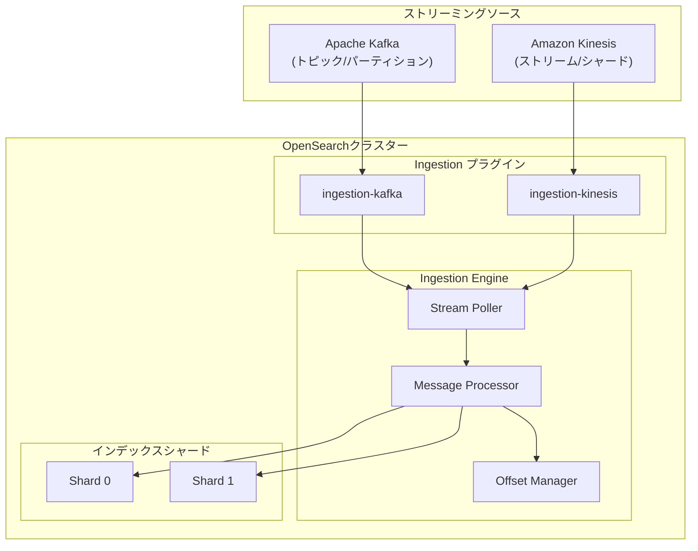
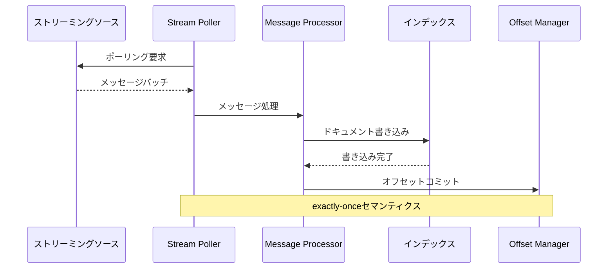

# Pull-based Ingestion (Kafka/Kinesis)

## 概要

Pull-based Ingestionは、OpenSearch v3.0.0で導入された実験的機能で、Apache KafkaやAmazon Kinesisなどのストリーミングソースからデータを直接取得できます。従来のREST APIによるプッシュ型インジェストとは異なり、OpenSearchがデータフローを制御し、exactly-onceセマンティクスとネイティブなバックプレッシャー処理を提供します。

主なメリット:
- **exactly-onceセマンティクス**: 重複なくデータを正確に1回だけ取り込み
- **バックプレッシャー処理**: トラフィックスパイク時のサーバー過負荷を防止
- **データパイプラインの安定性**: ストリーミングソースからの直接取得による信頼性向上
- **柔軟なオフセット管理**: タイムスタンプやオフセットによる開始位置指定

## 詳細

### アーキテクチャ



### データフロー



### コンポーネント

| コンポーネント | 説明 |
|--------------|------|
| `ingestion-kafka` | Kafkaトピックからデータを取得するプラグイン |
| `ingestion-kinesis` | Kinesisストリームからデータを取得するプラグイン |
| `IngestionEngine` | ストリーミングソースからデータをプルする新しいエンジン |
| `Stream Poller` | ストリーミングソースからメッセージをポーリング |
| `Message Processor` | メッセージを解析しドキュメントとして処理 |
| `Offset Manager` | 処理済みオフセットを追跡・管理 |

### 設定パラメータ

| パラメータ | 説明 |
|-----------|------|
| `ingestion_source.type` | ストリーミングソースタイプ (`kafka` または `kinesis`) |
| `ingestion_source.pointer.init.reset` | 開始位置 (`earliest`, `latest`, `rewind_by_offset`, `rewind_by_timestamp`, `none`) |
| `ingestion_source.pointer.init.reset.value` | `rewind_by_offset`/`rewind_by_timestamp`用の値 |
| `ingestion_source.error_strategy` | エラー処理戦略 (`DROP` または `BLOCK`) |
| `ingestion_source.max_batch_size` | ポーリングあたりの最大レコード数 |
| `ingestion_source.poll.timeout` | ポーリングのタイムアウト |
| `ingestion_source.num_processor_threads` | 処理スレッド数 (デフォルト: 1) |

### 使用例

#### Kafkaからのインジェスト

```json
PUT /my-index
{
  "settings": {
    "ingestion_source": {
      "type": "kafka",
      "pointer.init.reset": "earliest",
      "param": {
        "topic": "my-topic",
        "bootstrap_servers": "localhost:9092"
      }
    },
    "index.number_of_shards": 1,
    "index.number_of_replicas": 1,
    "index": {
      "replication.type": "SEGMENT"
    }
  }
}
```

#### Kinesisからのインジェスト

```json
PUT /my-index
{
  "settings": {
    "ingestion_source": {
      "type": "kinesis",
      "pointer.init.reset": "latest",
      "param": {
        "stream": "my-stream",
        "region": "us-east-1",
        "access_key": "<access_key>",
        "secret_key": "<secret_key>"
      }
    },
    "index.number_of_shards": 1,
    "index": {
      "replication.type": "SEGMENT"
    }
  }
}
```

#### メッセージフォーマット

```json
{"_id":"1", "_version":"1", "_source":{"name": "alice", "age": 30}, "_op_type": "index"}
{"_id":"2", "_version":"2", "_source":{"name": "bob", "age": 25}, "_op_type": "delete"}
```

#### インジェスト管理API

```bash
# インジェストの一時停止
POST /my-index/ingestion/_pause

# インジェストの再開
POST /my-index/ingestion/_resume

# インジェスト状態の取得
GET /my-index/ingestion/_state
```

### 前提条件

- `ingestion-kafka` または `ingestion-kinesis` プラグインのインストール
- セグメントレプリケーションとリモートバックドストレージの有効化
- インデックス作成時にpull-based ingestionを設定（既存インデックスの変換は不可）

### 制限事項

- **実験的機能**: 本番環境での使用は推奨されません
- **ドキュメントレプリケーション非対応**: セグメントレプリケーションが必須
- **REST API無効化**: pull-based ingestion有効時は従来のREST APIによるインジェストが無効
- **シャードとパーティションのマッピング**: インデックスシャード数はストリームパーティション数以上が必要
- **既存インデックスの変換不可**: インデックス作成時のみ設定可能

## 参考資料

### Pull Requests
- [#16958](https://github.com/opensearch-project/OpenSearch/pull/16958) - Pull-based ingestionエンジン、API、Kafkaプラグインの導入
- [#17354](https://github.com/opensearch-project/OpenSearch/pull/17354) - オフセット管理、オフセット/タイムスタンプによる巻き戻しサポート
- [#17427](https://github.com/opensearch-project/OpenSearch/pull/17427) - エラー処理戦略 (DROP/BLOCK) の追加
- [#17615](https://github.com/opensearch-project/OpenSearch/pull/17615) - Kinesisプラグインサポートの追加
- [#17631](https://github.com/opensearch-project/OpenSearch/pull/17631) - インジェスト管理API (Pause/Resume/GetState) の導入

### ドキュメント
- [Pull-based ingestion](https://docs.opensearch.org/3.0/api-reference/document-apis/pull-based-ingestion/)
- [Pull-based ingestion management](https://docs.opensearch.org/3.0/api-reference/document-apis/pull-based-ingestion-management/)

### 関連Issue
- [#16495](https://github.com/opensearch-project/OpenSearch/issues/16495) - Pull-based ingestion RFC
- [#16927](https://github.com/opensearch-project/OpenSearch/issues/16927), [#16928](https://github.com/opensearch-project/OpenSearch/issues/16928), [#16929](https://github.com/opensearch-project/OpenSearch/issues/16929) - 関連Issue
- [#16930](https://github.com/opensearch-project/OpenSearch/issues/16930) - META Issue
- [#17318](https://github.com/opensearch-project/OpenSearch/issues/17318) - オフセット巻き戻し関連Issue
- [#17085](https://github.com/opensearch-project/OpenSearch/issues/17085) - エラー処理関連Issue
- [#17442](https://github.com/opensearch-project/OpenSearch/issues/17442) - インジェスト管理API関連Issue

## 変更履歴

| バージョン | 変更内容 |
|-----------|---------|
| v3.0.0 | 初回リリース - Kafka/Kinesisサポート、オフセット管理、エラー処理戦略、管理API |
