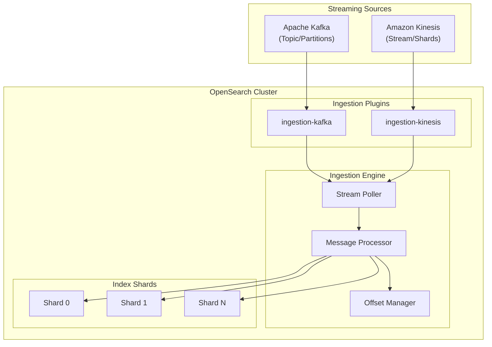
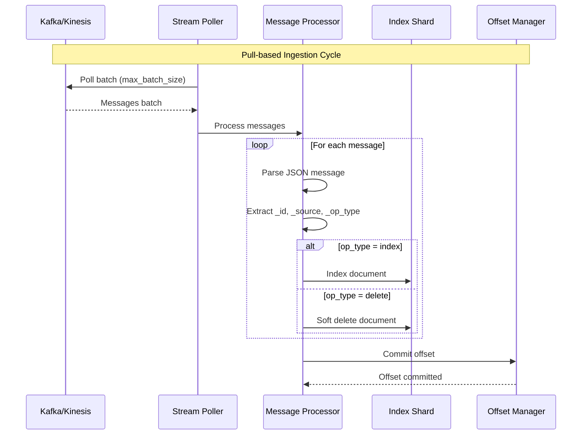

# Pull-based Ingestion (Kafka/Kinesis)

## Summary

Pull-based Ingestion is an experimental feature in OpenSearch v3.0.0 that enables OpenSearch to fetch data directly from streaming sources like Apache Kafka and Amazon Kinesis. Unlike traditional push-based ingestion via REST APIs, this approach allows OpenSearch to control data flow, providing exactly-once ingestion semantics and native backpressure handling.

Key benefits:
- **Backpressure handling**: OpenSearch controls ingestion rate, preventing server overload during traffic spikes
- **Exactly-once semantics**: Ensures data consistency through offset management
- **Resilient pipelines**: Native integration with streaming platforms for improved data pipeline stability
- **Flexible positioning**: Start ingestion from earliest, latest, specific offset, or timestamp

## Details

### Architecture



### Data Flow



### Components

| Component | Description |
|-----------|-------------|
| `ingestion-kafka` Plugin | Kafka consumer implementation for pull-based ingestion |
| `ingestion-kinesis` Plugin | Kinesis consumer implementation for pull-based ingestion |
| Stream Poller | Polls data from streaming source at configurable intervals |
| Message Processor | Parses and processes messages into OpenSearch documents |
| Offset Manager | Tracks and commits stream positions for exactly-once semantics |

### Configuration Parameters

| Parameter | Description | Default |
|-----------|-------------|---------|
| `type` | Streaming source type (`kafka` or `kinesis`) | Required |
| `pointer.init.reset` | Starting position (`earliest`, `latest`, `rewind_by_offset`, `rewind_by_timestamp`, `none`) | Optional |
| `pointer.init.reset.value` | Offset or timestamp value for rewind options | Required for rewind |
| `error_strategy` | Error handling (`DROP` or `BLOCK`) | `DROP` |
| `max_batch_size` | Maximum records per poll | Optional |
| `poll.timeout` | Maximum wait time per poll | Optional |
| `num_processor_threads` | Processing threads | `1` |

### Kafka-specific Parameters

| Parameter | Description |
|-----------|-------------|
| `param.topic` | Kafka topic to consume from |
| `param.bootstrap_servers` | Kafka server addresses |

### Kinesis-specific Parameters

| Parameter | Description |
|-----------|-------------|
| `param.stream` | Kinesis stream name |
| `param.region` | AWS Region |
| `param.access_key` | AWS access key |
| `param.secret_key` | AWS secret key |
| `param.endpoint_override` | Optional endpoint override |

### Usage Examples

#### Create Index with Kafka Ingestion

```json
PUT /my-index
{
  "settings": {
    "ingestion_source": {
      "type": "kafka",
      "pointer.init.reset": "earliest",
      "param": {
        "topic": "my-topic",
        "bootstrap_servers": "localhost:9092"
      }
    },
    "index.number_of_shards": 3,
    "index.number_of_replicas": 1,
    "index.replication.type": "SEGMENT"
  },
  "mappings": {
    "properties": {
      "title": { "type": "text" },
      "timestamp": { "type": "date" }
    }
  }
}
```

#### Create Index with Kinesis Ingestion

```json
PUT /my-index
{
  "settings": {
    "ingestion_source": {
      "type": "kinesis",
      "pointer.init.reset": "latest",
      "param": {
        "stream": "my-stream",
        "region": "us-east-1",
        "access_key": "<access_key>",
        "secret_key": "<secret_key>"
      }
    },
    "index.number_of_shards": 2,
    "index.replication.type": "SEGMENT"
  }
}
```

#### Message Format

Messages in the streaming source must follow this format:

```json
{"_id":"1", "_source":{"title": "Document 1"}, "_op_type": "index"}
{"_id":"2", "_version":"2", "_source":{"title": "Updated"}, "_op_type": "index"}
{"_id":"3", "_op_type": "delete"}
```

#### Pause Ingestion

```
POST /my-index/ingestion/_pause
```

#### Resume Ingestion

```
POST /my-index/ingestion/_resume
```

#### Get Ingestion State

```
GET /my-index/ingestion/_state
```

Response:
```json
{
  "ingestion_state": {
    "my-index": [
      {
        "shard": 0,
        "poller_state": "POLLING",
        "error_policy": "DROP",
        "poller_paused": false
      }
    ]
  }
}
```

#### Update Error Policy

```json
PUT /my-index/_settings
{
  "index.ingestion_source.error_strategy": "BLOCK"
}
```

### Stream Partitioning

- OpenSearch shards map one-to-one to stream partitions
- Number of index shards must be ≥ number of stream partitions
- Extra shards beyond partition count remain empty
- Documents must be sent to the same partition for successful updates

## Limitations

- **Experimental**: Not recommended for production use
- **Segment replication required**: Must use segment replication with remote-backed storage
- **Index creation only**: Cannot convert existing push-based indexes
- **REST API disabled**: Traditional REST ingestion is disabled for pull-based indexes
- **Plugin required**: Requires `ingestion-kafka` or `ingestion-kinesis` plugin

## Related PRs

| Version | PR | Description |
|---------|-----|-------------|
| v3.0.0 | [#16958](https://github.com/opensearch-project/OpenSearch/pull/16958) | Introduce pull-based ingestion engine, APIs, and Kafka plugin |
| v3.0.0 | [#17354](https://github.com/opensearch-project/OpenSearch/pull/17354) | Offset management, support rewind by offset or timestamp |
| v3.0.0 | [#17427](https://github.com/opensearch-project/OpenSearch/pull/17427) | Add error handling strategy (DROP/BLOCK) |
| v3.0.0 | [#17615](https://github.com/opensearch-project/OpenSearch/pull/17615) | Add Kinesis plugin support |
| v3.0.0 | [#17631](https://github.com/opensearch-project/OpenSearch/pull/17631) | Introduce ingestion management APIs (Pause/Resume/GetState) |

## Related Issues

- [#16495](https://github.com/opensearch-project/OpenSearch/issues/16495): RFC for pull-based ingestion
- [#16927](https://github.com/opensearch-project/OpenSearch/issues/16927): Ingestion source API
- [#16928](https://github.com/opensearch-project/OpenSearch/issues/16928): Kafka plugin
- [#16929](https://github.com/opensearch-project/OpenSearch/issues/16929): Ingestion engine
- [#16930](https://github.com/opensearch-project/OpenSearch/issues/16930): META issue for pull-based ingestion
- [#17085](https://github.com/opensearch-project/OpenSearch/issues/17085): Error handling support
- [#17318](https://github.com/opensearch-project/OpenSearch/issues/17318): Offset rewind support
- [#17442](https://github.com/opensearch-project/OpenSearch/issues/17442): Ingestion management APIs

## References

- [Pull-based Ingestion API](https://docs.opensearch.org/3.0/api-reference/document-apis/pull-based-ingestion/)
- [Pull-based Ingestion Management API](https://docs.opensearch.org/3.0/api-reference/document-apis/pull-based-ingestion-management/)
- [Additional Plugins](https://docs.opensearch.org/3.0/install-and-configure/additional-plugins/index/)
- [Segment Replication](https://docs.opensearch.org/3.0/tuning-your-cluster/availability-and-recovery/segment-replication/index/)
- [Remote-backed Storage](https://docs.opensearch.org/3.0/tuning-your-cluster/availability-and-recovery/remote-store/index/)

## Change History

- **v3.0.0** (2026): Initial experimental release with Kafka and Kinesis support, offset management, error handling strategies, and ingestion management APIs
