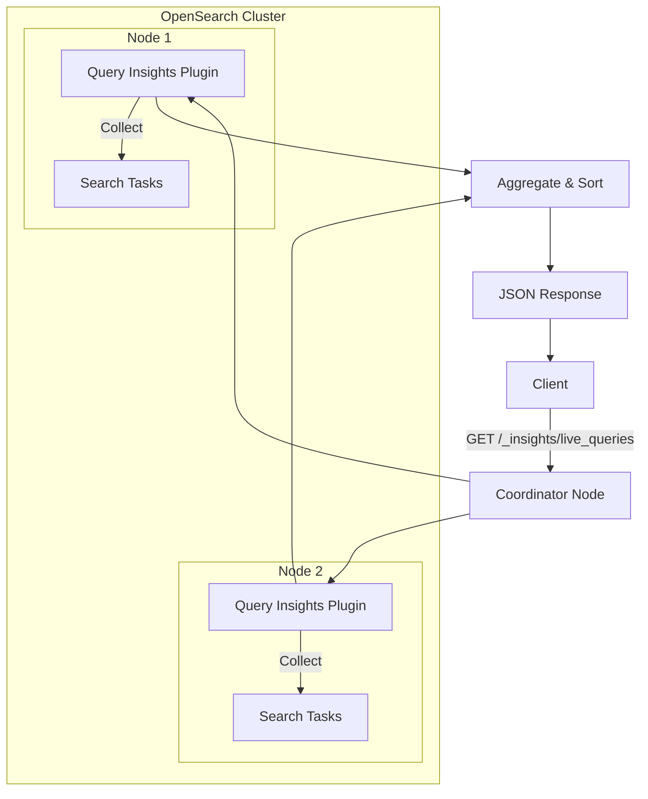
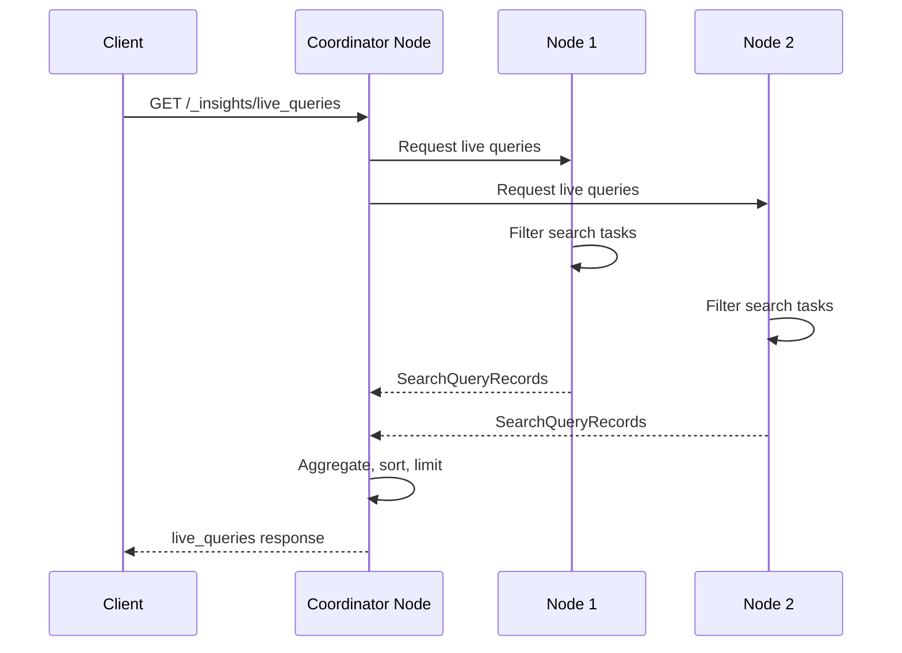

# Query Insights Live Queries API

## Summary

The Live Queries API, introduced in OpenSearch 3.0, provides real-time visibility into search queries currently executing within your cluster. This feature enables immediate troubleshooting of performance issues by allowing you to identify long-running or resource-intensive queries as they happen.

Key benefits:
- **Real-time monitoring**: View currently executing search queries across the cluster
- **Resource tracking**: Monitor CPU, memory, and latency metrics for live queries
- **Flexible filtering**: Filter by node, sort by metric, and limit results
- **Immediate troubleshooting**: Identify problematic queries before they cause widespread issues

## Details

### Architecture



### Data Flow



### Components

| Component | Description |
|-----------|-------------|
| LiveQueriesTransportAction | Handles transport-level communication for live queries requests |
| SearchQueryRecord | Data structure representing a live query with metrics |
| Query Insights Plugin | Core plugin providing query monitoring capabilities |
| Task Manager | OpenSearch component tracking active search tasks |

### API Endpoint

```
GET /_insights/live_queries
```

### Query Parameters

| Parameter | Type | Description | Default |
|-----------|------|-------------|---------|
| `verbose` | Boolean | Include detailed query source in output | `true` |
| `nodeId` | String | Comma-separated list of node IDs to filter | All nodes |
| `sort` | String | Metric to sort by: `latency`, `cpu`, `memory` | `latency` |
| `size` | Integer | Number of query records to return | `100` |

### Response Fields

| Field | Type | Description |
|-------|------|-------------|
| `timestamp` | Long | Query start time (ms since epoch) |
| `id` | String | Unique search task ID |
| `description` | String | Query details including indexes, search type, source |
| `node_id` | String | Coordinator node ID |
| `measurements.latency` | Object | Current running time (nanoseconds) |
| `measurements.cpu` | Object | CPU time consumed (nanoseconds) |
| `measurements.memory` | Object | Heap memory used (bytes) |

### Usage Examples

**Basic request:**
```bash
GET /_insights/live_queries
```

**Filter by node and sort by CPU:**
```bash
GET /_insights/live_queries?nodeId=node-1,node-2&sort=cpu&size=10
```

**Example response:**
```json
{
  "live_queries": [
    {
      "timestamp": 1745359226777,
      "id": "troGHNGUShqDj3wK_K5ZIw:512",
      "description": "indices[my-index-*], search_type[QUERY_THEN_FETCH], source[{\"size\":20,\"query\":{\"term\":{\"user.id\":{\"value\":\"userId\"}}}}]",
      "node_id": "troGHNGUShqDj3wK_K5ZIw",
      "measurements": {
        "latency": {"number": 13959364458, "count": 1, "aggregationType": "NONE"},
        "memory": {"number": 3104, "count": 1, "aggregationType": "NONE"},
        "cpu": {"number": 405000, "count": 1, "aggregationType": "NONE"}
      }
    }
  ]
}
```

## Limitations

- **Coordinator node metrics only**: Resource usage reflects coordinator node, not data nodes
- **Point-in-time snapshot**: Results represent queries at the moment of API call
- **No query cancellation**: API is read-only; use Task Management API to cancel queries
- **Requires Query Insights plugin**: Must install `query-insights` plugin

## Related PRs

| PR | Repository | Description |
|----|------------|-------------|
| [#295](https://github.com/opensearch-project/query-insights/pull/295) | query-insights | Initial Live Queries API implementation |
| [#300](https://github.com/opensearch-project/query-insights/pull/300) | query-insights | Verbose parameter for dashboard optimization |
| [#420](https://github.com/opensearch-project/query-insights/pull/420) | query-insights | Filter out shard-level tasks |
| [#414](https://github.com/opensearch-project/query-insights/pull/414) | query-insights | Fix size parameter validation |

## References

- [Live Queries Documentation](https://docs.opensearch.org/3.0/observing-your-data/query-insights/live-queries/)
- [Query Insights Overview](https://docs.opensearch.org/3.0/observing-your-data/query-insights/index/)
- [Blog: Real-time query monitoring with live queries in OpenSearch 3.0](https://opensearch.org/blog/real-time-query-monitoring-with-live-queries-in-opensearch-3-0/)

## Change History

- **v3.0.0** (2026): Initial release of Live Queries API
