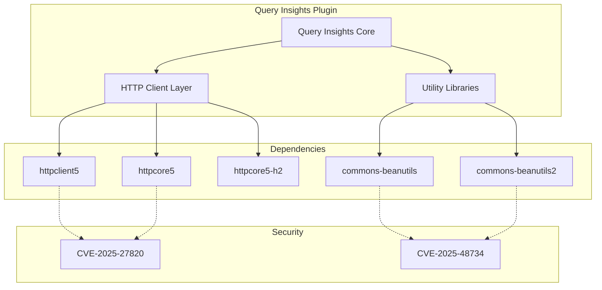

---
tags:
  - performance
  - search
  - security
---

# Query Insights Plugin Dependencies

## Summary

The Query Insights plugin manages its dependencies through Gradle build configuration to ensure security and compatibility. This includes proactive updates to address CVEs in transitive dependencies like Apache HttpClient and Apache Commons BeanUtils.

## Details

### Architecture



### Dependency Management Strategy

The plugin uses Gradle's `resolutionStrategy` to enforce specific versions of transitive dependencies:

```groovy
configurations.all {
  resolutionStrategy {
    force("org.apache.httpcomponents.client5:httpclient5:5.4.4")
    force("org.apache.httpcomponents:httpcore:5.3.4")
    force("org.apache.httpcomponents.core5:httpcore5-h2:5.3.4")
    force("commons-beanutils:commons-beanutils:1.11.0")
    force("org.apache.commons:commons-beanutils2:2.0.0-M2")

    eachDependency { DependencyResolveDetails details ->
      // Version enforcement rules
    }
  }
}
```

### Components

| Component | Description |
|-----------|-------------|
| httpclient5 | Apache HTTP client for making HTTP requests |
| httpcore5 | Core HTTP transport components |
| httpcore5-h2 | HTTP/2 support for httpcore5 |
| commons-beanutils | JavaBeans utility library |
| commons-beanutils2 | Next generation BeanUtils library |

### Security Vulnerabilities Addressed

| CVE | Severity | Component | Description |
|-----|----------|-----------|-------------|
| CVE-2025-27820 | High (7.5) | httpclient5 | PSL validation bug disables domain checks |
| CVE-2025-48734 | High (8.8) | commons-beanutils | Improper access control via enum classloader |

## Limitations

- Dependency versions must be kept in sync with OpenSearch core requirements
- Transitive dependency conflicts may require additional resolution rules

## Change History

- **v3.3.0**: Fixed CVE-2025-27820 (httpclient5) and CVE-2025-48734 (commons-beanutils)

## References

### Documentation
- [CVE-2025-27820](https://github.com/advisories/GHSA-73m2-qfq3-56cx): Apache HttpClient domain check bypass
- [CVE-2025-48734](https://github.com/advisories/GHSA-wxr5-93ph-8wr9): Apache Commons BeanUtils improper access control
- [Query Insights Plugin](https://github.com/opensearch-project/query-insights): GitHub repository

### Pull Requests
| Version | PR | Description | Related Issue |
|---------|-----|-------------|---------------|
| v3.3.0 | [#371](https://github.com/opensearch-project/query-insights/pull/371) | CVE-2025-27820 and CVE-2025-48734 fix |   |
| v3.3.0 | [#375](https://github.com/opensearch-project/query-insights/pull/375) | Backport to 3.1 branch |   |
