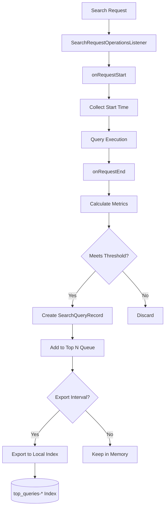

---
tags:
  - query-insights
---
# Query Insights

## Summary

Query Insights is an OpenSearch plugin that provides comprehensive monitoring and analysis capabilities for search queries. It enables cluster administrators to identify slow or resource-intensive queries, understand query performance patterns, and optimize search operations. The plugin collects performance metrics during query execution with minimal overhead and provides APIs for accessing historical and real-time query data.

## Details

### Architecture

```mermaid
graph TB
    subgraph "OpenSearch Cluster"
        subgraph "Query Insights Plugin"
            A[Search Request] --> B[Query Listener]
            B --> C{Profile Query?}
            C -->|Yes| D[Skip]
            C -->|No| E[Collectors]
            
            E --> F[Latency Collector]
            E --> G[CPU Collector]
            E --> H[Memory Collector]
            
            F --> I[Processors]
            G --> I
            H --> I
            
            I --> J[Top N Processor]
            J --> K[Exporters]
            
            K --> L[Local Index Exporter]
            L --> M[(top_queries-* Index)]
            
            N[Task Manager] --> O[Live Queries]
        end
        
        subgraph "APIs"
            P[/_insights/top_queries]
            Q[/_insights/live_queries]
            R[/_insights/health]
        end
        
        J --> P
        O --> Q
    end
```

### Data Flow



### Components

| Component | Description |
|-----------|-------------|
| `QueryInsightsPlugin` | Main plugin entry point, registers listeners and services |
| `QueryInsightsService` | Core service managing collectors, processors, and exporters |
| `SearchQueryRecord` | Data model representing a captured query with metrics |
| `TopQueriesService` | Manages Top N queries collection and retrieval |
| `QueryInsightsExporter` | Exports query records to local index |
| `QueryInsightsIndexTemplate` | Manages default index template for local indexes |
| `LiveQueriesAction` | Transport action for fetching in-flight queries |

### Configuration

| Setting | Description | Default |
|---------|-------------|---------|
| `search.insights.top_queries.latency.enabled` | Enable latency-based Top N queries | `false` |
| `search.insights.top_queries.latency.top_n_size` | Number of top queries to track | `10` |
| `search.insights.top_queries.latency.window_size` | Time window for collection | `1m` |
| `search.insights.top_queries.cpu.enabled` | Enable CPU-based Top N queries | `false` |
| `search.insights.top_queries.cpu.top_n_size` | Number of top queries to track | `10` |
| `search.insights.top_queries.cpu.window_size` | Time window for collection | `1m` |
| `search.insights.top_queries.memory.enabled` | Enable memory-based Top N queries | `false` |
| `search.insights.top_queries.memory.top_n_size` | Number of top queries to track | `10` |
| `search.insights.top_queries.memory.window_size` | Time window for collection | `1m` |
| `search.insights.top_queries.grouping.group_by` | Group queries by: `none`, `similarity` (v3.1.0+) | `none` |
| `search.insights.top_queries.grouping.max_groups_excluding_topn` | Maximum groups to track excluding top N (v3.1.0+) | `100` |
| `search.insights.top_queries.grouping.attributes.field_name` | Include field names in query structure for grouping | `true` |
| `search.insights.top_queries.grouping.attributes.field_type` | Include field types in query structure for grouping | `true` |
| `search.insights.top_queries.excluded_indices` | Indices to exclude from insights collection (v3.1.0+) | `[]` |
| `search.insights.top_queries.exporter.type` | Exporter type: `none`, `local_index` | `none` |
| `search.insights.top_queries.exporter.template_priority` | Index template priority | `1847` |
| `search.insights.top_queries.exporter.delete_after_days` | Days to retain exported data | `7` |
| `search.insights.top_queries.max_source_length` | Maximum source string length in characters before truncation (0 = empty source, v3.5.0+) | `524288` |

### APIs

#### Top N Queries API

Retrieve the most resource-intensive queries:

```bash
GET /_insights/top_queries
GET /_insights/top_queries?type=latency
GET /_insights/top_queries?type=cpu
GET /_insights/top_queries?type=memory
GET /_insights/top_queries?verbose=false
GET /_insights/top_queries?from=2025-01-01T00:00:00.000Z&to=2025-01-02T00:00:00.000Z
```

#### Live Queries API

Monitor currently executing queries:

```bash
GET /_insights/live_queries
GET /_insights/live_queries?nodeId=node1,node2
GET /_insights/live_queries?sort=cpu
GET /_insights/live_queries?size=10
GET /_insights/live_queries?verbose=false
```

#### Health API

Check plugin health status:

```bash
GET /_insights/health
```

### Usage Examples

**Enable Top N queries by latency:**
```bash
PUT _cluster/settings
{
  "persistent": {
    "search.insights.top_queries.latency.enabled": true,
    "search.insights.top_queries.latency.top_n_size": 10,
    "search.insights.top_queries.latency.window_size": "1m"
  }
}
```

**Enable local index export:**
```bash
PUT _cluster/settings
{
  "persistent": {
    "search.insights.top_queries.exporter.type": "local_index"
  }
}
```

**Query historical data:**
```bash
GET /_insights/top_queries?from=2025-01-01T00:00:00.000Z&to=2025-01-02T00:00:00.000Z
```

**Monitor live queries:**
```bash
GET /_insights/live_queries?sort=latency&size=5
```

## Limitations

- Query Insights adds minimal overhead but should be monitored in high-throughput environments
- Live Queries API returns coordinator node resource usage only
- Profile queries are automatically excluded from Top N collection
- Local index export requires additional storage capacity

## Change History

- **v3.5.0**: Added user attribution for top N queries with `username` and `user_roles` fields capturing who ran each query; added dedicated settings API endpoints (`GET/PUT /_insights/settings`) for secure Dashboard configuration without requiring broad cluster settings permissions; optimized query storage by storing source field as string (`SourceString` wrapper class) instead of `SearchSourceBuilder` object in local index — resolves field explosion (`IllegalArgumentException: Limit of total fields [1000]`) and depth limit (`MapperParsingException: depth exceeded [20]`) errors caused by dynamic mapping on deeply nested query sources, with up to 58% memory savings for average queries; added `search.insights.top_queries.max_source_length` setting (default: 524288 chars) to truncate long source strings with `source_truncated` boolean attribute and `TOP_N_QUERIES_SOURCE_TRUNCATION` operational metric; `SearchSourceBuilder` now kept as private field in `SearchQueryRecord` for in-memory categorization only, with `SOURCE` attribute set asynchronously in `TopQueriesService.addToTopNStore()`; version-aware serialization in `Attribute` class handles mixed-version clusters during rolling upgrades (converts between `SourceString` and `SearchSourceBuilder` based on stream version); `LocalIndexExporter` retries bulk with `useObjectSource=true` on `MapperException` for backward compatibility with existing indices; delayed user info extraction until after Top N filtering for performance; added missing mapping fields with enum-based validation tests; removed index template dependency in favor of explicit index mappings; retained local indices on exporter type change with new `LocalIndexLifecycleManager`; added `integTestRemote` Gradle target and `integTest` script for multi-node Jenkins testing; improved Cypress test pipeline with better dashboards readiness checks; fixed installation documentation
- **v3.4.0**: Added version-aware settings support to Query Insights Dashboards, enabling dynamic feature detection based on connected cluster version - Live Queries tab only shown for v3.1.0+, WLM features only enabled for v3.3.0+; added new `RouteService` class and `version-utils.ts` for version comparison with caching; added `/api/cluster/version` server endpoint; removed deprecated `/api/cat_plugins` endpoint; added comprehensive multi-node integration tests (`QueryInsightsClusterIT`) with 6 test methods for data collection, aggregation, and consistency validation; added `HealthStatsRestIT` for health stats REST API testing; fixed flaky tests by adding settings propagation delays and increasing window sizes from 1m to 5m; added new test helper methods (`getNodeClient`, `getClusterNodeCount`, `waitForExpectedNodes`); updated CI to use macOS 15 runner; excluded multi-node tests from security integration tests due to Java 21 SSL certificate limitations; **Bug fixes**: excluded internal `top_queries-*` indices from resource tracking by moving filtering logic to `QueryInsightsListener.skipSearchRequest()` method; **Dashboards**: fixed MDS (Multiple Data Sources) selector visibility on Workload Management pages (WLMMain, WLMDetails, WLMCreate) when `home:useNewHomePage` setting is enabled by removing `PageHeader` wrapper and directly rendering `WLMDataSourceMenu` component; fixed MDS support in server-side WLM routes by adding `WlmPlugin` custom client and `dataSourceId` query parameter support to all WLM routes; removed "Open in search comparison" button from Query Details and Query Group Details pages (was routing to wrong destination); fixed Jest test failures caused by Monaco editor ES module imports by adding mocks and updating Jest configuration
- **v3.3.0**: Bug fixes for query ID matching (changed from matchQuery to termQuery with keyword field mapping); fixed Live Queries API to filter out shard-level tasks; added time range validation (from < to); fixed positive size parameter validation; fixed flaky test by clearing stale queue records when disabling metrics; **Dashboards**: fixed Group By selector showing "None" after refresh by correcting settings path; fixed retrieveQueryById to explicitly match by ID; fixed indices filter, Query Count display for non-grouped queries, metric headers toggle, and date picker for relative ranges; CI/CD improvements for Cypress tests and branch cleanup workflows
- **v3.2.0**: Increased reader search limit to 500 and fixed sort by metric type; infrastructure updates including Maven endpoint migration, Gradle and Java version bumps; codecov configuration fixes; **Dashboards**: replaced Vega with react-vis for Live Queries visualizations to fix build errors; fixed search bar on Top N Queries page to properly filter by query ID; fixed table sorting with ID-based deduplication; added MDS support for Inflight Queries; changed default auto-refresh interval from 5s to 30s for better performance; multiple UI bug fixes including number formatting, validation messages, refresh button, and box plot updates; removed flaky Cypress tests for search bar
- **v3.1.0**: Added metric labels to historical data for filtering by metric type; consolidated grouping settings under `grouping.*` namespace; added `excluded_indices` setting to filter indices from insights; refactored local index reader to use asynchronous operations; added `is_cancelled` field to Live Queries API; new Live Queries Dashboard with real-time monitoring, auto-refresh, visual breakdowns, and query cancellation; new Workload Management Dashboard for query group management; fixed duplicate API requests on overview page; fixed node-level top queries request parameter serialization bug; improved Cypress test stability; fixed CI version mismatch; added multi-node cluster integration tests
- **v3.0.0**: Added Live Queries API, default index template, verbose parameter, profile query filtering, strict hash check; **Bug fixes (Batch 2)**: fixed default exporter settings that prevented data export to local index; changed local index replica count to 0 for green health on single-node domains; improved expired index deletion using ClusterStateRequest with index pattern (`top_queries-*`) instead of scanning all indices; reduced MAX_TOP_N_INDEX_READ_SIZE to 50 with descending latency sort; added comprehensive integration tests for exporter and reader components
- **v2.19.0**: **New Features**: Added `delete_after_days` setting (default: 7, range: 1-180) for automatic cleanup of expired local index data with daily scheduled job at 00:05 UTC; added usage counter for Top N queries with metric type and group-by type dimensions; added `type` attribute to search query records; added `query_group_hashcode` field to top queries response; added fetch top queries by ID API (`GET /_insights/top_queries?id={id}`); added field type cache stats to health API; **Enhancements**: Made default window size valid for all metric types; ensured all available metrics are always collected in top queries service; major refactoring of exporters and readers - consolidated exporter config from per-metric to service level, added index metadata for Query Insights indices, defined index mapping and sorting, implemented deduplication for multiple metrics; **Bug fixes**: Fixed parsing error in SearchQueryRecord; fixed `node_id` missing in local index; fixed null indexFieldMap bug; fixed toString on operational metrics; fixed grouping integration tests; **Dashboards**: Bootstrapped query-insights-dashboards repository with CI/CD infrastructure - Top N queries overview page, configuration page, query details page with drill-down analysis, historical data integration, query grouping visualization, Cypress e2e tests, MDS support, ESLint configuration, Mend security scanning; **Infrastructure**: Fixed 2.x GitHub checks and CI by adding eclipse dependency in build.gradle
- **v2.18.0**: Added Health Stats API for monitoring plugin health; added OpenTelemetry error metrics counters; added field name and type support for query shape grouping (defaults changed to `true`); added time range parameters for historical query retrieval; added cache eviction and cluster state listener for index field type mappings
- **v2.17.0**: Fixed listener startup when query metrics enabled; added query shape hash method; fixed CVE-2023-2976; improved integration test coverage for query grouping; added code hygiene checks (Spotless, Checkstyle); fixed snapshot publishing configuration
- **v2.16.0**: Initial release of Query Insights as standalone plugin repository; query categorization functionality moved from OpenSearch core to Query Insights plugin; removed `SearchQueryCategorizer`, `SearchQueryCategorizingVisitor`, `SearchQueryCounters`, `SearchQueryAggregationCategorizer`, and `QueryShapeVisitor` classes from core; removed `search.query.metrics.enabled` cluster setting from core; query metrics now configured through plugin settings with OpenTelemetry integration; this change reduces search path overhead by moving counter increments to occur after request completion; **Bug fixes**: added lower bound validation for `top_n_size` setting (must be between 1 and 100); fixed stream serialization for `TASK_RESOURCE_USAGES` attribute containing `TaskResourceInfo` objects by adding type-aware serialization methods (`writeValueTo`, `readAttributeValue`, `readAttributeMap`) in `Attribute` class; **Infrastructure**: bootstrapped plugin repository with maintainers; configured Mend (WhiteSource) for security vulnerability scanning; set up Gradle and CI workflows; added build script for artifact generation; added backport GitHub actions; added Maven publish workflow; added code hygiene checks (Spotless, Checkstyle); fixed Linux CI build failure for Node 20 upgrade; fixed NodeRequest class build error for 2.x compatibility; fixed zip file versioning; added 2.16 release notes
- **v2.12.0**: Initial release with Top N queries feature


## References

### Documentation
- [Query Insights Documentation](https://docs.opensearch.org/3.0/observing-your-data/query-insights/index/)
- [Top N Queries Documentation](https://docs.opensearch.org/3.0/observing-your-data/query-insights/top-n-queries/)
- [Live Queries Documentation](https://docs.opensearch.org/3.0/observing-your-data/query-insights/live-queries/)
- [Query Metrics Documentation](https://docs.opensearch.org/3.0/observing-your-data/query-insights/query-metrics/)
- [Query Insights Health Documentation](https://docs.opensearch.org/2.18/observing-your-data/query-insights/health/)
- [Query Insights Dashboards](https://docs.opensearch.org/3.0/observing-your-data/query-insights/query-insights-dashboard/)
- [GitHub Repository](https://github.com/opensearch-project/query-insights)

### Pull Requests
| Version | PR | Description | Related Issue |
|---------|-----|-------------|---------------|
| v3.5.0 | [#508](https://github.com/opensearch-project/query-insights/pull/508) | Add username and user roles to top n queries | - |
| v3.5.0 | [#527](https://github.com/opensearch-project/query-insights/pull/527) | Delay username and user roles extraction to after Top N Filtering | - |
| v3.5.0 | [#491](https://github.com/opensearch-project/query-insights/pull/491) | Add wrapper endpoints for query insights settings | [#517](https://github.com/opensearch-project/query-insights/issues/517) |
| v3.5.0 | [#483](https://github.com/opensearch-project/query-insights/pull/483) | Store source field as a string in local index | [#352](https://github.com/opensearch-project/query-insights/issues/352), [#411](https://github.com/opensearch-project/query-insights/issues/411) |
| v3.5.0 | [#484](https://github.com/opensearch-project/query-insights/pull/484) | Truncate source string in local index | [#352](https://github.com/opensearch-project/query-insights/issues/352), [#411](https://github.com/opensearch-project/query-insights/issues/411) |
| v3.5.0 | [#519](https://github.com/opensearch-project/query-insights/pull/519) | Better strategy to identify missing mapping fields | [#490](https://github.com/opensearch-project/query-insights/issues/490) |
| v3.5.0 | [#465](https://github.com/opensearch-project/query-insights/pull/465) | Retain local indices on exporter type change | [#453](https://github.com/opensearch-project/query-insights/issues/453) |
| v3.5.0 | [#479](https://github.com/opensearch-project/query-insights/pull/479) | Remove index template | - |
| v3.5.0 | [#530](https://github.com/opensearch-project/query-insights/pull/530) | Add integTestRemote target for remote cluster testing | [#526](https://github.com/opensearch-project/query-insights/issues/526) |
| v3.5.0 | [#533](https://github.com/opensearch-project/query-insights/pull/533) | Add integTest script for multinode run on Jenkins | [#526](https://github.com/opensearch-project/query-insights/issues/526) |
| v3.5.0 | [#512](https://github.com/opensearch-project/query-insights/pull/512) | Fix Installation Documentation | [#480](https://github.com/opensearch-project/query-insights/issues/480) |
| v3.5.0 | [#451](https://github.com/opensearch-project/query-insights-dashboards/pull/451) | More reliable check on dashboards readiness in cypress test pipelines | - |
| v3.3.0 | [#426](https://github.com/opensearch-project/query-insights/pull/426) | Change matchQuery to termQuery for query ID matching | [#425](https://github.com/opensearch-project/query-insights/issues/425) |
| v3.3.0 | [#420](https://github.com/opensearch-project/query-insights/pull/420) | Filter out shard-level tasks from live queries |   |
| v3.3.0 | [#413](https://github.com/opensearch-project/query-insights/pull/413) | Fix time range validation (from < to) |   |
| v3.3.0 | [#414](https://github.com/opensearch-project/query-insights/pull/414) | Fix positive size parameter validation |   |
| v3.3.0 | [#430](https://github.com/opensearch-project/query-insights/pull/430) | Fix flaky test by clearing stale queue records |   |
| v3.3.0 | [#435](https://github.com/opensearch-project/query-insights/pull/435) | Add unit tests for queue clearing |   |
| v3.3.0 | [#366](https://github.com/opensearch-project/query-insights-dashboards/pull/366) | Fix Group By selector on Configuration page |   |
| v3.3.0 | [#367](https://github.com/opensearch-project/query-insights-dashboards/pull/367) | Fix query ID matching in retrieveQueryById |   |
| v3.3.0 | [#338](https://github.com/opensearch-project/query-insights-dashboards/pull/338) | Fix filter and date picker bugs |   |
| v3.3.0 | [#329](https://github.com/opensearch-project/query-insights-dashboards/pull/329) | Cypress workflow fix |   |
| v3.3.0 | [#327](https://github.com/opensearch-project/query-insights-dashboards/pull/327) | Update delete-backport-branch workflow |   |
| v3.2.0 | [#381](https://github.com/opensearch-project/query-insights/pull/381) | Increase reader search limit to 500 and fix sort by metric type |   |
| v3.2.0 | [#392](https://github.com/opensearch-project/query-insights/pull/392) | Update Maven endpoint and bump Gradle/Java versions |   |
| v3.2.0 | [#393](https://github.com/opensearch-project/query-insights/pull/393) | Fix codecov configuration |   |
| v3.2.0 | [#394](https://github.com/opensearch-project/query-insights/pull/394) | Migrate to codecov v3 |   |
| v3.2.0 | [#395](https://github.com/opensearch-project/query-insights/pull/395) | Add release notes for 3.2.0 |   |
| v3.2.0 | [#217](https://github.com/opensearch-project/query-insights-dashboards/pull/217) | MDS support for Inflight Queries |   |
| v3.2.0 | [#304](https://github.com/opensearch-project/query-insights-dashboards/pull/304) | Updated default auto-refresh interval to 30s |   |
| v3.2.0 | [#243](https://github.com/opensearch-project/query-insights-dashboards/pull/243) | react-vis implementation for Live Queries Dashboards |   |
| v3.2.0 | [#247](https://github.com/opensearch-project/query-insights-dashboards/pull/247) | Revert renderApp to use default export |   |
| v3.2.0 | [#258](https://github.com/opensearch-project/query-insights-dashboards/pull/258) | Fix for UI bugs (number formatting, validation, refresh button) |   |
| v3.2.0 | [#267](https://github.com/opensearch-project/query-insights-dashboards/pull/267) | Search bar fix for Top N Queries page |   |
| v3.2.0 | [#285](https://github.com/opensearch-project/query-insights-dashboards/pull/285) | Fix top queries table sorting with correct id |   |
| v3.2.0 | [#306](https://github.com/opensearch-project/query-insights-dashboards/pull/306) | Removed search bar Cypress tests | [#8267](https://github.com/cypress-io/cypress/issues/8267) |
| v3.1.0 | [#326](https://github.com/opensearch-project/query-insights/pull/326) | Add metric labels to historical data | [#301](https://github.com/opensearch-project/query-insights/issues/301) |
| v3.1.0 | [#336](https://github.com/opensearch-project/query-insights/pull/336) | Consolidate grouping settings | [#136](https://github.com/opensearch-project/query-insights/issues/136) |
| v3.1.0 | [#308](https://github.com/opensearch-project/query-insights/pull/308) | Add setting to exclude certain indices | [#260](https://github.com/opensearch-project/query-insights/issues/260) |
| v3.1.0 | [#344](https://github.com/opensearch-project/query-insights/pull/344) | Asynchronous search operations in reader |   |
| v3.1.0 | [#355](https://github.com/opensearch-project/query-insights/pull/355) | Added isCancelled field in Live Queries API |   |
| v3.1.0 | [#199](https://github.com/opensearch-project/query-insights-dashboards/pull/199) | New Live Queries Dashboard |   |
| v3.1.0 | [#155](https://github.com/opensearch-project/query-insights-dashboards/pull/155) | New Workload Management Dashboard |   |
| v3.1.0 | [#179](https://github.com/opensearch-project/query-insights-dashboards/pull/179) | Remove duplicate requests on overview page |   |
| v3.1.0 | [#209](https://github.com/opensearch-project/query-insights-dashboards/pull/209) | Add unit tests for WLM dashboard |   |
| v3.1.0 | [#365](https://github.com/opensearch-project/query-insights/pull/365) | Fix node-level top queries request parameter serialization |   |
| v3.1.0 | [#210](https://github.com/opensearch-project/query-insights-dashboards/pull/210) | Fix live query status field location in response |   |
| v3.1.0 | [#206](https://github.com/opensearch-project/query-insights-dashboards/pull/206) | Fix failing Cypress tests |   |
| v3.1.0 | [#205](https://github.com/opensearch-project/query-insights-dashboards/pull/205) | Fix CI version mismatch |   |
| v3.4.0 | [#407](https://github.com/opensearch-project/query-insights-dashboards/pull/407) | Add version-aware settings support |   |
| v3.4.0 | [#403](https://github.com/opensearch-project/query-insights-dashboards/pull/403) | MDS support for live queries page |   |
| v3.4.0 | [#481](https://github.com/opensearch-project/query-insights/pull/481) | Exclude internal `top_queries-*` indices from tracking |   |
| v3.4.0 | [#482](https://github.com/opensearch-project/query-insights/pull/482) | Add multi-node, healthstats integration tests and fix flaky tests |   |
| v3.4.0 | [#411](https://github.com/opensearch-project/query-insights-dashboards/pull/411) | Fix MDS support in server/wlmRoutes |   |
| v3.4.0 | [#396](https://github.com/opensearch-project/query-insights-dashboards/pull/396) | Remove "Open in search comparison" button |   |
| v3.4.0 | [#435](https://github.com/opensearch-project/query-insights-dashboards/pull/435) | Fix Jest test failures due to Monaco editor imports |   |
| v3.4.0 | [#421](https://github.com/opensearch-project/query-insights-dashboards/pull/421) | Fix MDS Selector for Workload Management Dashboards |   |
| v3.1.0 | [#364](https://github.com/opensearch-project/query-insights/pull/364) | Fix flaky integration tests |   |
| v3.0.0 | [#295](https://github.com/opensearch-project/query-insights/pull/295) | Inflight Queries API | [#285](https://github.com/opensearch-project/query-insights/issues/285) |
| v3.0.0 | [#254](https://github.com/opensearch-project/query-insights/pull/254) | Default index template for local index | [#248](https://github.com/opensearch-project/query-insights/issues/248) |
| v3.0.0 | [#300](https://github.com/opensearch-project/query-insights/pull/300) | Top queries API verbose param | [#291](https://github.com/opensearch-project/query-insights/issues/291) |
| v3.0.0 | [#298](https://github.com/opensearch-project/query-insights/pull/298) | Skip profile queries | [#180](https://github.com/opensearch-project/query-insights/issues/180) |
| v3.0.0 | [#266](https://github.com/opensearch-project/query-insights/pull/266) | Strict hash check on top queries indices | [#261](https://github.com/opensearch-project/query-insights/issues/261) |
| v3.0.0 | [#234](https://github.com/opensearch-project/query-insights/pull/234) | Fix default exporter settings | [#232](https://github.com/opensearch-project/query-insights/issues/232) |
| v3.0.0 | [#257](https://github.com/opensearch-project/query-insights/pull/257) | Change local index replica count to 0 | [#256](https://github.com/opensearch-project/query-insights/issues/256) |
| v3.0.0 | [#262](https://github.com/opensearch-project/query-insights/pull/262) | Use ClusterStateRequest with index pattern for expired index deletion | [#261](https://github.com/opensearch-project/query-insights/issues/261) |
| v3.0.0 | [#281](https://github.com/opensearch-project/query-insights/pull/281) | Reduce MAX_TOP_N_INDEX_READ_SIZE to 50, sort by desc latency | [#105](https://github.com/opensearch-project/query-insights-dashboards/issues/105) |
| v3.0.0 | [#267](https://github.com/opensearch-project/query-insights/pull/267) | Integration tests for exporter and reader |   |
| v2.19.0 | [#1](https://github.com/opensearch-project/query-insights-dashboards/pull/1) | Configure Mend for GitHub.com |   |
| v2.19.0 | [#20](https://github.com/opensearch-project/query-insights-dashboards/pull/20) | Fix ESLint config and related linting issues | [#19](https://github.com/opensearch-project/query-insights-dashboards/issues/19) |
| v2.19.0 | [#23](https://github.com/opensearch-project/query-insights-dashboards/pull/23) | Add GitHub workflow for backport | [#19](https://github.com/opensearch-project/query-insights-dashboards/issues/19) |
| v2.19.0 | [#36](https://github.com/opensearch-project/query-insights-dashboards/pull/36) | Set up GitHub Actions for 2.x |   |
| v2.19.0 | [#48](https://github.com/opensearch-project/query-insights-dashboards/pull/48) | Add post build target |   |
| v2.19.0 | [#171](https://github.com/opensearch-project/query-insights/pull/171) | Fix 2.x GitHub checks |   |
| v2.19.0 | [#181](https://github.com/opensearch-project/query-insights/pull/181) | Fix GitHub CI by adding eclipse dependency |   |
| v2.19.0 | [#172](https://github.com/opensearch-project/query-insights/pull/172) | Top N indices auto deletion config & functionality | [#165](https://github.com/opensearch-project/query-insights/issues/165) |
| v2.19.0 | [#153](https://github.com/opensearch-project/query-insights/pull/153) | Usage counter for Top N queries |   |
| v2.19.0 | [#157](https://github.com/opensearch-project/query-insights/pull/157) | Add type attribute to search query record |   |
| v2.19.0 | [#156](https://github.com/opensearch-project/query-insights/pull/156) | Make default window size valid for all metric types |   |
| v2.19.0 | [#187](https://github.com/opensearch-project/query-insights/pull/187) | Ensure query_group_hashcode is present in all cases |   |
| v2.19.0 | [#191](https://github.com/opensearch-project/query-insights/pull/191) | Model changes for hashcode and id |   |
| v2.19.0 | [#195](https://github.com/opensearch-project/query-insights/pull/195) | Add fetch top queries by id API | [#159](https://github.com/opensearch-project/query-insights/issues/159) |
| v2.19.0 | [#193](https://github.com/opensearch-project/query-insights/pull/193) | Add field type cache stats |   |
| v2.19.0 | [#205](https://github.com/opensearch-project/query-insights/pull/205) | Always collect available metrics in top queries service |   |
| v2.19.0 | [#210](https://github.com/opensearch-project/query-insights/pull/210) | Refactor Exporters and Readers |   |
| v2.19.0 | [#184](https://github.com/opensearch-project/query-insights/pull/184) | Fix parsing error in SearchQueryRecord |   |
| v2.19.0 | [#207](https://github.com/opensearch-project/query-insights/pull/207) | Fix bug on node_id missing in local index |   |
| v2.19.0 | [#214](https://github.com/opensearch-project/query-insights/pull/214) | Fix null indexFieldMap bug & add UTs |   |
| v2.19.0 | [#219](https://github.com/opensearch-project/query-insights/pull/219) | Fix toString on operational metrics |   |
| v2.19.0 | [#223](https://github.com/opensearch-project/query-insights/pull/223) | Fix grouping integ tests |   |
| v2.19.0 | [#7](https://github.com/opensearch-project/query-insights-dashboards/pull/7) | Top N queries overview page |   |
| v2.19.0 | [#8](https://github.com/opensearch-project/query-insights-dashboards/pull/8) | Top N queries configuration page |   |
| v2.19.0 | [#9](https://github.com/opensearch-project/query-insights-dashboards/pull/9) | Top N queries query details page |   |
| v2.19.0 | [#10](https://github.com/opensearch-project/query-insights-dashboards/pull/10) | Top N queries connected to API |   |
| v2.19.0 | [#33](https://github.com/opensearch-project/query-insights-dashboards/pull/33) | Query grouping dashboard changes and extensive tests |   |
| v2.19.0 | [#53](https://github.com/opensearch-project/query-insights-dashboards/pull/53) | Add configuration section for exporter and delete_after |   |
| v2.19.0 | [#63](https://github.com/opensearch-project/query-insights-dashboards/pull/63) | Query/group details make API call to fetch data |   |
| v2.19.0 | [#71](https://github.com/opensearch-project/query-insights-dashboards/pull/71) | MDS support for query insights dashboards |   |
| v2.19.0 | [#74](https://github.com/opensearch-project/query-insights-dashboards/pull/74) | Version decoupling and tests for MDS |   |
| v2.18.0 | [#84](https://github.com/opensearch-project/query-insights/pull/84) | Support time range parameter for historical top N queries | [#12](https://github.com/opensearch-project/query-insights/issues/12) |
| v2.18.0 | [#111](https://github.com/opensearch-project/query-insights/pull/111) | Refactor query shape field data maps with WithFieldName interface | [#109](https://github.com/opensearch-project/query-insights/issues/109) |
| v2.18.0 | [#120](https://github.com/opensearch-project/query-insights/pull/120) | Add data models for health stats API | [#9](https://github.com/opensearch-project/query-insights/issues/9) |
| v2.18.0 | [#122](https://github.com/opensearch-project/query-insights/pull/122) | Create health_stats API for query insights | [#9](https://github.com/opensearch-project/query-insights/issues/9) |
| v2.18.0 | [#124](https://github.com/opensearch-project/query-insights/pull/124) | Add OpenTelemetry counters for error metrics | [#9](https://github.com/opensearch-project/query-insights/issues/9) |
| v2.18.0 | [#135](https://github.com/opensearch-project/query-insights/pull/135) | Add grouping settings for query field name and type |   |
| v2.18.0 | [#140](https://github.com/opensearch-project/query-insights/pull/140) | Add field type to query shape | [#69](https://github.com/opensearch-project/query-insights/issues/69) |
| v2.18.0 | [#142](https://github.com/opensearch-project/query-insights/pull/142) | Add cache eviction and listener for invalidating index field type mappings |   |
| v2.18.0 | [#8627](https://github.com/opensearch-project/documentation-website/pull/8627) | Documentation for health_stats API and error metrics | [#8343](https://github.com/opensearch-project/documentation-website/issues/8343) |
| v2.17.0 | [#74](https://github.com/opensearch-project/query-insights/pull/74) | Fix listener startup when query metrics enabled |   |
| v2.17.0 | [#64](https://github.com/opensearch-project/query-insights/pull/64) | Add query shape hash method |   |
| v2.17.0 | [#71](https://github.com/opensearch-project/query-insights/pull/71) | Add more integration tests | [#8](https://github.com/opensearch-project/query-insights/issues/8) |
| v2.17.0 | [#85](https://github.com/opensearch-project/query-insights/pull/85) | Query grouping integration tests | [#13357](https://github.com/opensearch-project/OpenSearch/issues/13357) |
| v2.17.0 | [#89](https://github.com/opensearch-project/query-insights/pull/89) | Additional grouping ITs and refactor |   |
| v2.17.0 | [#58](https://github.com/opensearch-project/query-insights/pull/58) | Fix CVE-2023-2976 for checkstyle | [#57](https://github.com/opensearch-project/query-insights/issues/57) |
| v2.17.0 | [#59](https://github.com/opensearch-project/query-insights/pull/59) | Fix security based integration tests | [#39](https://github.com/opensearch-project/query-insights/issues/39) |
| v2.17.0 | [#8139](https://github.com/opensearch-project/documentation-website/pull/8139) | Update GET top N api documentation | [#80](https://github.com/opensearch-project/documentation-website/issues/80) |
| v2.17.0 | [#51](https://github.com/opensearch-project/query-insights/pull/51) | Add code hygiene checks (Spotless, Checkstyle) | [#7](https://github.com/opensearch-project/query-insights/issues/7) |
| v2.17.0 | [#90](https://github.com/opensearch-project/query-insights/pull/90) | Fix snapshot publishing configuration | [#72](https://github.com/opensearch-project/query-insights/issues/72) |
| v2.16.0 | [#30](https://github.com/opensearch-project/query-insights/pull/30) | Increment latency, cpu and memory histograms for query/aggregation/sort query types | [#14588](https://github.com/opensearch-project/OpenSearch/issues/14588) |
| v2.16.0 | [#41](https://github.com/opensearch-project/query-insights/pull/41) | Always populate resource usage metrics for categorization | [#40](https://github.com/opensearch-project/query-insights/issues/40) |
| v2.16.0 | [#13](https://github.com/opensearch-project/query-insights/pull/13) | Sync bug fixes from core (top_n_size validation, stream serialization) | - |
| v2.16.0 | [#16](https://github.com/opensearch-project/query-insights/pull/16) | Move query categorization changes to plugin | [#14527](https://github.com/opensearch-project/OpenSearch/issues/14527) |
| v2.16.0 | [#14759](https://github.com/opensearch-project/OpenSearch/pull/14759) | Remove query categorization from core | [#14527](https://github.com/opensearch-project/OpenSearch/issues/14527) |
| v2.16.0 | [#1](https://github.com/opensearch-project/query-insights/pull/1) | Configure Mend for GitHub.com (security scanning) | - |
| v2.16.0 | [#2](https://github.com/opensearch-project/query-insights/pull/2) | Bootstrap query insights plugin repo with maintainers | - |
| v2.16.0 | [#14](https://github.com/opensearch-project/query-insights/pull/14) | Add build script to query insights plugin | - |
| v2.16.0 | [#15](https://github.com/opensearch-project/query-insights/pull/15) | Fix linux CI build failure (Node 20 upgrade) | - |
| v2.16.0 | [#17](https://github.com/opensearch-project/query-insights/pull/17) | Add backport GitHub actions | [#7](https://github.com/opensearch-project/query-insights/issues/7) |
| v2.16.0 | [#18](https://github.com/opensearch-project/query-insights/pull/18) | Fix build error in NodeRequest class for 2.x | - |
| v2.16.0 | [#24](https://github.com/opensearch-project/query-insights/pull/24) | Add maven publish workflow | - |
| v2.16.0 | [#34](https://github.com/opensearch-project/query-insights/pull/34) | Fix query insights zip versioning | [#33](https://github.com/opensearch-project/query-insights/issues/33) |
| v2.16.0 | [#51](https://github.com/opensearch-project/query-insights/pull/51) | Add code hygiene checks (Spotless, Checkstyle) | [#7](https://github.com/opensearch-project/query-insights/issues/7) |
| v2.16.0 | [#52](https://github.com/opensearch-project/query-insights/pull/52) | Added 2.16 release notes | [#32](https://github.com/opensearch-project/query-insights/issues/32) |
| v2.12.0 | - | Initial release with Top N queries |   |

### Issues (Design / RFC)
- [Issue #9](https://github.com/opensearch-project/query-insights/issues/9): Enrich operational metrics in Query Insights
- [Issue #12](https://github.com/opensearch-project/query-insights/issues/12): Historical top N queries from local index
- [Issue #69](https://github.com/opensearch-project/query-insights/issues/69): Query shape field type RFC
