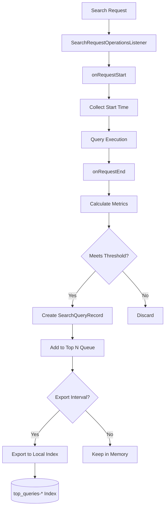

# Query Insights

## Summary

Query Insights is an OpenSearch plugin that provides comprehensive monitoring and analysis capabilities for search queries. It enables cluster administrators to identify slow or resource-intensive queries, understand query performance patterns, and optimize search operations. The plugin collects performance metrics during query execution with minimal overhead and provides APIs for accessing historical and real-time query data.

## Details

### Architecture

```mermaid
graph TB
    subgraph "OpenSearch Cluster"
        subgraph "Query Insights Plugin"
            A[Search Request] --> B[Query Listener]
            B --> C{Profile Query?}
            C -->|Yes| D[Skip]
            C -->|No| E[Collectors]
            
            E --> F[Latency Collector]
            E --> G[CPU Collector]
            E --> H[Memory Collector]
            
            F --> I[Processors]
            G --> I
            H --> I
            
            I --> J[Top N Processor]
            J --> K[Exporters]
            
            K --> L[Local Index Exporter]
            L --> M[(top_queries-* Index)]
            
            N[Task Manager] --> O[Live Queries]
        end
        
        subgraph "APIs"
            P[/_insights/top_queries]
            Q[/_insights/live_queries]
            R[/_insights/health]
        end
        
        J --> P
        O --> Q
    end
```

### Data Flow



### Components

| Component | Description |
|-----------|-------------|
| `QueryInsightsPlugin` | Main plugin entry point, registers listeners and services |
| `QueryInsightsService` | Core service managing collectors, processors, and exporters |
| `SearchQueryRecord` | Data model representing a captured query with metrics |
| `TopQueriesService` | Manages Top N queries collection and retrieval |
| `QueryInsightsExporter` | Exports query records to local index |
| `QueryInsightsIndexTemplate` | Manages default index template for local indexes |
| `LiveQueriesAction` | Transport action for fetching in-flight queries |

### Configuration

| Setting | Description | Default |
|---------|-------------|---------|
| `search.insights.top_queries.latency.enabled` | Enable latency-based Top N queries | `false` |
| `search.insights.top_queries.latency.top_n_size` | Number of top queries to track | `10` |
| `search.insights.top_queries.latency.window_size` | Time window for collection | `1m` |
| `search.insights.top_queries.cpu.enabled` | Enable CPU-based Top N queries | `false` |
| `search.insights.top_queries.cpu.top_n_size` | Number of top queries to track | `10` |
| `search.insights.top_queries.cpu.window_size` | Time window for collection | `1m` |
| `search.insights.top_queries.memory.enabled` | Enable memory-based Top N queries | `false` |
| `search.insights.top_queries.memory.top_n_size` | Number of top queries to track | `10` |
| `search.insights.top_queries.memory.window_size` | Time window for collection | `1m` |
| `search.insights.top_queries.group_by` | Group queries by: `NONE`, `SIMILARITY` | `NONE` |
| `search.insights.top_queries.exporter.type` | Exporter type: `none`, `local_index` | `none` |
| `search.insights.top_queries.exporter.template_priority` | Index template priority | `1847` |

### APIs

#### Top N Queries API

Retrieve the most resource-intensive queries:

```bash
GET /_insights/top_queries
GET /_insights/top_queries?type=latency
GET /_insights/top_queries?type=cpu
GET /_insights/top_queries?type=memory
GET /_insights/top_queries?verbose=false
GET /_insights/top_queries?from=2025-01-01T00:00:00.000Z&to=2025-01-02T00:00:00.000Z
```

#### Live Queries API

Monitor currently executing queries:

```bash
GET /_insights/live_queries
GET /_insights/live_queries?nodeId=node1,node2
GET /_insights/live_queries?sort=cpu
GET /_insights/live_queries?size=10
GET /_insights/live_queries?verbose=false
```

#### Health API

Check plugin health status:

```bash
GET /_insights/health
```

### Usage Examples

**Enable Top N queries by latency:**
```bash
PUT _cluster/settings
{
  "persistent": {
    "search.insights.top_queries.latency.enabled": true,
    "search.insights.top_queries.latency.top_n_size": 10,
    "search.insights.top_queries.latency.window_size": "1m"
  }
}
```

**Enable local index export:**
```bash
PUT _cluster/settings
{
  "persistent": {
    "search.insights.top_queries.exporter.type": "local_index"
  }
}
```

**Query historical data:**
```bash
GET /_insights/top_queries?from=2025-01-01T00:00:00.000Z&to=2025-01-02T00:00:00.000Z
```

**Monitor live queries:**
```bash
GET /_insights/live_queries?sort=latency&size=5
```

## Limitations

- Query Insights adds minimal overhead but should be monitored in high-throughput environments
- Live Queries API returns coordinator node resource usage only
- Profile queries are automatically excluded from Top N collection
- Local index export requires additional storage capacity

## Related PRs

| Version | PR | Description |
|---------|-----|-------------|
| v3.0.0 | [#295](https://github.com/opensearch-project/query-insights/pull/295) | Inflight Queries API |
| v3.0.0 | [#254](https://github.com/opensearch-project/query-insights/pull/254) | Default index template for local index |
| v3.0.0 | [#300](https://github.com/opensearch-project/query-insights/pull/300) | Top queries API verbose param |
| v3.0.0 | [#298](https://github.com/opensearch-project/query-insights/pull/298) | Skip profile queries |
| v3.0.0 | [#266](https://github.com/opensearch-project/query-insights/pull/266) | Strict hash check on top queries indices |
| v2.17.0 | [#74](https://github.com/opensearch-project/query-insights/pull/74) | Fix listener startup when query metrics enabled |
| v2.17.0 | [#64](https://github.com/opensearch-project/query-insights/pull/64) | Add query shape hash method |
| v2.17.0 | [#71](https://github.com/opensearch-project/query-insights/pull/71) | Add more integration tests |
| v2.17.0 | [#85](https://github.com/opensearch-project/query-insights/pull/85) | Query grouping integration tests |
| v2.17.0 | [#89](https://github.com/opensearch-project/query-insights/pull/89) | Additional grouping ITs and refactor |
| v2.17.0 | [#58](https://github.com/opensearch-project/query-insights/pull/58) | Fix CVE-2023-2976 for checkstyle |
| v2.17.0 | [#59](https://github.com/opensearch-project/query-insights/pull/59) | Fix security based integration tests |
| v2.17.0 | [#8139](https://github.com/opensearch-project/documentation-website/pull/8139) | Update GET top N api documentation |
| v2.17.0 | [#51](https://github.com/opensearch-project/query-insights/pull/51) | Add code hygiene checks (Spotless, Checkstyle) |
| v2.17.0 | [#90](https://github.com/opensearch-project/query-insights/pull/90) | Fix snapshot publishing configuration |
| v2.12.0 | - | Initial release with Top N queries |

## References

- [Query Insights Documentation](https://docs.opensearch.org/3.0/observing-your-data/query-insights/index/)
- [Top N Queries Documentation](https://docs.opensearch.org/3.0/observing-your-data/query-insights/top-n-queries/)
- [Live Queries Documentation](https://docs.opensearch.org/3.0/observing-your-data/query-insights/live-queries/)
- [Query Metrics Documentation](https://docs.opensearch.org/3.0/observing-your-data/query-insights/query-metrics/)
- [Query Insights Dashboards](https://docs.opensearch.org/3.0/observing-your-data/query-insights/query-insights-dashboard/)
- [GitHub Repository](https://github.com/opensearch-project/query-insights)

## Change History

- **v3.0.0**: Added Live Queries API, default index template, verbose parameter, profile query filtering, strict hash check
- **v2.17.0**: Fixed listener startup when query metrics enabled; added query shape hash method; fixed CVE-2023-2976; improved integration test coverage for query grouping; added code hygiene checks (Spotless, Checkstyle); fixed snapshot publishing configuration
- **v2.12.0**: Initial release with Top N queries feature
