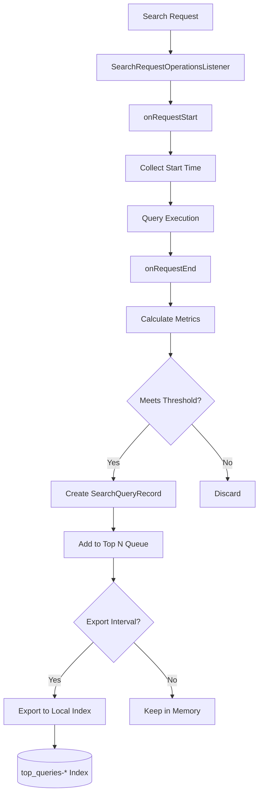

# Query Insights

## Summary

Query Insights is an OpenSearch plugin that provides comprehensive monitoring and analysis capabilities for search queries. It enables cluster administrators to identify slow or resource-intensive queries, understand query performance patterns, and optimize search operations. The plugin collects performance metrics during query execution with minimal overhead and provides APIs for accessing historical and real-time query data.

## Details

### Architecture

```mermaid
graph TB
    subgraph "OpenSearch Cluster"
        subgraph "Query Insights Plugin"
            A[Search Request] --> B[Query Listener]
            B --> C{Profile Query?}
            C -->|Yes| D[Skip]
            C -->|No| E[Collectors]
            
            E --> F[Latency Collector]
            E --> G[CPU Collector]
            E --> H[Memory Collector]
            
            F --> I[Processors]
            G --> I
            H --> I
            
            I --> J[Top N Processor]
            J --> K[Exporters]
            
            K --> L[Local Index Exporter]
            L --> M[(top_queries-* Index)]
            
            N[Task Manager] --> O[Live Queries]
        end
        
        subgraph "APIs"
            P[/_insights/top_queries]
            Q[/_insights/live_queries]
            R[/_insights/health]
        end
        
        J --> P
        O --> Q
    end
```

### Data Flow



### Components

| Component | Description |
|-----------|-------------|
| `QueryInsightsPlugin` | Main plugin entry point, registers listeners and services |
| `QueryInsightsService` | Core service managing collectors, processors, and exporters |
| `SearchQueryRecord` | Data model representing a captured query with metrics |
| `TopQueriesService` | Manages Top N queries collection and retrieval |
| `QueryInsightsExporter` | Exports query records to local index |
| `QueryInsightsIndexTemplate` | Manages default index template for local indexes |
| `LiveQueriesAction` | Transport action for fetching in-flight queries |

### Configuration

| Setting | Description | Default |
|---------|-------------|---------|
| `search.insights.top_queries.latency.enabled` | Enable latency-based Top N queries | `false` |
| `search.insights.top_queries.latency.top_n_size` | Number of top queries to track | `10` |
| `search.insights.top_queries.latency.window_size` | Time window for collection | `1m` |
| `search.insights.top_queries.cpu.enabled` | Enable CPU-based Top N queries | `false` |
| `search.insights.top_queries.cpu.top_n_size` | Number of top queries to track | `10` |
| `search.insights.top_queries.cpu.window_size` | Time window for collection | `1m` |
| `search.insights.top_queries.memory.enabled` | Enable memory-based Top N queries | `false` |
| `search.insights.top_queries.memory.top_n_size` | Number of top queries to track | `10` |
| `search.insights.top_queries.memory.window_size` | Time window for collection | `1m` |
| `search.insights.top_queries.grouping.group_by` | Group queries by: `none`, `similarity` (v3.1.0+) | `none` |
| `search.insights.top_queries.grouping.max_groups_excluding_topn` | Maximum groups to track excluding top N (v3.1.0+) | `100` |
| `search.insights.top_queries.grouping.attributes.field_name` | Include field names in query structure for grouping | `true` |
| `search.insights.top_queries.grouping.attributes.field_type` | Include field types in query structure for grouping | `true` |
| `search.insights.top_queries.excluded_indices` | Indices to exclude from insights collection (v3.1.0+) | `[]` |
| `search.insights.top_queries.exporter.type` | Exporter type: `none`, `local_index` | `none` |
| `search.insights.top_queries.exporter.template_priority` | Index template priority | `1847` |
| `search.insights.top_queries.exporter.delete_after_days` | Days to retain exported data | `7` |

### APIs

#### Top N Queries API

Retrieve the most resource-intensive queries:

```bash
GET /_insights/top_queries
GET /_insights/top_queries?type=latency
GET /_insights/top_queries?type=cpu
GET /_insights/top_queries?type=memory
GET /_insights/top_queries?verbose=false
GET /_insights/top_queries?from=2025-01-01T00:00:00.000Z&to=2025-01-02T00:00:00.000Z
```

#### Live Queries API

Monitor currently executing queries:

```bash
GET /_insights/live_queries
GET /_insights/live_queries?nodeId=node1,node2
GET /_insights/live_queries?sort=cpu
GET /_insights/live_queries?size=10
GET /_insights/live_queries?verbose=false
```

#### Health API

Check plugin health status:

```bash
GET /_insights/health
```

### Usage Examples

**Enable Top N queries by latency:**
```bash
PUT _cluster/settings
{
  "persistent": {
    "search.insights.top_queries.latency.enabled": true,
    "search.insights.top_queries.latency.top_n_size": 10,
    "search.insights.top_queries.latency.window_size": "1m"
  }
}
```

**Enable local index export:**
```bash
PUT _cluster/settings
{
  "persistent": {
    "search.insights.top_queries.exporter.type": "local_index"
  }
}
```

**Query historical data:**
```bash
GET /_insights/top_queries?from=2025-01-01T00:00:00.000Z&to=2025-01-02T00:00:00.000Z
```

**Monitor live queries:**
```bash
GET /_insights/live_queries?sort=latency&size=5
```

## Limitations

- Query Insights adds minimal overhead but should be monitored in high-throughput environments
- Live Queries API returns coordinator node resource usage only
- Profile queries are automatically excluded from Top N collection
- Local index export requires additional storage capacity

## Related PRs

| Version | PR | Description |
|---------|-----|-------------|
| v3.3.0 | [#426](https://github.com/opensearch-project/query-insights/pull/426) | Change matchQuery to termQuery for query ID matching |
| v3.3.0 | [#420](https://github.com/opensearch-project/query-insights/pull/420) | Filter out shard-level tasks from live queries |
| v3.3.0 | [#413](https://github.com/opensearch-project/query-insights/pull/413) | Fix time range validation (from < to) |
| v3.3.0 | [#414](https://github.com/opensearch-project/query-insights/pull/414) | Fix positive size parameter validation |
| v3.3.0 | [#430](https://github.com/opensearch-project/query-insights/pull/430) | Fix flaky test by clearing stale queue records |
| v3.3.0 | [#435](https://github.com/opensearch-project/query-insights/pull/435) | Add unit tests for queue clearing |
| v3.3.0 | [#366](https://github.com/opensearch-project/query-insights-dashboards/pull/366) | Fix Group By selector on Configuration page |
| v3.3.0 | [#367](https://github.com/opensearch-project/query-insights-dashboards/pull/367) | Fix query ID matching in retrieveQueryById |
| v3.3.0 | [#338](https://github.com/opensearch-project/query-insights-dashboards/pull/338) | Fix filter and date picker bugs |
| v3.3.0 | [#329](https://github.com/opensearch-project/query-insights-dashboards/pull/329) | Cypress workflow fix |
| v3.3.0 | [#327](https://github.com/opensearch-project/query-insights-dashboards/pull/327) | Update delete-backport-branch workflow |
| v3.2.0 | [#381](https://github.com/opensearch-project/query-insights/pull/381) | Increase reader search limit to 500 and fix sort by metric type |
| v3.2.0 | [#392](https://github.com/opensearch-project/query-insights/pull/392) | Update Maven endpoint and bump Gradle/Java versions |
| v3.2.0 | [#393](https://github.com/opensearch-project/query-insights/pull/393) | Fix codecov configuration |
| v3.2.0 | [#394](https://github.com/opensearch-project/query-insights/pull/394) | Migrate to codecov v3 |
| v3.2.0 | [#395](https://github.com/opensearch-project/query-insights/pull/395) | Add release notes for 3.2.0 |
| v3.2.0 | [#217](https://github.com/opensearch-project/query-insights-dashboards/pull/217) | MDS support for Inflight Queries |
| v3.2.0 | [#304](https://github.com/opensearch-project/query-insights-dashboards/pull/304) | Updated default auto-refresh interval to 30s |
| v3.2.0 | [#243](https://github.com/opensearch-project/query-insights-dashboards/pull/243) | react-vis implementation for Live Queries Dashboards |
| v3.2.0 | [#247](https://github.com/opensearch-project/query-insights-dashboards/pull/247) | Revert renderApp to use default export |
| v3.2.0 | [#258](https://github.com/opensearch-project/query-insights-dashboards/pull/258) | Fix for UI bugs (number formatting, validation, refresh button) |
| v3.2.0 | [#267](https://github.com/opensearch-project/query-insights-dashboards/pull/267) | Search bar fix for Top N Queries page |
| v3.2.0 | [#285](https://github.com/opensearch-project/query-insights-dashboards/pull/285) | Fix top queries table sorting with correct id |
| v3.2.0 | [#306](https://github.com/opensearch-project/query-insights-dashboards/pull/306) | Removed search bar Cypress tests |
| v3.1.0 | [#326](https://github.com/opensearch-project/query-insights/pull/326) | Add metric labels to historical data |
| v3.1.0 | [#336](https://github.com/opensearch-project/query-insights/pull/336) | Consolidate grouping settings |
| v3.1.0 | [#308](https://github.com/opensearch-project/query-insights/pull/308) | Add setting to exclude certain indices |
| v3.1.0 | [#344](https://github.com/opensearch-project/query-insights/pull/344) | Asynchronous search operations in reader |
| v3.1.0 | [#355](https://github.com/opensearch-project/query-insights/pull/355) | Added isCancelled field in Live Queries API |
| v3.1.0 | [#199](https://github.com/opensearch-project/query-insights-dashboards/pull/199) | New Live Queries Dashboard |
| v3.1.0 | [#155](https://github.com/opensearch-project/query-insights-dashboards/pull/155) | New Workload Management Dashboard |
| v3.1.0 | [#179](https://github.com/opensearch-project/query-insights-dashboards/pull/179) | Remove duplicate requests on overview page |
| v3.1.0 | [#209](https://github.com/opensearch-project/query-insights-dashboards/pull/209) | Add unit tests for WLM dashboard |
| v3.1.0 | [#365](https://github.com/opensearch-project/query-insights/pull/365) | Fix node-level top queries request parameter serialization |
| v3.1.0 | [#210](https://github.com/opensearch-project/query-insights-dashboards/pull/210) | Fix live query status field location in response |
| v3.1.0 | [#206](https://github.com/opensearch-project/query-insights-dashboards/pull/206) | Fix failing Cypress tests |
| v3.1.0 | [#205](https://github.com/opensearch-project/query-insights-dashboards/pull/205) | Fix CI version mismatch |
| v3.4.0 | [#481](https://github.com/opensearch-project/query-insights/pull/481) | Exclude internal `top_queries-*` indices from tracking |
| v3.4.0 | [#482](https://github.com/opensearch-project/query-insights/pull/482) | Add multi-node, healthstats integration tests and fix flaky tests |
| v3.4.0 | [#411](https://github.com/opensearch-project/query-insights-dashboards/pull/411) | Fix MDS support in server/wlmRoutes |
| v3.4.0 | [#396](https://github.com/opensearch-project/query-insights-dashboards/pull/396) | Remove "Open in search comparison" button |
| v3.4.0 | [#435](https://github.com/opensearch-project/query-insights-dashboards/pull/435) | Fix Jest test failures due to Monaco editor imports |
| v3.4.0 | [#421](https://github.com/opensearch-project/query-insights-dashboards/pull/421) | Fix MDS Selector for Workload Management Dashboards |
| v3.1.0 | [#364](https://github.com/opensearch-project/query-insights/pull/364) | Fix flaky integration tests |
| v3.0.0 | [#295](https://github.com/opensearch-project/query-insights/pull/295) | Inflight Queries API |
| v3.0.0 | [#254](https://github.com/opensearch-project/query-insights/pull/254) | Default index template for local index |
| v3.0.0 | [#300](https://github.com/opensearch-project/query-insights/pull/300) | Top queries API verbose param |
| v3.0.0 | [#298](https://github.com/opensearch-project/query-insights/pull/298) | Skip profile queries |
| v3.0.0 | [#266](https://github.com/opensearch-project/query-insights/pull/266) | Strict hash check on top queries indices |
| v2.18.0 | [#84](https://github.com/opensearch-project/query-insights/pull/84) | Support time range parameter for historical top N queries |
| v2.18.0 | [#111](https://github.com/opensearch-project/query-insights/pull/111) | Refactor query shape field data maps with WithFieldName interface |
| v2.18.0 | [#120](https://github.com/opensearch-project/query-insights/pull/120) | Add data models for health stats API |
| v2.18.0 | [#122](https://github.com/opensearch-project/query-insights/pull/122) | Create health_stats API for query insights |
| v2.18.0 | [#124](https://github.com/opensearch-project/query-insights/pull/124) | Add OpenTelemetry counters for error metrics |
| v2.18.0 | [#135](https://github.com/opensearch-project/query-insights/pull/135) | Add grouping settings for query field name and type |
| v2.18.0 | [#140](https://github.com/opensearch-project/query-insights/pull/140) | Add field type to query shape |
| v2.18.0 | [#142](https://github.com/opensearch-project/query-insights/pull/142) | Add cache eviction and listener for invalidating index field type mappings |
| v2.18.0 | [#8627](https://github.com/opensearch-project/documentation-website/pull/8627) | Documentation for health_stats API and error metrics |
| v2.17.0 | [#74](https://github.com/opensearch-project/query-insights/pull/74) | Fix listener startup when query metrics enabled |
| v2.17.0 | [#64](https://github.com/opensearch-project/query-insights/pull/64) | Add query shape hash method |
| v2.17.0 | [#71](https://github.com/opensearch-project/query-insights/pull/71) | Add more integration tests |
| v2.17.0 | [#85](https://github.com/opensearch-project/query-insights/pull/85) | Query grouping integration tests |
| v2.17.0 | [#89](https://github.com/opensearch-project/query-insights/pull/89) | Additional grouping ITs and refactor |
| v2.17.0 | [#58](https://github.com/opensearch-project/query-insights/pull/58) | Fix CVE-2023-2976 for checkstyle |
| v2.17.0 | [#59](https://github.com/opensearch-project/query-insights/pull/59) | Fix security based integration tests |
| v2.17.0 | [#8139](https://github.com/opensearch-project/documentation-website/pull/8139) | Update GET top N api documentation |
| v2.17.0 | [#51](https://github.com/opensearch-project/query-insights/pull/51) | Add code hygiene checks (Spotless, Checkstyle) |
| v2.17.0 | [#90](https://github.com/opensearch-project/query-insights/pull/90) | Fix snapshot publishing configuration |
| v2.12.0 | - | Initial release with Top N queries |

## References

- [Query Insights Documentation](https://docs.opensearch.org/3.0/observing-your-data/query-insights/index/)
- [Top N Queries Documentation](https://docs.opensearch.org/3.0/observing-your-data/query-insights/top-n-queries/)
- [Live Queries Documentation](https://docs.opensearch.org/3.0/observing-your-data/query-insights/live-queries/)
- [Query Metrics Documentation](https://docs.opensearch.org/3.0/observing-your-data/query-insights/query-metrics/)
- [Query Insights Health Documentation](https://docs.opensearch.org/2.18/observing-your-data/query-insights/health/)
- [Query Insights Dashboards](https://docs.opensearch.org/3.0/observing-your-data/query-insights/query-insights-dashboard/)
- [GitHub Repository](https://github.com/opensearch-project/query-insights)
- [Issue #9](https://github.com/opensearch-project/query-insights/issues/9): Enrich operational metrics in Query Insights
- [Issue #12](https://github.com/opensearch-project/query-insights/issues/12): Historical top N queries from local index
- [Issue #69](https://github.com/opensearch-project/query-insights/issues/69): Query shape field type RFC

## Change History

- **v3.4.0**: Added comprehensive multi-node integration tests (`QueryInsightsClusterIT`) with 6 test methods for data collection, aggregation, and consistency validation; added `HealthStatsRestIT` for health stats REST API testing; fixed flaky tests by adding settings propagation delays and increasing window sizes from 1m to 5m; added new test helper methods (`getNodeClient`, `getClusterNodeCount`, `waitForExpectedNodes`); updated CI to use macOS 15 runner; excluded multi-node tests from security integration tests due to Java 21 SSL certificate limitations; **Bug fixes**: excluded internal `top_queries-*` indices from resource tracking by moving filtering logic to `QueryInsightsListener.skipSearchRequest()` method; **Dashboards**: fixed MDS (Multiple Data Sources) selector visibility on Workload Management pages (WLMMain, WLMDetails, WLMCreate) when `home:useNewHomePage` setting is enabled by removing `PageHeader` wrapper and directly rendering `WLMDataSourceMenu` component; fixed MDS support in server-side WLM routes by adding `WlmPlugin` custom client and `dataSourceId` query parameter support to all WLM routes; removed "Open in search comparison" button from Query Details and Query Group Details pages (was routing to wrong destination); fixed Jest test failures caused by Monaco editor ES module imports by adding mocks and updating Jest configuration
- **v3.3.0**: Bug fixes for query ID matching (changed from matchQuery to termQuery with keyword field mapping); fixed Live Queries API to filter out shard-level tasks; added time range validation (from < to); fixed positive size parameter validation; fixed flaky test by clearing stale queue records when disabling metrics; **Dashboards**: fixed Group By selector showing "None" after refresh by correcting settings path; fixed retrieveQueryById to explicitly match by ID; fixed indices filter, Query Count display for non-grouped queries, metric headers toggle, and date picker for relative ranges; CI/CD improvements for Cypress tests and branch cleanup workflows
- **v3.2.0**: Increased reader search limit to 500 and fixed sort by metric type; infrastructure updates including Maven endpoint migration, Gradle and Java version bumps; codecov configuration fixes; **Dashboards**: replaced Vega with react-vis for Live Queries visualizations to fix build errors; fixed search bar on Top N Queries page to properly filter by query ID; fixed table sorting with ID-based deduplication; added MDS support for Inflight Queries; changed default auto-refresh interval from 5s to 30s for better performance; multiple UI bug fixes including number formatting, validation messages, refresh button, and box plot updates; removed flaky Cypress tests for search bar
- **v3.1.0**: Added metric labels to historical data for filtering by metric type; consolidated grouping settings under `grouping.*` namespace; added `excluded_indices` setting to filter indices from insights; refactored local index reader to use asynchronous operations; added `is_cancelled` field to Live Queries API; new Live Queries Dashboard with real-time monitoring, auto-refresh, visual breakdowns, and query cancellation; new Workload Management Dashboard for query group management; fixed duplicate API requests on overview page; fixed node-level top queries request parameter serialization bug; improved Cypress test stability; fixed CI version mismatch; added multi-node cluster integration tests
- **v3.0.0**: Added Live Queries API, default index template, verbose parameter, profile query filtering, strict hash check
- **v2.18.0**: Added Health Stats API for monitoring plugin health; added OpenTelemetry error metrics counters; added field name and type support for query shape grouping (defaults changed to `true`); added time range parameters for historical query retrieval; added cache eviction and cluster state listener for index field type mappings
- **v2.17.0**: Fixed listener startup when query metrics enabled; added query shape hash method; fixed CVE-2023-2976; improved integration test coverage for query grouping; added code hygiene checks (Spotless, Checkstyle); fixed snapshot publishing configuration
- **v2.12.0**: Initial release with Top N queries feature
