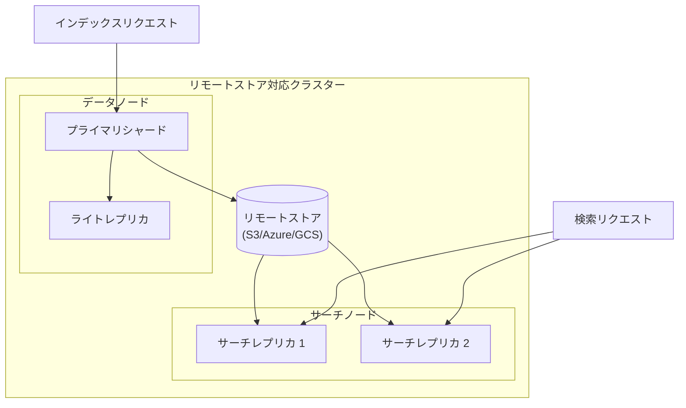
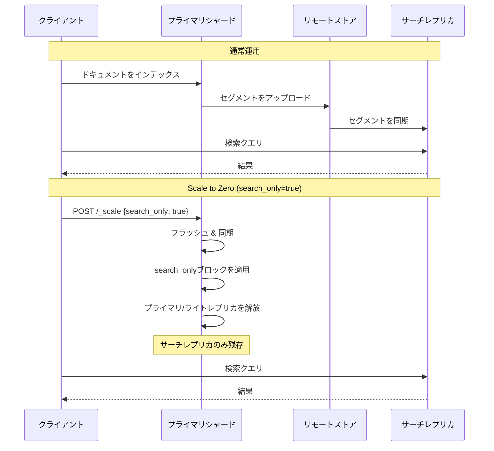

# Reader/Writer分離 (Scale to Zero)

## 概要

Reader/Writer分離は、リモートストア対応クラスターにおいて、インデックス作成ワークロードと検索ワークロードを異なるハードウェアに分離する機能です。検索クエリを専門に処理するサーチレプリカと、インデックス操作を管理するライトレプリカを導入します。新しい`_scale` APIにより、インデックスをsearch-onlyモードに切り替え、書き込み後読み取り専用のユースケースでプライマリシャードとライトレプリカを非アクティブ化できます。

主なメリット:
- **ワークロード分離**: インデックス作成と検索トラフィックを分離し、障害の影響範囲を限定
- **独立したスケーリング**: インデックス作成と検索のキャパシティを個別にスケール
- **コスト効率**: 各ワークロードタイプに特化したハードウェアを使用
- **Scale to Zero**: 不要時に書き込みワークロードを非アクティブ化してリソース消費を削減

## 詳細

### アーキテクチャ



### データフロー



### コンポーネント

| コンポーネント | 説明 |
|---------------|------|
| サーチノード | サーチレプリカをホストする専用の`search`ロールを持つノード |
| サーチレプリカ | 検索クエリのみを処理する読み取り専用のシャードコピー |
| ライトレプリカ | 高可用性のためにプライマリに昇格可能な標準レプリカ |
| `_scale` API | インデックスのsearch-onlyモードを有効/無効にするAPI |
| `search_only`ブロック | 検索を許可しながら書き込み操作を防止するインデックスブロック |

### 設定

| 設定 | 説明 | デフォルト |
|------|------|-----------|
| `node.roles: [ search ]` | ノードを検索専用として設定 | N/A |
| `index.number_of_search_replicas` | インデックスのサーチレプリカ数 | `0` |
| `cluster.routing.search_replica.strict` | `true`の場合、検索をサーチレプリカのみにルーティング | `true` |
| `auto_expand_search_replicas` | 利用可能なサーチノード数に基づいてサーチレプリカを自動スケール | N/A |

### 使用例

#### サーチノードの設定

```yaml
# opensearch.yml
node.name: searcher-node1
node.roles: [ search ]
```

#### サーチレプリカ付きインデックスの作成

```json
PUT /my-index
{
  "settings": {
    "index": {
      "number_of_shards": 1,
      "number_of_replicas": 1,
      "number_of_search_replicas": 2
    }
  }
}
```

#### Search-Onlyモードの有効化 (Scale to Zero)

```json
POST /my-index/_scale
{
  "search_only": true
}
```

#### Search-Onlyモードの無効化

```json
POST /my-index/_scale
{
  "search_only": false
}
```

#### 検索ルーティングの設定

```json
PUT /_cluster/settings
{
  "persistent": {
    "cluster.routing.search_replica.strict": "false"
  }
}
```

### サーチレプリカのリカバリシナリオ

| シナリオ | リモートストア状態 | 永続データディレクトリ | リカバリ動作 |
|---------|-------------------|----------------------|-------------|
| 1 | 無効 | あり | 再起動後に自動リカバリ |
| 2 | 有効 | なし | プライマリなしでリモートストアからリカバリ |
| 3 | 有効 | あり | シームレスなリカバリ、サーチレプリカのみ起動 |
| 4 | 無効 | なし | インデックスはリカバリ不可（全状態が失われる） |

### 2フェーズスケールダウンプロセス

search-onlyモードを有効化する際:
1. **フェーズ1**: スケールダウン操作中に一時ブロックを適用
2. **フェーズ2**: シャード同期、フラッシュ、メタデータ更新を完了
3. **フェーズ3**: 一時ブロックを永続的な`search_only`ブロックに置換
4. **フェーズ4**: プライマリとライトレプリカシャードを解放

## 制限事項

- **リモートストアが必須**: リモートストア対応クラスターでのみ動作
- **セグメントレプリケーションが必須**: インデックスはセグメントレプリケーションを使用する必要あり（リモートストアのデフォルト）
- **search-onlyモードでは書き込み不可**: `search_only=true`の場合、すべてのインデックス作成がブロック
- **サーチレプリカは昇格不可**: ライトレプリカと異なり、サーチレプリカはプライマリになれない

## 関連PR

| バージョン | PR | 説明 |
|-----------|-----|------|
| v3.0.0 | [#17299](https://github.com/opensearch-project/OpenSearch/pull/17299) | Reader/Writer分離によるSearch onlyレプリカ (scale to zero) |
| v3.0.0 | [#17803](https://github.com/opensearch-project/OpenSearch/pull/17803) | Search Only strictルーティング設定 |

## 関連Issue

- [#16720](https://github.com/opensearch-project/OpenSearch/issues/16720): Search-onlyレプリカ機能リクエスト
- [#15306](https://github.com/opensearch-project/OpenSearch/issues/15306): Reader/Writer分離トラッキングIssue
- [#17424](https://github.com/opensearch-project/OpenSearch/issues/17424): 検索ルーティング設定

## 参考資料

- [インデックスと検索ワークロードの分離](https://docs.opensearch.org/3.0/tuning-your-cluster/separate-index-and-search-workloads/)
- [Scale API](https://docs.opensearch.org/3.0/api-reference/index-apis/scale/)
- [Index Blocks API](https://docs.opensearch.org/3.0/api-reference/index-apis/blocks/)
- [リモートバックドストレージ](https://docs.opensearch.org/3.0/tuning-your-cluster/availability-and-recovery/remote-store/index/)

## 変更履歴

- **v3.0.0** (2026): `_scale` API、サーチレプリカ、search-onlyモードの初回リリース
