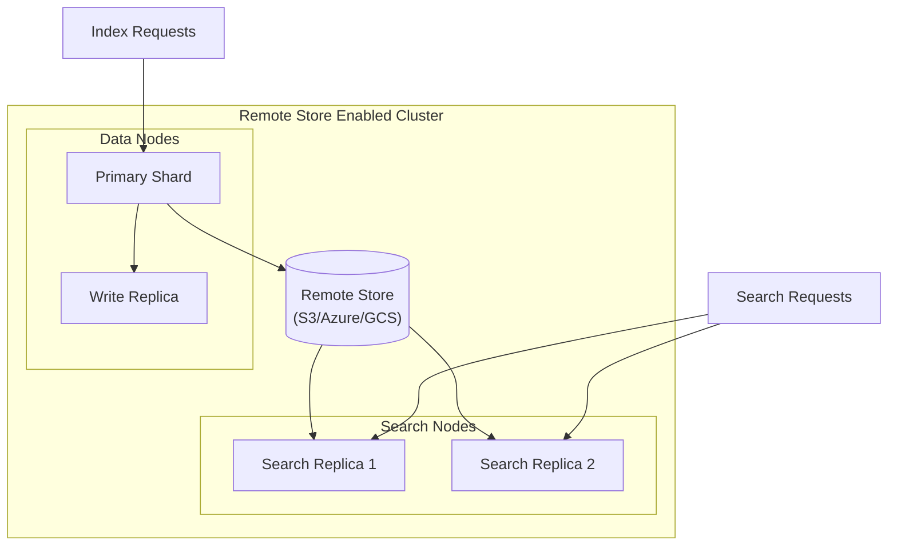
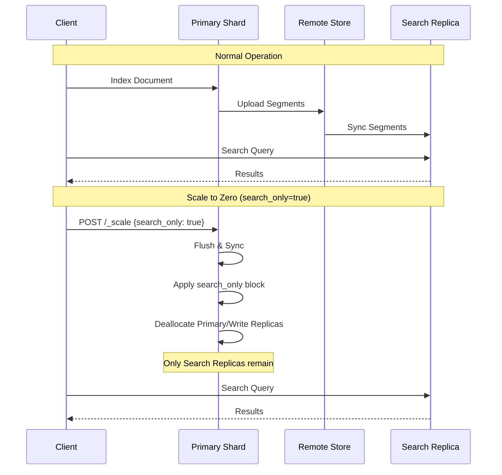

# Reader/Writer Separation (Scale to Zero)

## Summary

Reader/Writer Separation enables segregation of indexing and search workloads across different hardware in remote-store-enabled clusters. This feature introduces search replicas that handle search queries exclusively, while write replicas manage indexing operations. A new `_scale` API allows indexes to enter search-only mode, deactivating primary shards and write replicas for write-once, read-many use cases.

Key benefits:
- **Workload isolation**: Separate indexing and search traffic for failure isolation
- **Independent scaling**: Scale indexing and search capacity independently
- **Cost efficiency**: Use specialized hardware for each workload type
- **Scale to zero**: Deactivate write workloads when not needed to reduce resource consumption

## Details

### Architecture



### Data Flow



### Components

| Component | Description |
|-----------|-------------|
| Search Node | Node with `search` role dedicated to hosting search replicas |
| Search Replica | Read-only shard copy that handles search queries exclusively |
| Write Replica | Standard replica that can be promoted to primary for high availability |
| `_scale` API | API to enable/disable search-only mode on indexes |
| `search_only` Block | Index block that prevents write operations while allowing searches |

### Configuration

| Setting | Description | Default |
|---------|-------------|---------|
| `node.roles: [ search ]` | Configure node as search-only | N/A |
| `index.number_of_search_replicas` | Number of search replicas for an index | `0` |
| `cluster.routing.search_replica.strict` | Route searches only to search replicas when `true` | `true` |
| `auto_expand_search_replicas` | Auto-scale search replicas based on available search nodes | N/A |

### Usage Examples

#### Configure Search Node

```yaml
# opensearch.yml
node.name: searcher-node1
node.roles: [ search ]
```

#### Create Index with Search Replicas

```json
PUT /my-index
{
  "settings": {
    "index": {
      "number_of_shards": 1,
      "number_of_replicas": 1,
      "number_of_search_replicas": 2
    }
  }
}
```

#### Enable Search-Only Mode (Scale to Zero)

```json
POST /my-index/_scale
{
  "search_only": true
}
```

#### Disable Search-Only Mode

```json
POST /my-index/_scale
{
  "search_only": false
}
```

#### Configure Search Routing

```json
PUT /_cluster/settings
{
  "persistent": {
    "cluster.routing.search_replica.strict": "false"
  }
}
```

### Search Replica Recovery Scenarios

| Scenario | Remote Store State | Persistent Data Dir | Recovery Behavior |
|----------|-------------------|---------------------|-------------------|
| 1 | Disabled | Yes | Automatic recovery after restart |
| 2 | Enabled | No | Recovers from remote store without primaries |
| 3 | Enabled | Yes | Seamless recovery, only search replicas start |
| 4 | Disabled | No | Index unrecoverable (all state lost) |

### Two-Phase Scale-Down Process

When enabling search-only mode:
1. **Phase 1**: Apply temporary block during scale-down operation
2. **Phase 2**: Complete shard sync, flush, and metadata updates
3. **Phase 3**: Replace temporary block with permanent `search_only` block
4. **Phase 4**: Deallocate primary and write replica shards

## Limitations

- **Remote store required**: Only works with remote-store-enabled clusters
- **Segment replication required**: Indexes must use segment replication (default for remote store)
- **No write operations in search-only mode**: All indexing blocked when `search_only=true`
- **Search replicas cannot be promoted**: Unlike write replicas, search replicas cannot become primaries

## Related PRs

| Version | PR | Description |
|---------|-----|-------------|
| v3.0.0 | [#17299](https://github.com/opensearch-project/OpenSearch/pull/17299) | Search only replicas (scale to zero) with Reader/Writer Separation |
| v3.0.0 | [#17803](https://github.com/opensearch-project/OpenSearch/pull/17803) | Search Only strict routing setting |

## Related Issues

- [#16720](https://github.com/opensearch-project/OpenSearch/issues/16720): Search-only replicas feature request
- [#15306](https://github.com/opensearch-project/OpenSearch/issues/15306): Reader/Writer separation tracking issue
- [#17424](https://github.com/opensearch-project/OpenSearch/issues/17424): Search routing configuration

## References

- [Separate index and search workloads](https://docs.opensearch.org/3.0/tuning-your-cluster/separate-index-and-search-workloads/)
- [Scale API](https://docs.opensearch.org/3.0/api-reference/index-apis/scale/)
- [Index Blocks API](https://docs.opensearch.org/3.0/api-reference/index-apis/blocks/)
- [Remote-backed storage](https://docs.opensearch.org/3.0/tuning-your-cluster/availability-and-recovery/remote-store/index/)

## Change History

- **v3.0.0** (2026): Initial release with `_scale` API, search replicas, and search-only mode