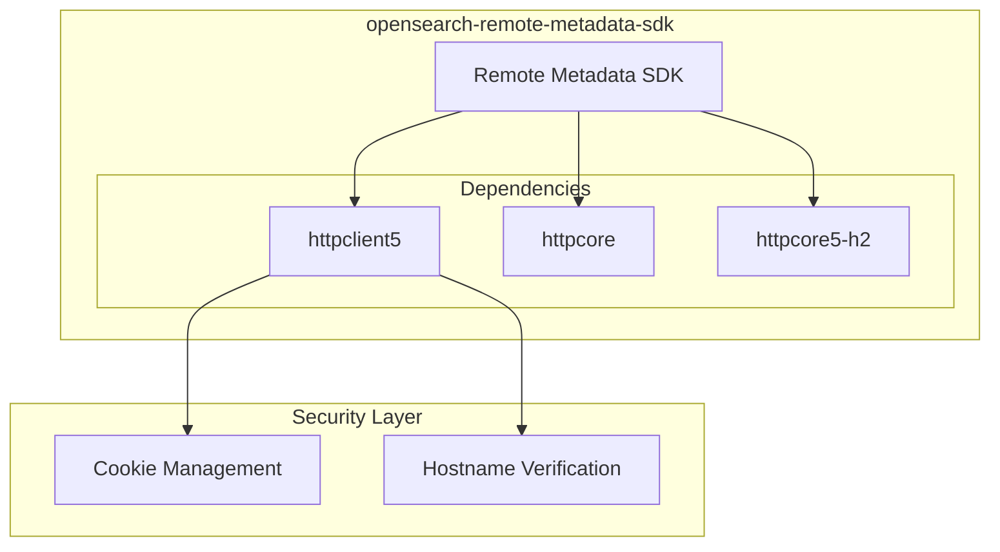

# Security CVE Fixes

## Summary

The opensearch-remote-metadata-sdk maintains security by addressing Common Vulnerabilities and Exposures (CVEs) in its dependencies. This includes fixes for vulnerabilities in Apache HttpClient and other transitive dependencies that could potentially compromise security.

## Details

### Architecture



### Components

| Component | Description |
|-----------|-------------|
| httpclient5 | Apache HttpClient 5.x for HTTP communication |
| httpcore | Apache HttpCore for low-level HTTP transport |
| httpcore5-h2 | HTTP/2 support for Apache HttpCore 5.x |

### Configuration

The SDK uses Gradle's resolution strategy to enforce secure dependency versions:

```groovy
configurations.all {
    resolutionStrategy {
        force("org.apache.httpcomponents.client5:httpclient5:5.4.4")
        force("org.apache.httpcomponents:httpcore:5.3.4")
        force("org.apache.httpcomponents.core5:httpcore5-h2:5.3.4")
    }
}
```

### CVE Details

#### CVE-2025-27820

| Attribute | Value |
|-----------|-------|
| Affected Component | Apache HttpClient |
| Impact | Domain-related checks bypass |
| Affected Functions | Cookie management, hostname verification |
| Fixed Version | httpclient5 5.4.4 |

This vulnerability could allow malicious domains to bypass domain-related checks in cookie management and hostname verification, potentially enabling unauthorized activities.

## Limitations

- CVE fixes are applied at the SDK level; downstream consumers should verify their own dependency trees
- Transitive dependencies may still require independent verification

## Related PRs

| Version | PR | Description |
|---------|-----|-------------|
| v3.1.0 | [#195](https://github.com/opensearch-project/opensearch-remote-metadata-sdk/pull/195) | CVE fix for CVE-2025-27820 |

## References

- [CVE-2025-27820](https://www.sentinelone.com/vulnerability-database/cve-2025-27820/): Apache HttpClient Auth Bypass Vulnerability
- [opensearch-remote-metadata-sdk](https://github.com/opensearch-project/opensearch-remote-metadata-sdk): SDK repository

## Change History

- **v3.1.0** (2025-06): Fixed CVE-2025-27820 by updating Apache HttpClient dependencies
