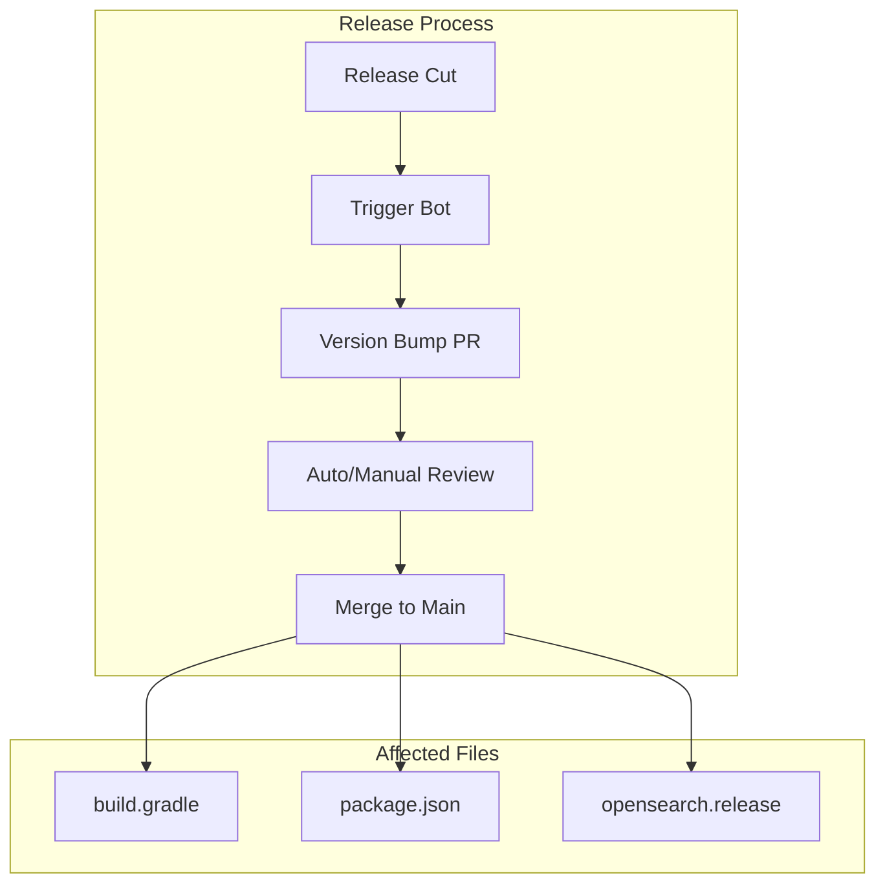

# AUTO Version Management

## Summary

Automated version management system used across OpenSearch repositories. The opensearch-trigger-bot automatically creates pull requests to increment version numbers as part of the release engineering workflow.

## Details

### Architecture

### Components

| Component | Description |
|-----------|-------------|
| opensearch-trigger-bot | GitHub bot that creates automated PRs |
| Version bump workflow | GitHub Actions workflow triggering version updates |
| Release branch | Branch cut for stable release (e.g., `3.0`) |

### Configuration

| Setting | Description | Example |
|---------|-------------|---------|
| SNAPSHOT version | Development version suffix | `3.1.0-SNAPSHOT` |
| Release version | Stable release version | `3.0.0` |

### Workflow

1. Release manager cuts a release branch (e.g., `3.0`)
2. Trigger bot detects branch creation
3. Bot creates PR to increment main branch to next SNAPSHOT
4. PR is reviewed and merged
5. Development continues on main with new version

## Limitations

- Automated PRs require human review before merge
- Version conflicts may occur if manual version changes are made

## Change History

- **v3.0.0** (2025-05-06): Version increment to 3.1.0-SNAPSHOT for reporting repository

## References

### Documentation
- [OpenSearch Build Repository](https://github.com/opensearch-project/opensearch-build)
- [OpenSearch Release Process](https://github.com/opensearch-project/.github/blob/main/RELEASING.md)

### Pull Requests
| Version | PR | Description | Related Issue |
|---------|-----|-------------|---------------|
| v3.0.0 | [#1092](https://github.com/opensearch-project/reporting/pull/1092) | Increment to 3.1.0-SNAPSHOT |   |
