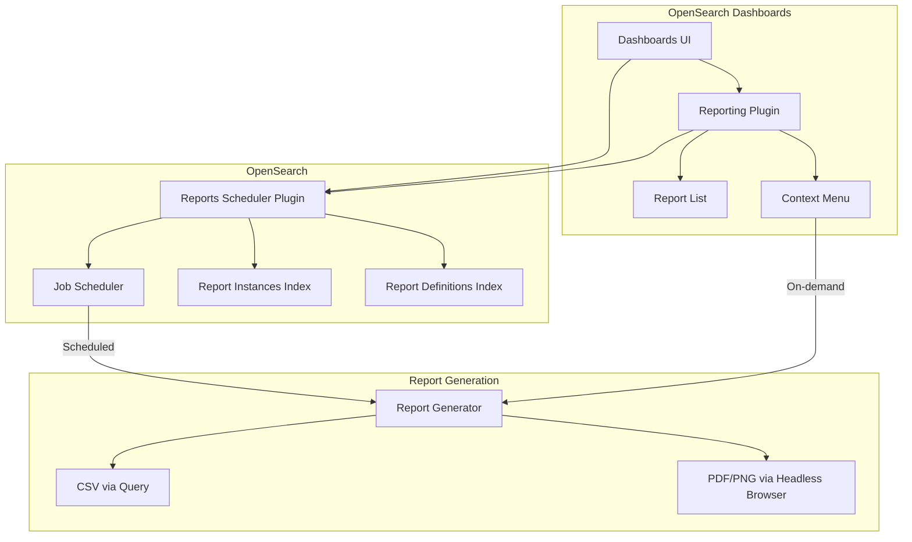
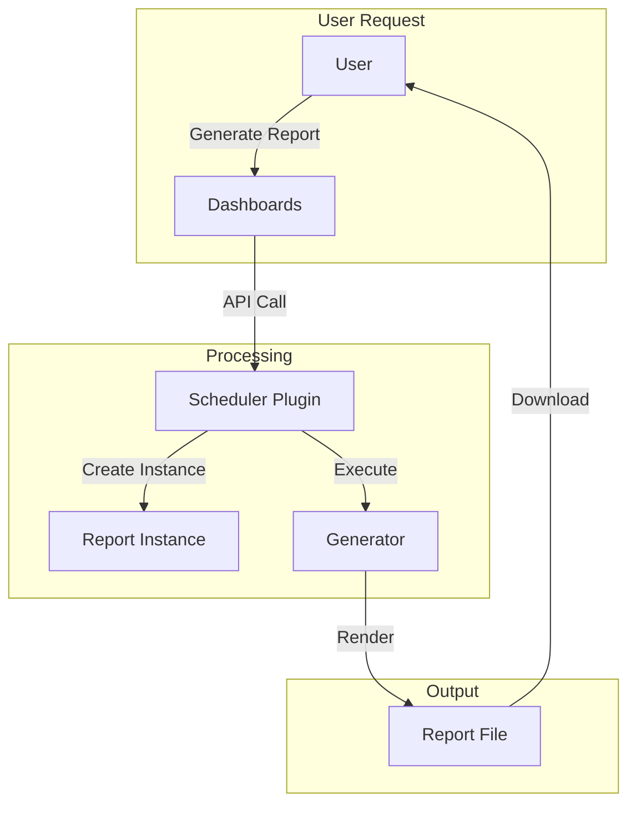

---
tags:
  - dashboards
  - indexing
  - ml
  - search
  - security
---

# Reporting Plugin

## Summary

The OpenSearch Reporting plugin enables users to export and automate reports from OpenSearch Dashboards in PDF, PNG, and CSV formats. It provides both on-demand report generation and scheduled reporting capabilities, integrating with the OpenSearch security model for access control.

## Details

### Architecture

### Data Flow

### Components

| Component | Description |
|-----------|-------------|
| `dashboards-reporting` | OpenSearch Dashboards plugin for UI and report generation |
| `reporting` | OpenSearch plugin for scheduling and managing report definitions |
| `ReportDefinitionsIndex` | System index storing report definition configurations |
| `ReportInstancesIndex` | System index storing generated report instances |
| `Job Scheduler` | Handles scheduled report execution |

### Configuration

| Setting | Description | Default |
|---------|-------------|---------|
| `opensearch_security.cookie.secure` | Secure cookie for authentication | `true` |
| `opensearch.requestTimeout` | Timeout for report generation requests | `300000` |
| `server.maxPayloadBytes` | Maximum payload size for reports | `10485760` |

### System Indices

| Index | Description |
|-------|-------------|
| `.opendistro-reports-definitions` | Stores report definition configurations |
| `.opendistro-reports-instances` | Stores generated report metadata and status |

### Usage Example

Generate a CSV report from a saved search:

1. Navigate to Discover
2. Open a saved search
3. Click "Reporting" in the top menu
4. Select "Generate CSV"
5. Download the generated report

### Security Integration

The Reporting plugin integrates with OpenSearch Security:

- Report definitions respect document-level security (DLS)
- Field-level security (FLS) is applied to CSV exports
- Multi-tenancy support for isolated report management
- System indices are created in system context to avoid permission issues

## Limitations

- CSV reports have a 10,000-row limit in OpenSearch version 2.16 and earlier
- PDF/PNG generation requires a headless browser (Chromium)
- Large reports may timeout depending on cluster configuration
- Report scheduling requires the Job Scheduler plugin

## Change History

- **v3.3.0** (2026-01-11): Security fix for CVE-2025-7783
- **v3.2.0** (2026-01-11): Fixed system index creation permissions and tenant URL parsing
- **v3.1.0** (2025-06-13): Version increment and release notes maintenance

## Related Features
- [Reporting (Dashboards)](../dashboards-reporting/dashboards-reporting.md)

## References

### Documentation
- [Reporting Documentation](https://docs.opensearch.org/3.0/reporting/): Official OpenSearch Reporting documentation
- [Reporting CLI](https://docs.opensearch.org/3.0/reporting/rep-cli-index/): Command-line interface for report generation
- [Reporting Repository](https://github.com/opensearch-project/reporting): Backend plugin repository
- [Dashboards Reporting Repository](https://github.com/opensearch-project/dashboards-reporting): Frontend plugin repository

### Blog Posts
- [OpenSearch Reporting 101](https://opensearch.org/blog/feature-highlight-reporting/): Feature highlight blog post

### Pull Requests
| Version | PR | Description | Related Issue |
|---------|-----|-------------|---------------|
| v3.3.0 | [#640](https://github.com/opensearch-project/reporting/pull/640) | Fixing CVE-2025-7783 |   |
| v3.2.0 | [#1108](https://github.com/opensearch-project/reporting/pull/1108) | Create report indices in system context to avoid permission issues | [#998](https://github.com/opensearch-project/reporting/issues/998) |
| v3.2.0 | [#599](https://github.com/opensearch-project/dashboards-reporting/pull/599) | Fix tenant URL parsing when generating reports from Discover | [#535](https://github.com/opensearch-project/dashboards-reporting/issues/535) |

### Issues (Design / RFC)
- [Issue #998](https://github.com/opensearch-project/reporting/issues/998): Permission issue when creating reporting indices
- [Issue #535](https://github.com/opensearch-project/dashboards-reporting/issues/535): Tenant URL parsing bug
