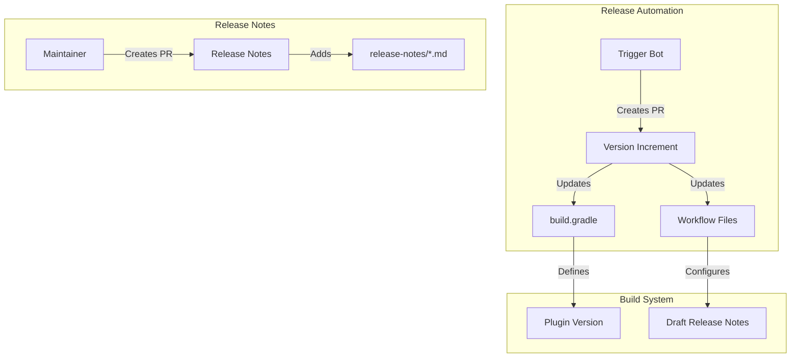

# Release Maintenance

## Summary

The OpenSearch Reporting plugin follows a standard release maintenance process that includes automated version increments and release notes generation. This ensures the plugin stays synchronized with OpenSearch core releases and maintains proper documentation of changes.

## Details

### Architecture



### Components

| Component | Description |
|-----------|-------------|
| `build.gradle` | Defines plugin version and OpenSearch compatibility |
| `draft-release-notes-workflow.yml` | GitHub Actions workflow for generating draft release notes |
| `release-notes/` | Directory containing release notes for each version |

### Configuration

| Setting | Description | Location |
|---------|-------------|----------|
| `opensearch_version` | Target OpenSearch version | `build.gradle` |
| `buildVersionQualifier` | Version qualifier (e.g., beta1, rc1) | `build.gradle` |
| `version` | Draft release notes version | `.github/workflows/draft-release-notes-workflow.yml` |

### Release Notes Format

Release notes follow a standard format:

```markdown
## Version X.Y.Z.W Release Notes

Compatible with OpenSearch X.Y.Z

### Maintenance
- [AUTO] Increment version to X.Y.Z-SNAPSHOT ([#PR](url))
- Adding release notes for X.Y.Z ([#PR](url))

### Features
- Feature description ([#PR](url))

### Bug Fixes
- Bug fix description ([#PR](url))
```

## Limitations

- Version increments are automated and should not be manually modified
- Release notes must be added before the release branch is cut

## Related PRs

| Version | PR | Description |
|---------|-----|-------------|
| v3.1.0 | [#1092](https://github.com/opensearch-project/reporting/pull/1092) | [AUTO] Increment version to 3.1.0-SNAPSHOT |
| v3.1.0 | [#1101](https://github.com/opensearch-project/reporting/pull/1101) | Adding release notes for 3.1.0 |

## References

- [Issue #1095](https://github.com/opensearch-project/reporting/issues/1095): [RELEASE] Release version 3.1.0
- [Reporting Repository](https://github.com/opensearch-project/reporting): Export and automate PNG, PDF, and CSV reports in OpenSearch Dashboards
- [Release Notes Guidelines](https://github.com/opensearch-project/opensearch-plugins/blob/main/RELEASE_NOTES.md): Official release notes format

## Change History

- **v3.1.0** (2025-06-13): Version increment to 3.1.0-SNAPSHOT and release notes added
