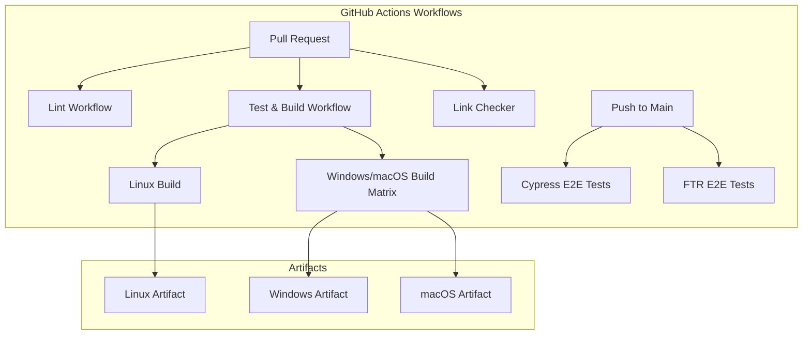

---
tags:
  - domain/infra
  - component/server
  - dashboards
---
# CI/CD Workflow

## Summary

The dashboards-reporting plugin uses GitHub Actions for continuous integration and delivery. The CI/CD infrastructure includes workflows for testing, building, linting, and end-to-end testing across multiple platforms (Linux, Windows, macOS).

## Details

### Architecture



### Workflow Files

| Workflow | Trigger | Purpose |
|----------|---------|---------|
| `dashboards-reports-test-and-build-workflow.yml` | Push/PR | Build and test on Linux, Windows, macOS |
| `cypress-e2e-reporting-test.yml` | Push to main | Cypress end-to-end tests |
| `ftr-e2e-reporting-test.yml` | Push to main | Functional test runner E2E tests |
| `lint.yml` | Pull request | Code linting |
| `link-checker.yml` | Push/PR to main | Check for broken links |
| `verify-binary-installation.yml` | Manual/scheduled | Verify binary installation |

### Build Matrix Configuration

The test and build workflow uses a matrix strategy for cross-platform builds:

```yaml
windows-mac-builds:
  runs-on: ${{ matrix.os }}
  strategy:
    matrix:
      os: [windows-latest, macos-latest]
```

### Key Dependencies

| Dependency | Source |
|------------|--------|
| Node.js version | Read from `OpenSearch-Dashboards/.nvmrc` |
| Yarn version | Read from `OpenSearch-Dashboards/package.json` |
| OpenSearch Dashboards | Checked out as sibling directory |

## Limitations

- E2E tests only run on push to main branch, not on pull requests
- Windows builds require `core.longpaths` git configuration

## Change History

- **v3.0.0** (2025-05-06): Upgraded actions/checkout to v4, consolidated Windows/macOS builds into matrix job, fixed documentation links

## Related Features
- [Reporting (Dashboards)](../dashboards-reporting/dashboards-reporting.md)

## References

### Documentation
- [GitHub Actions documentation](https://docs.github.com/en/actions): GitHub Actions reference
- [dashboards-reporting repository](https://github.com/opensearch-project/dashboards-reporting): Source repository

### Pull Requests
| Version | PR | Description | Related Issue |
|---------|-----|-------------|---------------|
| v3.0.0 | [#548](https://github.com/opensearch-project/dashboards-reporting/pull/548) | CI updates and workflow fixes |   |
