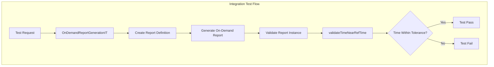

---
tags:
  - reporting
---
# Integration Test Stability

## Summary

The OpenSearch Reporting plugin includes integration tests that validate report generation functionality. These tests verify timing accuracy of generated reports, and require appropriate tolerance settings to account for infrastructure variability across different CI environments.

## Details

### Architecture



### Components

| Component | Description |
|-----------|-------------|
| `OnDemandReportGenerationIT` | Integration test class for on-demand report generation |
| `validateTimeNearRefTime` | Helper function that validates timestamps are within expected tolerance |
| `IntegTestHelpers.kt` | Utility file containing test helper functions |

### Configuration

| Setting | Description | Default |
|---------|-------------|---------|
| Accuracy (seconds) | Time tolerance for timestamp validation | 3 |

### Test Validation Logic

The `validateTimeNearRefTime` function compares:

1. The report's `beginTimeMs` timestamp
2. The expected time based on report definition duration
3. A tolerance window (in seconds)

```kotlin
validateTimeNearRefTime(
    Instant.ofEpochMilli(reportInstance.get("beginTimeMs").asLong),
    Instant.now().minus(Duration.parse(reportDefinition.get("format").asJsonObject.get("duration").asString)),
    3  // seconds tolerance
)
```

## Limitations

- Higher tolerance values may mask genuine timing issues
- Test stability depends on CI infrastructure performance
- Windows ARM64 environments show higher timing variability

## Change History

- **v2.17.0** (2024-09-17): Increased time tolerance from 1 to 3 seconds for `OnDemandReportGenerationIT`


## References

### Documentation
- [Reporting Documentation](https://docs.opensearch.org/2.17/reporting/): Official OpenSearch Reporting docs

### Pull Requests
| Version | PR | Description | Related Issue |
|---------|-----|-------------|---------------|
| v2.17.0 | [#1022](https://github.com/opensearch-project/reporting/pull/1022) | Increase accuracy seconds for on-demand report test | [#1019](https://github.com/opensearch-project/reporting/issues/1019) |

### Issues (Design / RFC)
- [Issue #1019](https://github.com/opensearch-project/reporting/issues/1019): Original test failure report
