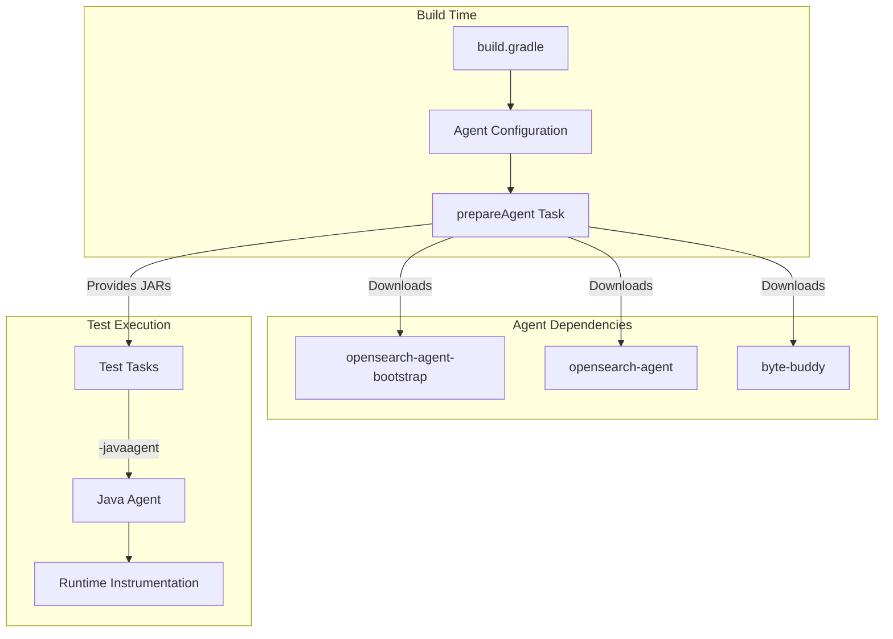
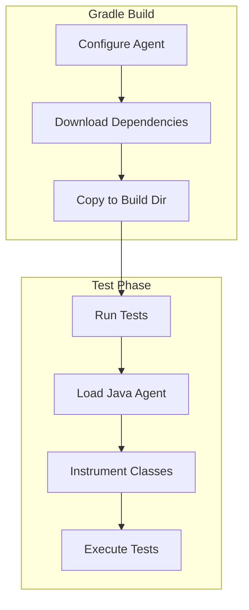

---
tags:
  - reporting
---
# Reporting Plugin Java Agent Migration

## Summary

The Reporting plugin has been updated to support OpenSearch 3.0's Java Agent-based security model. This migration replaces the deprecated Java SecurityManager with a modern bytecode instrumentation approach, ensuring the plugin remains compatible with JDK 21+ and future Java versions where SecurityManager is permanently removed.

## Details

### Architecture



### Data Flow



### Components

| Component | Description |
|-----------|-------------|
| Agent Configuration | Gradle configuration for agent dependencies |
| prepareAgent Task | Copies agent JARs to build directory |
| Test JVM Args | Configures Java Agent for test execution |

### Configuration

| Setting | Description | Default |
|---------|-------------|---------|
| `agent` configuration | Dependency configuration for agent JARs | N/A |
| `javaagent` JVM arg | Path to opensearch-agent JAR | `$buildDir/agent/opensearch-agent-${version}.jar` |

### Usage Example

```groovy
// build.gradle configuration for Java Agent support
allprojects {
    plugins.withId('java') {
        sourceCompatibility = targetCompatibility = "21"
    }

    configurations {
        agent
    }

    task prepareAgent(type: Copy) {
        from(configurations.agent)
        into "$buildDir/agent"
    }

    dependencies {
        agent "org.opensearch:opensearch-agent-bootstrap:${opensearch_version}"
        agent "org.opensearch:opensearch-agent:${opensearch_version}"
        agent "net.bytebuddy:byte-buddy:${versions.bytebuddy}"
    }

    tasks.withType(Test) {
        dependsOn prepareAgent
        jvmArgs += ["-javaagent:" + project.layout.buildDirectory.file("agent/opensearch-agent-${opensearch_version}.jar").get()]
    }
}
```

## Limitations

- Requires JDK 21 as minimum runtime
- All tests must run with the Java Agent enabled
- Not backward compatible with OpenSearch 2.x builds
- Plugin must be rebuilt for OpenSearch 3.0

## Change History

- **v3.0.0** (2025-05-06): Added Java Agent build configuration for SecurityManager replacement


## References

### Documentation
- [Documentation](https://docs.opensearch.org/3.0/reporting/): Reporting plugin documentation
- [PR #17861](https://github.com/opensearch-project/OpenSearch/pull/17861): Phase off SecurityManager usage in favor of Java Agent
- [PR #17900](https://github.com/opensearch-project/OpenSearch/pull/17900): Custom Gradle plugin for Java Agent

### Pull Requests
| Version | PR | Description | Related Issue |
|---------|-----|-------------|---------------|
| v3.0.0 | [#1085](https://github.com/opensearch-project/reporting/pull/1085) | Fix build due to phasing off SecurityManager usage in favor of Java Agent |   |

### Issues (Design / RFC)
- [Issue #16634](https://github.com/opensearch-project/OpenSearch/issues/16634): META - Replace Java Security Manager
