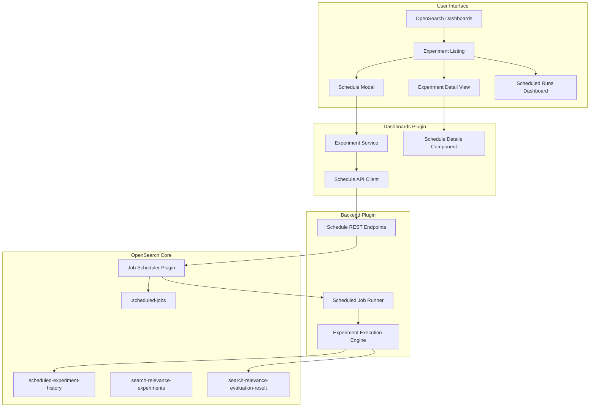
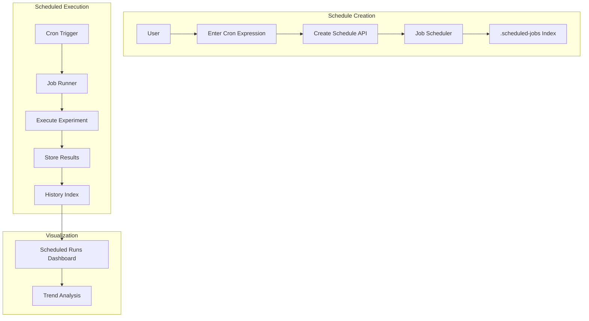

# Scheduled Experiments

## Summary

Scheduled Experiments is a feature in the OpenSearch Search Relevance plugin that enables automated, recurring execution of search relevance experiments. Users can schedule pointwise evaluation and hybrid optimizer experiments to run at specified intervals using cron expressions, allowing continuous monitoring of search quality over time. Results are stored historically, enabling trend analysis and performance tracking through dedicated dashboards.

## Details

### Architecture



### Data Flow



### Components

| Component | Location | Description |
|-----------|----------|-------------|
| `ScheduleModal` | dashboards-search-relevance | Modal dialog for entering cron expressions to schedule experiments |
| `DeleteScheduleModal` | dashboards-search-relevance | Modal for viewing schedule details and deleting schedules |
| `ScheduleDetails` | dashboards-search-relevance | Component displaying schedule information (cron, start time, last run) |
| `ExperimentService` | dashboards-search-relevance | Service class with methods for scheduled experiment CRUD operations |
| `ScheduledJobRunner` | search-relevance | Backend component that executes experiments on schedule |
| `Pointwise Daily Scheduled Runs Dashboard` | dashboards-search-relevance | Pre-built dashboard for visualizing scheduled experiment results over time |

### API Reference

#### Create Scheduled Experiment

```
POST /_plugins/_search_relevance/experiments/schedule
```

Request body:
```json
{
  "experimentId": "string",
  "cronExpression": "string"
}
```

Response:
```json
{
  "id": "string",
  "enabled": true,
  "schedule": {
    "cron": {
      "expression": "0 1 * * *",
      "timezone": "America/Los_Angeles"
    }
  },
  "enabledTime": 1234567890000,
  "lastUpdateTime": 1234567890000
}
```

#### List Scheduled Experiments

```
GET /_plugins/_search_relevance/experiments/schedule
```

#### Get Scheduled Experiment

```
GET /_plugins/_search_relevance/experiments/schedule/{id}
```

#### Delete Scheduled Experiment

```
DELETE /_plugins/_search_relevance/experiments/schedule/{id}
```

### Configuration

| Setting | Description | Default | Required |
|---------|-------------|---------|----------|
| `experimentId` | ID of the experiment to schedule | - | Yes |
| `cronExpression` | Unix cron expression (5 fields) | - | Yes |
| `timezone` | Timezone for schedule evaluation | System default | No |

### Cron Expression Examples

| Expression | Description |
|------------|-------------|
| `0 1 * * *` | Daily at 1:00 AM |
| `0 */6 * * *` | Every 6 hours |
| `0 0 * * 0` | Weekly on Sunday at midnight |
| `0 0 1 * *` | Monthly on the 1st at midnight |
| `*/30 * * * *` | Every 30 minutes |

### Usage Example

#### Scheduling an Experiment via UI

1. Navigate to the Experiments listing page
2. Find a completed pointwise or hybrid optimizer experiment
3. Click the clock icon (unscheduled) to open the Schedule Modal
4. Enter a valid cron expression (e.g., `0 1 * * *` for daily at 1 AM)
5. Click "Schedule Experiment to Run"

#### Viewing Scheduled Results

1. For scheduled pointwise experiments, click the dashboard icon
2. The "Pointwise Daily Scheduled Runs" dashboard shows:
   - Metrics over time (NDCG, MAP, Precision) as line charts
   - Tabular view of daily results with all metrics

#### Deleting a Schedule

1. Click the clock icon (blue, indicating scheduled) on a scheduled experiment
2. View the current cron expression and schedule details
3. Click "Delete" to remove the schedule (experiment remains intact)

### Supported Experiment Types

| Type | Scheduling Support |
|------|-------------------|
| `POINTWISE_EVALUATION` | ✅ Supported |
| `HYBRID_OPTIMIZER` | ✅ Supported |
| `PAIRWISE_COMPARISON` | ❌ Not supported |

## Limitations

- Only experiments in `COMPLETED` status can be scheduled
- Cron expressions must use single spaces between the five fields
- Workload management integration is not yet available
- Alerting integration for failed scheduled runs is planned for future releases
- Resource monitoring for scheduled jobs is not yet implemented
- Cannot modify an existing schedule; must delete and recreate

## Change History

- **v3.4.0** (2025-12): Initial implementation with scheduling APIs, UI components, and dedicated dashboard

## References

### Documentation
- [Job Scheduler Plugin](https://docs.opensearch.org/3.0/monitoring-your-cluster/job-scheduler/index/): OpenSearch Job Scheduler documentation
- [Cron Expression Reference](https://docs.opensearch.org/3.0/observing-your-data/alerting/cron/): Cron expression format guide
- [Search Relevance Overview](https://docs.opensearch.org/3.0/search-plugins/search-relevance/index/): Search Relevance plugin documentation

### Pull Requests
| Version | PR | Repository | Description |
|---------|-----|------------|-------------|
| v3.4.0 | [#220](https://github.com/opensearch-project/search-relevance/pull/220) | search-relevance | Backend APIs and scheduled job runner |
| v3.4.0 | [#636](https://github.com/opensearch-project/dashboards-search-relevance/pull/636) | dashboards-search-relevance | UI components for scheduling |
| v3.4.0 | [#324](https://github.com/opensearch-project/search-relevance/pull/324) | search-relevance | Data integrity for experiment deletion |
| v3.4.0 | [#685](https://github.com/opensearch-project/dashboards-search-relevance/pull/685) | dashboards-search-relevance | GUID search for Search Configuration |
| v3.4.0 | [#686](https://github.com/opensearch-project/dashboards-search-relevance/pull/686) | dashboards-search-relevance | Type/status filtering |
| v3.4.0 | [#670](https://github.com/opensearch-project/dashboards-search-relevance/pull/670) | dashboards-search-relevance | Experiment detail page title |

### Issues (Design / RFC)
- [Issue #213](https://github.com/opensearch-project/search-relevance/issues/213): Original feature request for scheduled experiments
- [Issue #226](https://github.com/opensearch-project/search-relevance/issues/226): Scheduling requirements
- [Issue #238](https://github.com/opensearch-project/search-relevance/issues/238): Data integrity requirements
