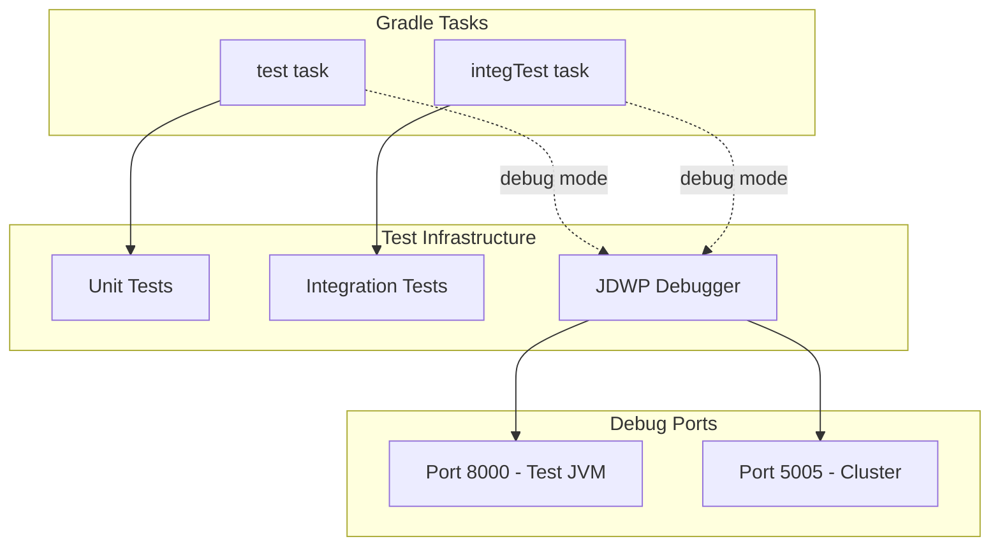

---
tags:
  - domain/search
  - component/server
  - search
---
# Search Relevance CI/Tests

## Summary
The Search Relevance plugin includes a comprehensive CI/CD infrastructure and test framework that supports unit testing, integration testing, and debugging capabilities. This documentation covers the testing infrastructure, debugging tools, and best practices for developers working with the Search Relevance Workbench.

## Details

### Architecture


### Components
| Component | Description |
|-----------|-------------|
| Unit Tests | Fast-running tests for individual components |
| Integration Tests | End-to-end tests with OpenSearch cluster |
| JDWP Debugger | Java Debug Wire Protocol support for debugging |
| UBI Mappings | Manual mappings for User Behavior Insights integration |

### Configuration
| Setting | Description | Default |
|---------|-------------|---------|
| `test.debug` | Enable JDWP debugging for tests | disabled |
| Debug Port (test) | Port for test JVM debugging | 8000 |
| Debug Port (cluster) | Port for cluster debugging | 5005 |

### Usage Example

#### Running Unit Tests
```bash
# Run all unit tests
./gradlew test

# Run with debugging enabled
./gradlew test -Dtest.debug=1
```

#### Running Integration Tests
```bash
# Run all integration tests
./gradlew :integTest

# Run with debugging enabled
./gradlew :integTest -Dtest.debug=1
```

#### Debugging Workflow
1. Start tests with `-Dtest.debug=1` flag
2. Wait for "Listening for transport dt_socket at address: 8000"
3. Attach IDE debugger to `localhost:8000`
4. Set breakpoints and debug

## Limitations
- Debug mode runs tests sequentially (`maxParallelForks = 1`)
- Only one debug agent can be loaded per JVM
- Integration tests require OpenSearch cluster to be running

## Change History
- **v3.4.0** (2026-01-11): Fixed UBI test dependencies, added JDWP debug support, removed deprecated AccessController usage, test code cleanups


## References

### Documentation
- [Search Relevance Repository](https://github.com/opensearch-project/search-relevance)

### Pull Requests
| Version | PR | Description | Related Issue |
|---------|-----|-------------|---------------|
| v3.4.0 | [#311](https://github.com/opensearch-project/search-relevance/pull/311) | Fixed CalculateJudgmentsIT dependency on UBI plugin | [#302](https://github.com/opensearch-project/search-relevance/issues/302) |
| v3.4.0 | [#300](https://github.com/opensearch-project/search-relevance/pull/300) | Added JDWP debug support for test Gradle task | [#299](https://github.com/opensearch-project/search-relevance/issues/299) |
| v3.4.0 | [#296](https://github.com/opensearch-project/search-relevance/pull/296) | Fixed duplicate JDWP configuration in integTest | [#295](https://github.com/opensearch-project/search-relevance/issues/295) |
| v3.4.0 | [#307](https://github.com/opensearch-project/search-relevance/pull/307) | Removed deprecated AccessController.doPrivileged() |   |
| v3.4.0 | [#288](https://github.com/opensearch-project/search-relevance/pull/288) | Small cleanups to test classes |   |

### Issues (Design / RFC)
- [Issue #302](https://github.com/opensearch-project/search-relevance/issues/302): CalculateJudgmentsIT UBI dependency issue
- [Issue #299](https://github.com/opensearch-project/search-relevance/issues/299): JDWP debug support request
- [Issue #295](https://github.com/opensearch-project/search-relevance/issues/295): Duplicate JDWP configuration bug
- [Issue #306](https://github.com/opensearch-project/search-relevance/issues/306): AccessController deprecation warnings
