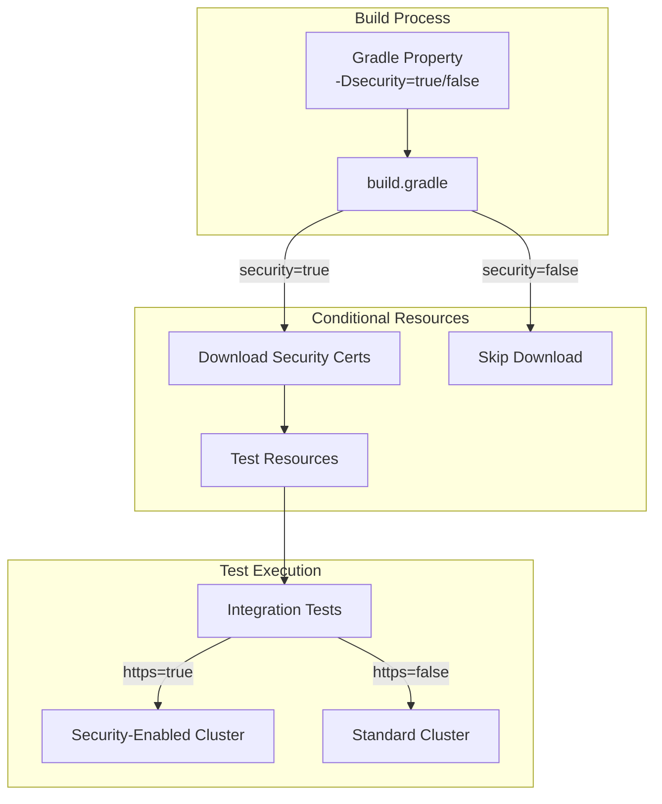

---
tags:
  - search-relevance
---
# Security Integration Test Control

## Summary

The search-relevance plugin provides a configurable system property to control whether integration tests run with the OpenSearch security plugin enabled. This feature allows developers and CI/CD pipelines to selectively enable security plugin integration during testing, providing flexibility in test execution and reducing unnecessary resource downloads when security testing is not required.

## Details

### Architecture



### Components

| Component | Description |
|-----------|-------------|
| `build.gradle` | Contains conditional logic for security resource handling |
| `test_security.yml` | GitHub Actions workflow for security-enabled testing |
| `integtest.sh` | Shell script for remote integration testing |

### Configuration

| Setting | Description | Default |
|---------|-------------|---------|
| `-Dsecurity` | Enable/disable security plugin integration | Not set (disabled) |
| `-Dhttps` | Enable HTTPS for test cluster | `false` |

### Security Certificates

When security testing is enabled, the following certificates are downloaded from the security repository:

| Certificate | Purpose |
|-------------|---------|
| `esnode.pem` | Node certificate |
| `esnode-key.pem` | Node private key |
| `kirk.pem` | Admin certificate |
| `kirk-key.pem` | Admin private key |
| `root-ca.pem` | Root CA certificate |
| `sample.pem` | Sample certificate |
| `test-kirk.jks` | Java keystore for testing |

### Usage Example

```bash
# CI workflow with security enabled
./gradlew integTest -Dhttps=true -Dsecurity=true

# Local development without security
./gradlew integTest

# Remote integration test with security
./gradlew integTestRemote -Dsecurity=true \
  -Dopensearch.version=$VERSION \
  -Dtests.rest.cluster="localhost:9200" \
  -Dhttps=true \
  -Duser=admin \
  -Dpassword=admin
```

## Limitations

- Security certificates are fetched from the `main` branch of the security repository
- The `-Dsecurity` property requires exact string value `"true"` to enable
- Certificate download requires network access to GitHub

## Change History

- **v3.4.0** (2026-01-11): Initial implementation - Added system property to control security plugin integration in tests


## References

### Documentation
- [PR #287](https://github.com/opensearch-project/search-relevance/pull/287): Use a system property to control run integ test with security plugin
- [OpenSearch Security Repository](https://github.com/opensearch-project/security): Source of test certificates

### Pull Requests
| Version | PR | Description | Related Issue |
|---------|-----|-------------|---------------|
| v3.4.0 | [#287](https://github.com/opensearch-project/search-relevance/pull/287) | Initial implementation |   |
