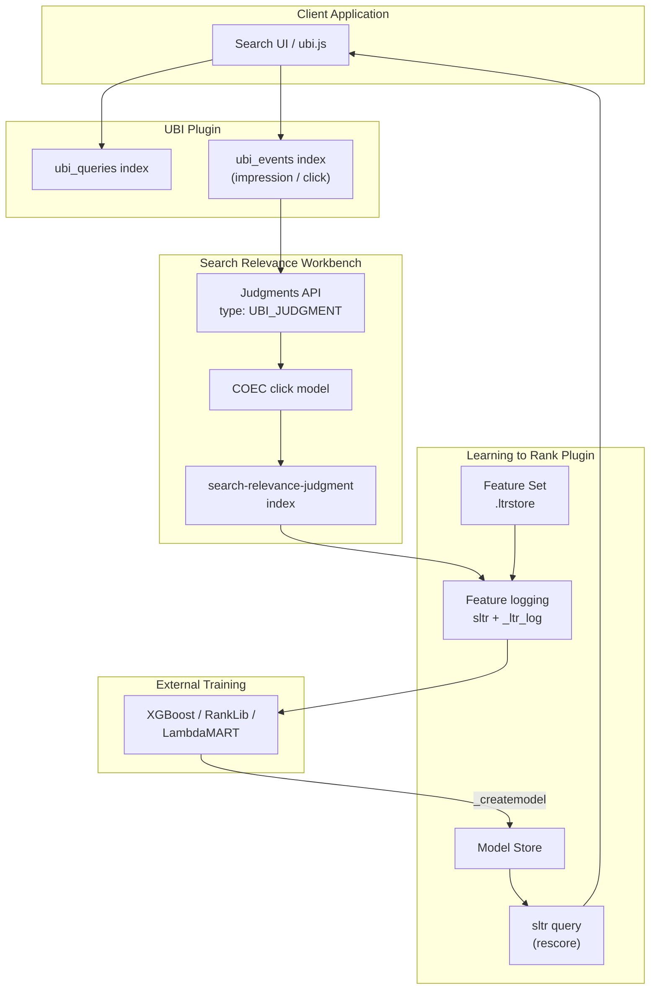
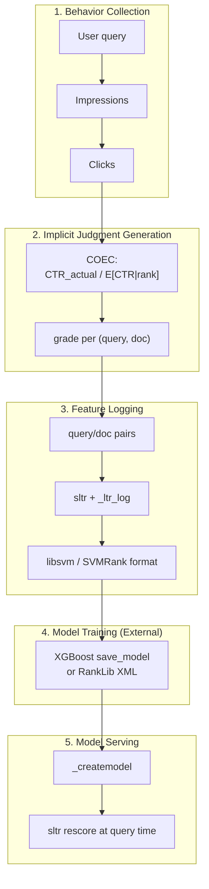

---
tags:
  - search-relevance
---
# UBI and Learning to Rank Integration

## Summary

OpenSearch provides a production path from User Behavior Insights (UBI) data to Learning to Rank (LTR) model training through the Search Relevance Workbench (SRW) Judgments feature. UBI captures user queries, impressions, and clicks; SRW converts that behavioral data into an implicit judgment list using the Clicks Over Expected Clicks (COEC) click model; the LTR plugin then uses those judgments (combined with feature logging) to produce training data for external model training with XGBoost or RankLib. The trained model is uploaded back to the LTR plugin and applied at search time via the `sltr` query.

There is no single API that bridges UBI and LTR directly. The integration is a pipeline that stitches together three independent plugins (UBI, Search Relevance, LTR) plus an external training step.

## Details

### End-to-End Architecture



### Integration Data Flow



### Component Responsibilities

| Component | Plugin / Repo | Role in the Integration |
|-----------|---------------|-------------------------|
| `ubi_queries`, `ubi_events` | user-behavior-insights | Raw behavioral data store (UBI schema 1.3.0) |
| `ubi.js` collector | user-behavior-insights | Client-side capture of queries, impressions, clicks |
| Judgments API (`UBI_JUDGMENT`) | search-relevance (SRW) | Reads `ubi_events`, applies COEC, writes judgment list |
| COEC click model | search-relevance (SRW) | Rank-bias-corrected implicit relevance calculation |
| Feature Set (`.ltrstore`) | opensearch-learning-to-rank-base | Defines query-dependent features |
| `sltr` + `_ltr_log` | opensearch-learning-to-rank-base | Emits feature values for training rows |
| Model parsers | opensearch-learning-to-rank-base | Ingest trained XGBoost / RankLib / linear models |
| `sltr` query | opensearch-learning-to-rank-base | Runtime rescoring with trained model |

### COEC: The Bridge Algorithm

COEC (Clicks Over Expected Clicks) is the only click model implemented in SRW. It converts raw click logs into a relevance grade while correcting for position bias.

For each query–document pair `(q, d)`:

```
judgment(q, d) = CTR_actual(q, d) / E[CTR | rank]
```

Where:
- `E[CTR | rank]` is the average click-through rate observed at each rank across all events in `ubi_events`
- Pairs with CTR higher than the rank average get `judgment > 1` (more relevant than expected)
- Pairs with lower CTR get `judgment < 1` (less relevant than expected)

When the same `(q, d)` is observed at multiple positions, SRW conservatively assumes the lowest (best) position for all impressions and clicks. This biases judgments downward, reflecting the observation that higher-ranked results naturally receive more clicks.

### UBI Judgment Generation Example

```json
PUT _plugins/_search_relevance/judgments
{
  "name": "Implicit Judgments from UBI",
  "type": "UBI_JUDGMENT",
  "clickModel": "coec",
  "maxRank": 20,
  "startDate": "2026-01-01",
  "endDate": "2026-03-31"
}
```

| Parameter | Purpose |
|-----------|---------|
| `type` | Must be `UBI_JUDGMENT` to consume UBI data |
| `clickModel` | Only `coec` is supported today |
| `maxRank` | Upper rank cutoff for events included in the calculation |
| `startDate` / `endDate` | Optional time window (`yyyy-MM-dd`) for behavior data |

### Complementary Judgment Sources in SRW

SRW supports three judgment sources that can coexist and complement UBI-based judgments:

| Type | API `type` value | When to use |
|------|------------------|-------------|
| Implicit | `UBI_JUDGMENT` | You have UBI traffic; best for reflecting real user intent at scale |
| LLM-assisted | `LLM_JUDGMENT` | No user traffic yet, or cold-start queries; requires an ML Commons connector |
| Imported | `IMPORT_JUDGMENT` | You already produce explicit human-rated judgments externally |

### Training Pipeline (External Step)

OpenSearch itself does not train LTR models. The typical pipeline is:

1. Export SRW judgment list via `GET _plugins/_search_relevance/judgments/{id}`
2. For each `(query, docId)` with a grade, run the query through OpenSearch with `sltr` + feature logging to emit feature values
3. Transform the logged output into libsvm / SVMRank format
4. Train with XGBoost (`save_model`) or RankLib (LambdaMART, RankNet) outside the cluster
5. Upload the model:

```json
POST _ltr/_featureset/my_features/_createmodel
{
  "model": {
    "name": "ubi_ltr_v1",
    "model": {
      "type": "model/xgboost+json+raw",
      "definition": "{...XGBoost save_model JSON...}"
    }
  }
}
```

6. Use the model at query time:

```json
POST products/_search
{
  "query": { "match": { "title": "red dress" } },
  "rescore": {
    "window_size": 100,
    "query": {
      "rescore_query": {
        "sltr": {
          "params": { "keywords": "red dress" },
          "model": "ubi_ltr_v1"
        }
      }
    }
  }
}
```

### A/B Testing LTR Models with UBI

UBI v3.2.0 added a `search_config` field on events, enabling Team Draft Interleaving (TDI) and side-by-side comparison of an LTR-enabled configuration against a baseline. This closes the loop: UBI captures behavior → SRW generates judgments → LTR model is trained → UBI collects new behavior under the new model → SRW experiments measure lift.

## Limitations

- **COEC is the only click model** in SRW. More advanced click models (DBN, UBM, cascade) are not supported.
- **Position-bias correction only**: COEC does not correct for presentation bias (thumbnails, snippets, badges), selection bias from earlier rankers, or trust bias.
- **Lowest-rank assumption** for multi-position observations biases judgments conservatively downward.
- **No built-in training engine**: OpenSearch does not train LTR models. Steps 3–4 in the pipeline require an external environment (Python + XGBoost/RankLib).
- **No direct UBI → LTR feature logging shortcut**: You must explicitly replay the queries in the judgment list against `sltr` to generate training rows; UBI does not store feature values.
- **Traffic threshold**: COEC requires enough impressions per `(q, d, rank)` bucket to produce stable judgments. Low-traffic sites should combine `UBI_JUDGMENT` with `LLM_JUDGMENT` or `IMPORT_JUDGMENT`.
- **Cold-start gaps**: New queries or new documents have no UBI history and will be absent from UBI-derived judgment lists.
- **Schema coupling**: SRW reads fixed fields (`action_name`, rank/position) from `ubi_events`. Custom UBI extensions must still conform to the UBI schema to be consumed.

## Change History

- **v3.2.0** (2025-06-26): UBI added `search_config` field on events, enabling A/B testing of LTR configurations with Team Draft Interleaving
- **v3.0.0** (2025-05-13): LTR plugin added XGBoost raw JSON parser (`model/xgboost+json+raw`) supporting the `save_model` serialization format, which is the recommended output from XGBoost-based training on UBI judgments
- **v2.15.0** (2024-06-25): UBI introduced as a standard schema and plugin, making systematic behavior capture for LTR training possible
- SRW Judgments with `UBI_JUDGMENT` + COEC: available in current SRW releases as the officially documented UBI-to-judgment path

## References

### Documentation
- [User Behavior Insights](https://docs.opensearch.org/latest/search-plugins/ubi/index/): UBI overview and schema
- [UBI Schema Specification](https://github.com/o19s/ubi): Industry-standard schema (referenced by OpenSearch UBI 1.3.0)
- [Search Relevance Workbench: Judgments](https://docs.opensearch.org/latest/search-plugins/search-relevance/judgments/): `UBI_JUDGMENT`, `LLM_JUDGMENT`, `IMPORT_JUDGMENT` API reference and COEC description
- [LTR ML Ranking Core Concepts](https://docs.opensearch.org/latest/search-plugins/ltr/core-concepts/): Judgment lists, features, training, testing
- [LTR: Logging Feature Scores](https://docs.opensearch.org/latest/search-plugins/ltr/logging-features/): Generating training data
- [LTR: Uploading Trained Models](https://docs.opensearch.org/latest/search-plugins/ltr/training-models/): Model upload formats
- [LTR: Searching with Your Model](https://docs.opensearch.org/latest/search-plugins/ltr/searching-with-your-model/): `sltr` query usage

### Related Feature Reports
- Learning to Rank (`docs/features/learning/learning-to-rank.md`)
- User Behavior Insights Data Generator (`docs/features/user-behavior-insights/user-behavior-insights-data-generator.md`)
- Search Relevance Workbench (SRW) (`docs/features/dashboards-search-relevance/dashboards-search-relevance-search-relevance-workbench-srw.md`)

### Repositories
- [opensearch-project/user-behavior-insights](https://github.com/opensearch-project/user-behavior-insights)
- [opensearch-project/search-relevance](https://github.com/opensearch-project/search-relevance)
- [opensearch-project/opensearch-learning-to-rank-base](https://github.com/opensearch-project/opensearch-learning-to-rank-base)

### Background Reading
- [Unbiased Learning-to-Rank with Biased Feedback (Joachims et al., 2017)](https://www.cs.cornell.edu/people/tj/publications/joachims_etal_17a.pdf): Theoretical foundation for click-model-based judgments
- [Click Models for Web Search](https://clickmodels.weebly.com/): Overview of CTR, COEC, cascade, DBN, and related models
