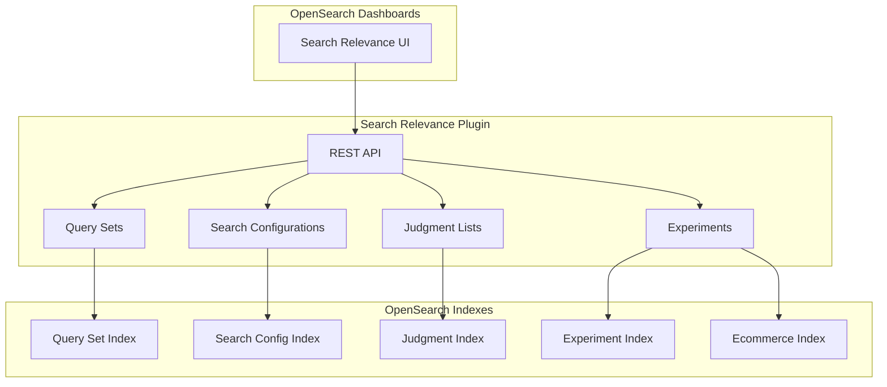

---
tags:
  - search-relevance
---
# Search Relevance Workbench

## Summary

Search Relevance Workbench is an experimental toolkit in OpenSearch that helps search relevance engineers and business users improve search result quality through experimentation. It provides tools for comparing search configurations, evaluating search quality with metrics, and optimizing hybrid search queries.

## Details

### Architecture



### Components

| Component | Description |
|-----------|-------------|
| Query Sets | Collections of queries used for search evaluation experiments |
| Search Configurations | Query patterns defining how searches are executed |
| Judgment Lists | Relevance ratings for query-document pairs |
| Experiments | Evaluation runs comparing search configurations |

### Experiment Types

| Type | Description |
|------|-------------|
| Pairwise Comparison | Compare results of two search configurations side-by-side |
| Pointwise Evaluation | Evaluate search quality using metrics and judgment lists |
| Hybrid Search Optimization | Find optimal parameters for hybrid search queries |

### Configuration

Enable the Search Relevance Workbench backend:

```json
PUT _cluster/settings
{
  "persistent": {
    "plugins.search_relevance.workbench_enabled": true
  }
}
```

### API Endpoints

| Endpoint | Description |
|----------|-------------|
| `PUT _plugins/_search_relevance/query_sets` | Create a query set |
| `PUT _plugins/_search_relevance/search_configurations` | Create a search configuration |
| `PUT _plugins/_search_relevance/judgments` | Import judgments |
| `POST _plugins/_search_relevance/experiments` | Create and run an experiment |
| `GET _plugins/_search_relevance/experiments/{id}` | Get experiment results |

### Usage Example

Create a query set:
```json
PUT _plugins/_search_relevance/query_sets
{
  "name": "Product Queries",
  "description": "Common product search queries",
  "sampling": "manual",
  "querySetQueries": [
    { "queryText": "laptop" },
    { "queryText": "wireless headphones" }
  ]
}
```

Create a search configuration:
```json
PUT _plugins/_search_relevance/search_configurations
{
  "name": "baseline_config",
  "query": "{\"query\":{\"multi_match\":{\"query\":\"%SearchText%\",\"fields\":[\"title\",\"description\"]}}}",
  "index": "ecommerce"
}
```

Run a comparison experiment:
```json
POST _plugins/_search_relevance/experiments
{
  "querySetId": "<query_set_id>",
  "searchConfigurationList": ["<config_1_id>", "<config_2_id>"],
  "size": 10,
  "type": "PAIRWISE_COMPARISON"
}
```

### Metrics

The workbench calculates several comparison metrics:

| Metric | Description |
|--------|-------------|
| Jaccard | Overlap between result sets |
| RBO50 | Rank-Biased Overlap at 50% weight |
| RBO90 | Rank-Biased Overlap at 90% weight |
| Frequency Weighted | Weighted frequency of result overlap |

### Test Data

The plugin includes test data based on Amazon's ESCI (Shopping Queries Dataset):

- **Product catalog**: E-commerce products with images
- **Query set**: 150 queries from the ESCI ranking task
- **Judgments**: Relevance ratings for query-document pairs

## Limitations

- Experimental feature - not recommended for production use
- Requires both frontend (Dashboards) and backend plugins to be enabled
- Dynamic field mappings may require increased `total_fields.limit` setting

## Change History

- **v3.5.0** (2026-02-11): LLM judgment customization - customizable prompt templates with three rating types (SCORE0_1, SCORE1_5, RELEVANT_IRRELEVANT), enhanced caching with prompt template differentiation
- **v3.5.0** (2026-02-11): New `_search` API endpoints for Query Sets, Search Configurations, Judgments, and Experiments using OpenSearch DSL
- **v3.5.0** (2026-02-11): UBI sample dataset and dashboards for understanding user interaction patterns
- **v3.5.0** (2026-02-11): UI/UX improvements - Search Configuration reuse in comparison workflows, improved Judgment Detail page with structured table view
- **v3.5.0** (2026-02-11): Infrastructure - version-based index mapping updates with `_meta.schema_version`, description field for Search Configurations
- **v3.4.0** (2026-01-11): Bug fix - Fix floating-point precision issues in Hybrid Optimizer weight generation by switching to step-based iteration and rounding, ensuring clean weight pairs like 0.4/0.6 instead of 0.39999998/0.60000002
- **v3.4.0** (2026-01-11): Bug fix - Fix hybrid optimizer experiments stuck in PROCESSING after judgment deletion by correcting failure handling to properly transition to ERROR state
- **v3.4.0** (2026-01-11): Bug fix - Fix query serialization for plugins (e.g., Learning to Rank) that extend OpenSearch's DSL, enabling LTR rescore queries in experiments
- **v3.3.0** (2026-01-11): Bug fix - ImportJudgmentsProcessor now handles numeric ratings (integers, floats) in addition to strings, and preserves original judgment order
- **v3.2.0** (2026-01-11): Major enhancements - new default SRW UI, dashboard visualization for experiments, polling mechanism for status updates, date filtering for implicit judgments, task scheduling for experiments
- **v3.2.0** (2026-01-10): Bug fixes - backend plugin disabled messaging, pipeline error suppression, validation results overflow, Venn diagram statistics, REST API error status, input validation, pipeline parameter fix
- **v3.2.0** (2026-01-10): Fixed toast notification error messages not rendering correctly across multiple UI components
- **v3.1.0** (2025-06-16): Major feature additions - hybrid search experiment type, feature flag, external judgment import, Stats API, URL path changes, security integration with roles
- **v3.1.0** (2025-06-16): Bug fixes - data model restructuring, LLM judgment improvements, search request builder fix, hybrid optimizer fix, input validation
- **v3.1.0** (2025-06-06): Added realistic ESCI-based test dataset with 150 queries and matching judgments


## References

### Documentation
- [Search Relevance Workbench Documentation](https://docs.opensearch.org/3.1/search-plugins/search-relevance/using-search-relevance-workbench/)
- [Search Relevance Plugin Repository](https://github.com/opensearch-project/search-relevance)
- [Dashboards Search Relevance Repository](https://github.com/opensearch-project/dashboards-search-relevance)
- [ESCI Dataset](https://github.com/amazon-science/esci-data): Amazon Shopping Queries Dataset

### Blog Posts
- [Taking your first steps towards search relevance](https://opensearch.org/blog/taking-your-first-steps-towards-search-relevance/): Blog post

### Pull Requests
| Version | PR | Description | Related Issue |
|---------|-----|-------------|---------------|
| v3.5.0 | [#667](https://github.com/opensearch-project/dashboards-search-relevance/pull/667) | Add FrontEnd Support for LLM Judgement Template Prompt |   |
| v3.5.0 | [#727](https://github.com/opensearch-project/dashboards-search-relevance/pull/727) | Reuse Search Configurations with Single Query Comparison UI | [#695](https://github.com/opensearch-project/dashboards-search-relevance/issues/695) |
| v3.5.0 | [#729](https://github.com/opensearch-project/dashboards-search-relevance/pull/729) | Add UBI sample dataset and dashboards | [#730](https://github.com/opensearch-project/dashboards-search-relevance/issues/730) |
| v3.5.0 | [#674](https://github.com/opensearch-project/dashboards-search-relevance/pull/674) | Add optional status=COMPLETED parameter for filtering judgments | [#266](https://github.com/opensearch-project/search-relevance/issues/266) |
| v3.5.0 | [#699](https://github.com/opensearch-project/dashboards-search-relevance/pull/699) | Add Search Pipeline to Search Configuration Detail page |   |
| v3.5.0 | [#713](https://github.com/opensearch-project/dashboards-search-relevance/pull/713) | Improve UX of the Judgment Detail page | [#691](https://github.com/opensearch-project/dashboards-search-relevance/issues/691) |
| v3.5.0 | [#344](https://github.com/opensearch-project/search-relevance/pull/344) | Version-based index mapping update support | [#310](https://github.com/opensearch-project/search-relevance/issues/310) |
| v3.5.0 | [#264](https://github.com/opensearch-project/search-relevance/pull/264) | LLM Judgement Customized Prompt Template Implementation |   |
| v3.5.0 | [#372](https://github.com/opensearch-project/search-relevance/pull/372) | Add `_search` endpoint for Search Configurations | [#351](https://github.com/opensearch-project/search-relevance/issues/351) |
| v3.5.0 | [#371](https://github.com/opensearch-project/search-relevance/pull/371) | Add `_search` endpoint for Judgments | [#351](https://github.com/opensearch-project/search-relevance/issues/351) |
| v3.5.0 | [#362](https://github.com/opensearch-project/search-relevance/pull/362) | Add `_search` endpoint for Query Sets | [#351](https://github.com/opensearch-project/search-relevance/issues/351) |
| v3.5.0 | [#369](https://github.com/opensearch-project/search-relevance/pull/369) | Add `_search` endpoint for Experiments | [#351](https://github.com/opensearch-project/search-relevance/issues/351) |
| v3.5.0 | [#354](https://github.com/opensearch-project/search-relevance/pull/354) | Better ESCI demo dataset with images |   |
| v3.5.0 | [#364](https://github.com/opensearch-project/search-relevance/pull/364) | Support for parsing custom UBI indexes |   |
| v3.5.0 | [#370](https://github.com/opensearch-project/search-relevance/pull/370) | Add description support in Search Configuration | [#281](https://github.com/opensearch-project/search-relevance/issues/281) |
| v3.5.0 | [#349](https://github.com/opensearch-project/search-relevance/pull/349) | Add BWC and Integration tests for index mapping update |   |
| v3.2.0 | [#570](https://github.com/opensearch-project/dashboards-search-relevance/pull/570) | Dashboard visualization for evaluation and hybrid experiments |   |
| v3.2.0 | [#577](https://github.com/opensearch-project/dashboards-search-relevance/pull/577) | AutoPopulated fields in Query Compare page via URL parameters |   |
| v3.2.0 | [#594](https://github.com/opensearch-project/dashboards-search-relevance/pull/594) | Polling mechanism for experiment and judgment listing |   |
| v3.2.0 | [#604](https://github.com/opensearch-project/dashboards-search-relevance/pull/604) | Date picker fields for implicit judgment filtering |   |
| v3.2.0 | [#614](https://github.com/opensearch-project/dashboards-search-relevance/pull/614) | Default to new SRW UI with opt-out option | [#605](https://github.com/opensearch-project/dashboards-search-relevance/issues/605) |
| v3.2.0 | [#567](https://github.com/opensearch-project/dashboards-search-relevance/pull/567) | Show names instead of IDs in experiment creation |   |
| v3.2.0 | [#574](https://github.com/opensearch-project/dashboards-search-relevance/pull/574) | Retrieve experiment results using experimentId field | [#175](https://github.com/opensearch-project/search-relevance/issues/175) |
| v3.2.0 | [#573](https://github.com/opensearch-project/dashboards-search-relevance/pull/573) | Add tooltips for metrics |   |
| v3.2.0 | [#572](https://github.com/opensearch-project/dashboards-search-relevance/pull/572) | Remove IDs from experiment table, link type instead |   |
| v3.2.0 | [#593](https://github.com/opensearch-project/dashboards-search-relevance/pull/593) | Publish metrics stats without authorization |   |
| v3.2.0 | [#165](https://github.com/opensearch-project/search-relevance/pull/165) | Date filtering for UBI events in implicit judgments |   |
| v3.2.0 | [#174](https://github.com/opensearch-project/search-relevance/pull/174) | Enrich results index for dashboard visualization |   |
| v3.2.0 | [#139](https://github.com/opensearch-project/search-relevance/pull/139) | Task scheduling for hybrid optimizer experiments | [#159](https://github.com/opensearch-project/search-relevance/issues/159) |
| v3.2.0 | [#167](https://github.com/opensearch-project/search-relevance/pull/167) | Task scheduling for pointwise experiments | [#162](https://github.com/opensearch-project/search-relevance/issues/162) |
| v3.2.0 | [#578](https://github.com/opensearch-project/dashboards-search-relevance/pull/578) | Improve messaging when backend plugin is disabled | [#543](https://github.com/opensearch-project/dashboards-search-relevance/issues/543) |
| v3.2.0 | [#582](https://github.com/opensearch-project/dashboards-search-relevance/pull/582) | Do not show Pipeline error if there are no pipelines yet | [#557](https://github.com/opensearch-project/dashboards-search-relevance/issues/557) |
| v3.2.0 | [#585](https://github.com/opensearch-project/dashboards-search-relevance/pull/585) | Avoid validation results overflow in Search Configuration creation | [#584](https://github.com/opensearch-project/dashboards-search-relevance/issues/584) |
| v3.2.0 | [#586](https://github.com/opensearch-project/dashboards-search-relevance/pull/586) | Fix wrong unique number of results in Venn diagram | [#529](https://github.com/opensearch-project/dashboards-search-relevance/issues/529) |
| v3.2.0 | [#176](https://github.com/opensearch-project/search-relevance/pull/176) | Bug fix on REST APIs error status for creations |   |
| v3.2.0 | [#177](https://github.com/opensearch-project/search-relevance/pull/177) | Added queryText and referenceAnswer text validation from manual input | [#186](https://github.com/opensearch-project/search-relevance/issues/186) |
| v3.2.0 | [#187](https://github.com/opensearch-project/search-relevance/pull/187) | Fixed pipeline parameter being ignored in pairwise metrics processing for hybrid | [#170](https://github.com/opensearch-project/search-relevance/issues/170) |
| v3.2.0 | [#612](https://github.com/opensearch-project/dashboards-search-relevance/pull/612) | Bug fixes for error messages not render correctly for toast notifications |   |
| v3.1.0 | [#533](https://github.com/opensearch-project/opensearch-dashboards-search-relevance/pull/533) | Add search relevance workbench features (Dashboards) |   |
| v3.1.0 | [#26](https://github.com/opensearch-project/opensearch-search-relevance/pull/26) | Added new experiment type for hybrid search |   |
| v3.1.0 | [#29](https://github.com/opensearch-project/opensearch-search-relevance/pull/29) | Extend data model to adopt different experiment options/parameters |   |
| v3.1.0 | [#34](https://github.com/opensearch-project/opensearch-search-relevance/pull/34) | Added feature flag for search relevance workbench |   |
| v3.1.0 | [#40](https://github.com/opensearch-project/opensearch-search-relevance/pull/40) | Added validation for hybrid query structure |   |
| v3.1.0 | [#42](https://github.com/opensearch-project/opensearch-search-relevance/pull/42) | Add support for importing judgments created externally |   |
| v3.1.0 | [#62](https://github.com/opensearch-project/opensearch-search-relevance/pull/62) | Changing URL for plugin APIs to /_plugin/_search_relevance |   |
| v3.1.0 | [#63](https://github.com/opensearch-project/opensearch-search-relevance/pull/63) | Add stats API |   |
| v3.1.0 | [#5376](https://github.com/opensearch-project/security/pull/5376) | Integrate search-relevance functionalities with security plugin |   |
| v3.1.0 | [#70](https://github.com/opensearch-project/search-relevance/pull/70) | Add realistic ESCI-based test dataset |   |
| v3.1.0 | [#22](https://github.com/opensearch-project/search-relevance/pull/22) | Build search request with normal parsing and wrapper query |   |
| v3.1.0 | [#27](https://github.com/opensearch-project/search-relevance/pull/27) | LLM Judgment Processor improvements | [#28](https://github.com/opensearch-project/search-relevance/issues/28) |
| v3.1.0 | [#45](https://github.com/opensearch-project/search-relevance/pull/45) | Handle when no experiment variants exist |   |
| v3.1.0 | [#60](https://github.com/opensearch-project/search-relevance/pull/60) | Enable Search Relevance backend plugin in demo scripts |   |
| v3.1.0 | [#64](https://github.com/opensearch-project/search-relevance/pull/64) | Migrate from judgment score to judgment rating |   |
| v3.1.0 | [#65](https://github.com/opensearch-project/search-relevance/pull/65) | Added lazy index creation for APIs | [#55](https://github.com/opensearch-project/search-relevance/issues/55) |
| v3.1.0 | [#69](https://github.com/opensearch-project/search-relevance/pull/69) | Extend hybrid search optimizer demo script |   |
| v3.1.0 | [#74](https://github.com/opensearch-project/search-relevance/pull/74) | Set limit for number of fields programmatically | [#71](https://github.com/opensearch-project/search-relevance/issues/71) |
| v3.1.0 | [#77](https://github.com/opensearch-project/search-relevance/pull/77) | Change model for Judgment entity | [#71](https://github.com/opensearch-project/search-relevance/issues/71) |
| v3.1.0 | [#93](https://github.com/opensearch-project/search-relevance/pull/93) | Fix judgment handling for implicit judgments | [#71](https://github.com/opensearch-project/search-relevance/issues/71) |
| v3.1.0 | [#98](https://github.com/opensearch-project/search-relevance/pull/98) | Refactor and fix LLM judgment duplication issue |   |
| v3.1.0 | [#99](https://github.com/opensearch-project/search-relevance/pull/99) | Change model for Experiment and Evaluation Result entities | [#71](https://github.com/opensearch-project/search-relevance/issues/71) |
| v3.1.0 | [#116](https://github.com/opensearch-project/search-relevance/pull/116) | Add text validation and query set file size check |   |
| v3.1.0 | [#124](https://github.com/opensearch-project/search-relevance/pull/124) | Fixed missing variants in Hybrid Optimizer | [#109](https://github.com/opensearch-project/search-relevance/issues/109) |
| v3.4.0 | [#308](https://github.com/opensearch-project/search-relevance/pull/308) | Fix floating-point precision issues in Hybrid Optimizer weight generation | [#298](https://github.com/opensearch-project/search-relevance/issues/298) |
| v3.4.0 | [#292](https://github.com/opensearch-project/search-relevance/pull/292) | Fix hybrid optimizer experiments stuck in PROCESSING after judgment deletion | [#282](https://github.com/opensearch-project/search-relevance/issues/282) |
| v3.4.0 | [#260](https://github.com/opensearch-project/search-relevance/pull/260) | Fix query serialization for plugins (e.g., Learning to Rank) that extend OpenSearch's DSL | [#255](https://github.com/opensearch-project/search-relevance/issues/255) |
| v3.3.0 | [#230](https://github.com/opensearch-project/search-relevance/pull/230) | Fix ImportJudgmentsProcessor to handle numeric ratings | [#229](https://github.com/opensearch-project/search-relevance/issues/229) |

### Issues (Design / RFC)
- [Issue #12](https://github.com/opensearch-project/search-relevance/issues/12): LLM Judgment improvements
- [Issue #14](https://github.com/opensearch-project/search-relevance/issues/14): Search request builder fix
- [Issue #55](https://github.com/opensearch-project/search-relevance/issues/55): Lazy index creation
- [Issue #71](https://github.com/opensearch-project/search-relevance/issues/71): Dynamic field mapping issues
- [Issue #95](https://github.com/opensearch-project/search-relevance/issues/95): LLM judgment duplication
- [Issue #109](https://github.com/opensearch-project/search-relevance/issues/109): Missing variants in Hybrid Optimizer
- [Issue #114](https://github.com/opensearch-project/search-relevance/issues/114): Input validation
- [Issue #170](https://github.com/opensearch-project/search-relevance/issues/170): Missing pipeline name in experiments
- [Issue #186](https://github.com/opensearch-project/search-relevance/issues/186): Input validation for query sets
- [Issue #529](https://github.com/opensearch-project/dashboards-search-relevance/issues/529): Venn diagram incorrect counts
- [Issue #543](https://github.com/opensearch-project/dashboards-search-relevance/issues/543): Backend plugin disabled messaging
- [Issue #557](https://github.com/opensearch-project/dashboards-search-relevance/issues/557): Pipeline error when no pipelines exist
- [Issue #584](https://github.com/opensearch-project/dashboards-search-relevance/issues/584): Validation results overflow
- [Issue #298](https://github.com/opensearch-project/search-relevance/issues/298): Floating-point precision in Hybrid Optimizer weights
- [Issue #282](https://github.com/opensearch-project/search-relevance/issues/282): Hybrid Optimizer stuck in PROCESSING after judgment deletion
- [Issue #229](https://github.com/opensearch-project/search-relevance/issues/229): Numeric rating type casting bug
