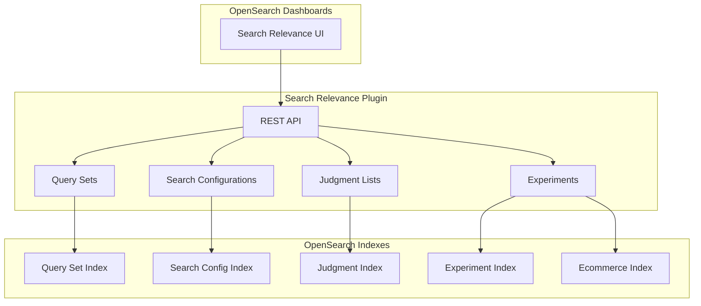

# Search Relevance Workbench

## Summary

Search Relevance Workbench is an experimental toolkit in OpenSearch that helps search relevance engineers and business users improve search result quality through experimentation. It provides tools for comparing search configurations, evaluating search quality with metrics, and optimizing hybrid search queries.

## Details

### Architecture



### Components

| Component | Description |
|-----------|-------------|
| Query Sets | Collections of queries used for search evaluation experiments |
| Search Configurations | Query patterns defining how searches are executed |
| Judgment Lists | Relevance ratings for query-document pairs |
| Experiments | Evaluation runs comparing search configurations |

### Experiment Types

| Type | Description |
|------|-------------|
| Pairwise Comparison | Compare results of two search configurations side-by-side |
| Pointwise Evaluation | Evaluate search quality using metrics and judgment lists |
| Hybrid Search Optimization | Find optimal parameters for hybrid search queries |

### Configuration

Enable the Search Relevance Workbench backend:

```json
PUT _cluster/settings
{
  "persistent": {
    "plugins.search_relevance.workbench_enabled": true
  }
}
```

### API Endpoints

| Endpoint | Description |
|----------|-------------|
| `PUT _plugins/_search_relevance/query_sets` | Create a query set |
| `PUT _plugins/_search_relevance/search_configurations` | Create a search configuration |
| `PUT _plugins/_search_relevance/judgments` | Import judgments |
| `POST _plugins/_search_relevance/experiments` | Create and run an experiment |
| `GET _plugins/_search_relevance/experiments/{id}` | Get experiment results |

### Usage Example

Create a query set:
```json
PUT _plugins/_search_relevance/query_sets
{
  "name": "Product Queries",
  "description": "Common product search queries",
  "sampling": "manual",
  "querySetQueries": [
    { "queryText": "laptop" },
    { "queryText": "wireless headphones" }
  ]
}
```

Create a search configuration:
```json
PUT _plugins/_search_relevance/search_configurations
{
  "name": "baseline_config",
  "query": "{\"query\":{\"multi_match\":{\"query\":\"%SearchText%\",\"fields\":[\"title\",\"description\"]}}}",
  "index": "ecommerce"
}
```

Run a comparison experiment:
```json
POST _plugins/_search_relevance/experiments
{
  "querySetId": "<query_set_id>",
  "searchConfigurationList": ["<config_1_id>", "<config_2_id>"],
  "size": 10,
  "type": "PAIRWISE_COMPARISON"
}
```

### Metrics

The workbench calculates several comparison metrics:

| Metric | Description |
|--------|-------------|
| Jaccard | Overlap between result sets |
| RBO50 | Rank-Biased Overlap at 50% weight |
| RBO90 | Rank-Biased Overlap at 90% weight |
| Frequency Weighted | Weighted frequency of result overlap |

### Test Data

The plugin includes test data based on Amazon's ESCI (Shopping Queries Dataset):

- **Product catalog**: E-commerce products with images
- **Query set**: 150 queries from the ESCI ranking task
- **Judgments**: Relevance ratings for query-document pairs

## Limitations

- Experimental feature - not recommended for production use
- Requires both frontend (Dashboards) and backend plugins to be enabled
- Dynamic field mappings may require increased `total_fields.limit` setting

## Related PRs

| Version | PR | Description |
|---------|-----|-------------|
| v3.1.0 | [#70](https://github.com/opensearch-project/search-relevance/pull/70) | Add realistic ESCI-based test dataset |

## References

- [Search Relevance Workbench Documentation](https://docs.opensearch.org/3.1/search-plugins/search-relevance/using-search-relevance-workbench/)
- [Search Relevance Plugin Repository](https://github.com/opensearch-project/search-relevance)
- [Dashboards Search Relevance Repository](https://github.com/opensearch-project/dashboards-search-relevance)
- [ESCI Dataset](https://github.com/amazon-science/esci-data): Amazon Shopping Queries Dataset
- [Taking your first steps towards search relevance](https://opensearch.org/blog/taking-your-first-steps-towards-search-relevance/): Blog post

## Change History

- **v3.1.0** (2025-06-06): Added realistic ESCI-based test dataset with 150 queries and matching judgments
