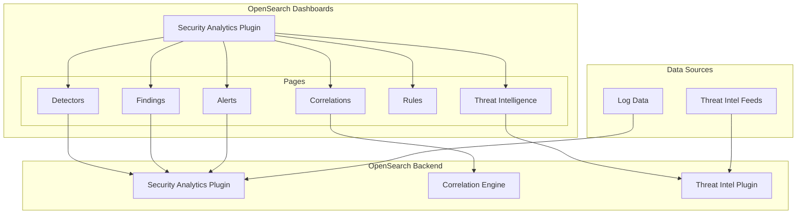

# Security Analytics

## Summary

Security Analytics is a security information and event management (SIEM) solution for OpenSearch, designed to investigate, detect, analyze, and respond to security threats. It provides out-of-the-box threat detection using Sigma rules, correlation capabilities to identify relationships between security events across different log sources, and threat intelligence integration for IOC-based detection.

## Details

### Architecture

### Components

| Component | Description |
|-----------|-------------|
| Detectors | Configure threat detection for specific log types using Sigma rules |
| Findings | Security events identified by detectors matching rules |
| Alerts | Notifications triggered when findings meet specified conditions |
| Correlations | Relationships between findings from different log sources |
| Rules | Sigma-based detection rules for identifying threats |
| Threat Intelligence | IOC-based detection using external threat feeds |

### Key Features

#### Threat Detection
- Pre-packaged Sigma rules for common log types
- Custom rule creation and import
- Multiple log type support (CloudTrail, VPC Flow, Windows, etc.)

#### Correlation Engine
- Cross-log-type correlation rules
- Visual correlation graph
- Time-window based correlation

#### Threat Intelligence
- External threat feed integration
- IOC type support (IP, domain, hash, etc.)
- Automated scanning of log sources

### Configuration

| Setting | Description | Default |
|---------|-------------|---------|
| `plugins.security_analytics.correlation_time_window` | Time window for correlations | 5m |
| `plugins.security_analytics.filter_by_backend_roles` | Enable backend role filtering | false |

## Limitations

- Correlation graph visualization requires sufficient findings data
- Vega-based visualizations may have compatibility issues in certain environments

## Change History

- **v3.4.0** (2026-01): Fixed correlation table rendering bug - table was not being populated due to missing error handling and incorrect filter logic
- **v3.2.0** (2026-01): Bugfixes for correlations page (removed Vega chart) and IOC types API update

## References

### Documentation
- [Security Analytics Documentation](https://docs.opensearch.org/3.0/security-analytics/)
- [Setting up Security Analytics](https://docs.opensearch.org/3.0/security-analytics/sec-analytics-config/index/)
- [Threat Intelligence](https://docs.opensearch.org/3.0/security-analytics/threat-intelligence/index/)
- [Working with the Correlation Graph](https://docs.opensearch.org/3.0/security-analytics/usage/correlation-graph/)
- [Creating Correlation Rules](https://docs.opensearch.org/3.0/security-analytics/sec-analytics-config/correlation-config/)
- [Security Analytics Settings](https://docs.opensearch.org/3.0/security-analytics/settings/)

### Pull Requests
| Version | PR | Description | Related Issue |
|---------|-----|-------------|---------------|
| v3.4.0 | [#1360](https://github.com/opensearch-project/security-analytics-dashboards-plugin/pull/1360) | Correlation table rendering fixed |   |
| v3.2.0 | [#1313](https://github.com/opensearch-project/security-analytics-dashboards-plugin/pull/1313) | Remove correlated findings bar chart that uses vega |   |
| v3.2.0 | [#1312](https://github.com/opensearch-project/security-analytics-dashboards-plugin/pull/1312) | Update API call to get IOC types |   |
