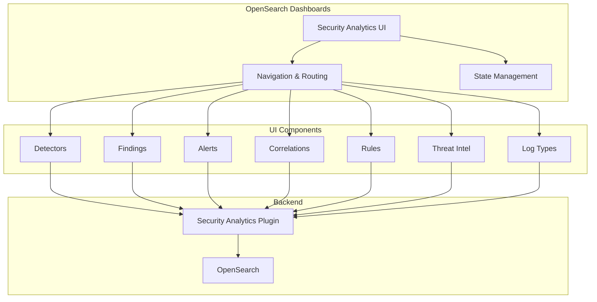

---
tags:
  - security-analytics-dashboards
---
# Security Analytics Dashboards Plugin

## Summary

The Security Analytics Dashboards plugin provides the user interface for OpenSearch Security Analytics, enabling security teams to detect threats, investigate security events, and manage detection rules through OpenSearch Dashboards. It integrates with the Security Analytics backend plugin to provide visualization of findings, alerts, correlations, and threat intelligence data.

## Details

### Architecture

### Components

| Component | Description |
|-----------|-------------|
| Detectors | Create and manage threat detectors with detection rules |
| Findings | View and investigate security findings generated by detectors |
| Alerts | Configure and manage alerts based on findings |
| Correlations | Visualize relationships between security events |
| Rules | Import, create, and customize Sigma detection rules |
| Threat Intel | Manage threat intelligence sources and IOCs |
| Log Types | Configure log type mappings for detection |

### Key Features

- **Detector Management**: Create detectors with custom rules and field mappings
- **Findings Dashboard**: View, filter, and investigate security findings
- **Alert Configuration**: Set up notifications for security events
- **Correlation Graph**: Visualize relationships between correlated findings
- **Rule Editor**: Create and customize Sigma-based detection rules
- **Threat Intelligence**: Integrate external threat feeds and IOC sources
- **Multi-Data Source Support**: Work with multiple OpenSearch data sources

### Configuration

The plugin integrates with OpenSearch Dashboards and requires the Security Analytics backend plugin.

| Setting | Description | Default |
|---------|-------------|---------|
| `securityAnalytics.enabled` | Enable/disable the plugin | `true` |

## Limitations

- Requires Security Analytics backend plugin to be installed
- Some features require specific OpenSearch Dashboards versions for full compatibility
- Workspace integration requires proper configuration of workspace availability settings

## Change History

- **v2.18.0** (2024-11-12): Comprehensive UX improvements including navigation menu restructuring for Analytics (All) use case, standardized UI spacing and typography (H3 titles, 16px padding), compressed search bars and filters, context-aware page titles, improved button placement with bulk delete and plus icons, tabs moved to top of Alerts/Findings pages, HOURS option for source refresh interval
- **v2.18.0** (2024-11-12): Findings page stability fixes including crash prevention when custom rules are deleted and correct severity display for multi-rule findings; Data source handling bug fixes including picker remount optimization, error toast suppression, default data source selection, threat alerts card default, and getting started cards visual redesign
- **v2.17.0** (2024-09-17): UI enhancements including data source label updates, threat alerts card for Analytics workspace, URL data source ID handling, and comprehensive fit-and-finish styling updates
- **v2.17.0** (2024-09-17): Multiple UI bugfixes including navigation, webpack errors, multi-data source support, and various UI/UX improvements

## References

### Documentation
- [About Security Analytics](https://docs.opensearch.org/2.18/security-analytics/): Overview of Security Analytics
- [Setting up Security Analytics](https://docs.opensearch.org/2.18/security-analytics/sec-analytics-config/index/): Configuration guide
- [Using Security Analytics](https://docs.opensearch.org/2.18/security-analytics/usage/index/): Usage documentation
- [OpenSearch Security for Security Analytics](https://docs.opensearch.org/2.18/security-analytics/security/): Security configuration
- [Configuring and using multiple data sources](https://docs.opensearch.org/2.18/dashboards/management/multi-data-sources/): Multi-data source configuration
- [security-analytics-dashboards-plugin](https://github.com/opensearch-project/security-analytics-dashboards-plugin): GitHub repository

### Pull Requests
| Version | PR | Description | Related Issue |
|---------|-----|-------------|---------------|
| v2.18.0 | [#1169](https://github.com/opensearch-project/security-analytics-dashboards-plugin/pull/1169) | Update category to flatten menus in analytics(all) use case |   |
| v2.18.0 | [#1174](https://github.com/opensearch-project/security-analytics-dashboards-plugin/pull/1174) | Fit and Finish UX Fixes |   |
| v2.18.0 | [#1175](https://github.com/opensearch-project/security-analytics-dashboards-plugin/pull/1175) | Security analytics overview page improvements |   |
| v2.18.0 | [#1197](https://github.com/opensearch-project/security-analytics-dashboards-plugin/pull/1197) | Added HOURS option for source refresh interval |   |
| v2.18.0 | [#1160](https://github.com/opensearch-project/security-analytics-dashboards-plugin/pull/1160) | Fix findings page crash and rule severity correctness |   |
| v2.18.0 | [#1186](https://github.com/opensearch-project/security-analytics-dashboards-plugin/pull/1186) | Avoid showing unhelpful error toast when datasource is not yet selected |   |
| v2.18.0 | [#1188](https://github.com/opensearch-project/security-analytics-dashboards-plugin/pull/1188) | Update getting started cards content and visual design |   |
| v2.18.0 | [#1192](https://github.com/opensearch-project/security-analytics-dashboards-plugin/pull/1192) | Fix data source picker remount multiple times |   |
| v2.18.0 | [#1199](https://github.com/opensearch-project/security-analytics-dashboards-plugin/pull/1199) | Switch to default datasource instead of local cluster on initial loading |   |
| v2.18.0 | [#1200](https://github.com/opensearch-project/security-analytics-dashboards-plugin/pull/1200) | Make data source default cluster for threat alerts card |   |
| v2.17.0 | [#1100](https://github.com/opensearch-project/security-analytics-dashboards-plugin/pull/1100) | Update data source selection label and help text |   |
| v2.17.0 | [#1124](https://github.com/opensearch-project/security-analytics-dashboards-plugin/pull/1124) | Add threat alerts card for Analytics (All) workspace |   |
| v2.17.0 | [#1125](https://github.com/opensearch-project/security-analytics-dashboards-plugin/pull/1125) | Update URL with data source ID; redirect on reload |   |
| v2.17.0 | [#1147](https://github.com/opensearch-project/security-analytics-dashboards-plugin/pull/1147) | Fit and Finishes Changes for Security Analytics |   |
| v2.17.0 | [#1093](https://github.com/opensearch-project/security-analytics-dashboards-plugin/pull/1093) | Navigation category and workspace availability fix |   |
| v2.17.0 | [#1107](https://github.com/opensearch-project/security-analytics-dashboards-plugin/pull/1107) | UI fixes for correlation graph, pagination, filtering |   |
| v2.17.0 | [#1123](https://github.com/opensearch-project/security-analytics-dashboards-plugin/pull/1123) | PageHeader and SideNav bug fixes |   |
| v2.17.0 | [#1132](https://github.com/opensearch-project/security-analytics-dashboards-plugin/pull/1132) | Multi data source support check |   |
| v2.17.0 | [#1136](https://github.com/opensearch-project/security-analytics-dashboards-plugin/pull/1136) | Import fix for webpack compatibility |   |
| v2.17.0 | [#1144](https://github.com/opensearch-project/security-analytics-dashboards-plugin/pull/1144) | Remove problematic import |   |
| v2.17.0 | [#1149](https://github.com/opensearch-project/security-analytics-dashboards-plugin/pull/1149) | URL state passthrough fix |   |
