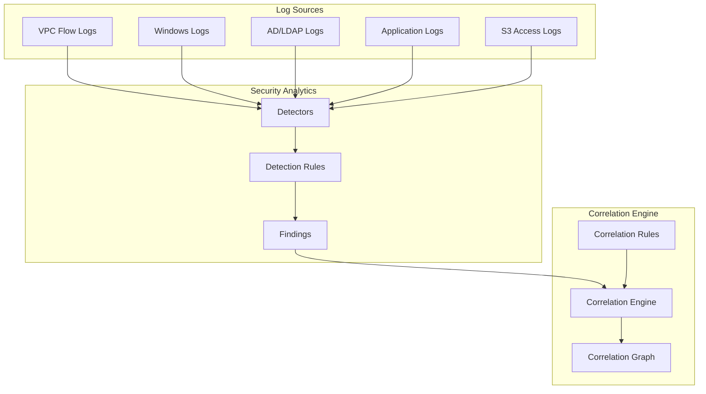
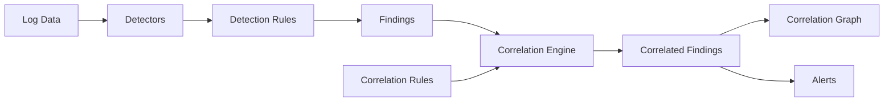

# Correlation Engine

## Summary

The Correlation Engine is a component of OpenSearch Security Analytics that enables security practitioners to identify relationships between security findings across different log sources. It provides a "security findings knowledge graph" that correlates events from multiple detectors, helping analysts identify complex threat scenarios that span multiple systems in an infrastructure.

## Details

### Architecture



### Data Flow



### Components

| Component | Description |
|-----------|-------------|
| Correlation Rules | Define threat scenarios by specifying queries across multiple log types |
| Correlation Engine | Matches findings against correlation rules within time windows |
| Correlation Graph | Visual representation of correlated findings in OpenSearch Dashboards |
| Correlation Score | Metric measuring the strength of correlation between findings |
| Correlation Alerts | Notifications triggered when correlation rules match |

### Configuration

| Setting | Description | Default |
|---------|-------------|---------|
| `plugins.security_analytics.correlation_time_window` | Time window for correlating findings | `5m` |

### Usage Example

#### Create a Correlation Rule

```json
POST /_plugins/_security_analytics/correlation/rules
{
  "correlate": [
    {
      "index": "vpc_flow",
      "query": "dstaddr:4.5.6.7 or dstaddr:4.5.6.6",
      "category": "network"
    },
    {
      "index": "windows",
      "query": "winlog.event_data.SubjectDomainName:NTAUTHORI*",
      "category": "windows"
    },
    {
      "index": "ad_logs",
      "query": "ResultType:50126",
      "category": "ad_ldap"
    },
    {
      "index": "app_logs",
      "query": "endpoint:/customer_records.txt",
      "category": "others_application"
    }
  ]
}
```

#### Query Correlations

```json
GET /_plugins/_security_analytics/correlations?start_timestamp=1689289210000&end_timestamp=1689300010000
```

#### Response

```json
{
  "findings": [
    {
      "finding1": "931de5f0-a276-45d5-9cdb-83e1045a3630",
      "logType1": "network",
      "finding2": "1e6f6a12-83f1-4a38-9bb8-648f196859cc",
      "logType2": "test_windows",
      "rules": ["nqI2TokBgL5wWFPZ6Gfu"]
    }
  ]
}
```

#### Find Correlations for a Specific Finding

```json
GET /_plugins/_security_analytics/findings/correlate?finding=425dce0b-f5ee-4889-b0c0-7d15669f0871&detector_type=ad_ldap&nearby_findings=20&time_window=10m
```

#### Set Correlation Time Window

```json
PUT /_cluster/settings
{
  "transient": {
    "plugins.security_analytics.correlation_time_window": "2m"
  }
}
```

### Correlation Graph Visualization

The correlation graph in OpenSearch Dashboards displays:
- Findings as nodes with colored borders indicating severity level
- Three-letter abbreviations inside nodes indicating log type
- Lines connecting findings representing correlations
- Heavy lines for strong correlations, light lines for weaker correlations
- Correlation scores measuring relationship strength

## Limitations

- Requires Security Analytics plugin to be installed
- Correlation rules require at least two different log sources
- Time window affects correlation detection - findings outside the window are not correlated
- Correlation is focused on security use cases; general-purpose event correlation requires custom implementation

## Related PRs

| Version | PR | Description |
|---------|-----|-------------|
| v3.0.0 | [#16885](https://github.com/opensearch-project/OpenSearch/pull/16885) | Removed incomplete events-correlation-engine from core |
| v2.x | Various | Security Analytics correlation engine implementation |

## References

- [Security Analytics Documentation](https://docs.opensearch.org/3.0/security-analytics/): Main Security Analytics documentation
- [Correlation Engine APIs](https://docs.opensearch.org/3.0/security-analytics/api-tools/correlation-eng/): API reference
- [Creating Correlation Rules](https://docs.opensearch.org/3.0/security-analytics/sec-analytics-config/correlation-config/): Configuration guide
- [Working with the Correlation Graph](https://docs.opensearch.org/3.0/security-analytics/usage/correlation-graph/): UI guide
- [Blog: Correlating security events](https://opensearch.org/blog/correlating-security-events/): Feature overview

## Change History

- **v3.0.0** (2024-12): Removed incomplete events-correlation-engine plugin from OpenSearch core; correlation functionality remains available through Security Analytics plugin
- **v2.9.0**: Correlation engine enhancements in Security Analytics
- **v2.6.0**: Initial correlation engine release in Security Analytics plugin
