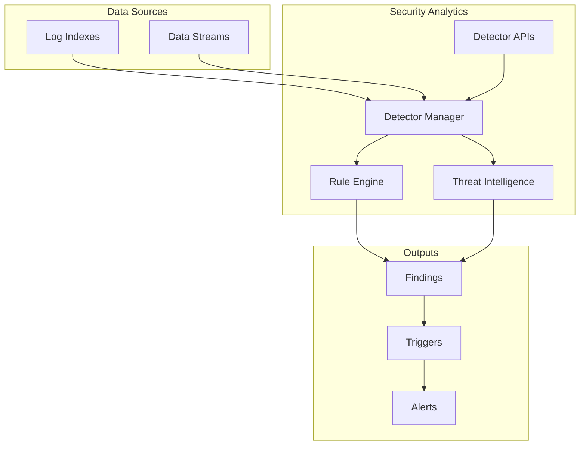

# Security Analytics Detectors

## Summary

Security Analytics detectors are the core components that monitor log data sources for security threats. Detectors use detection rules (Sigma-based) to identify suspicious activities and can trigger alerts when threats are detected. The Detector APIs provide programmatic access to create, update, search, and manage detectors.

## Details

### Architecture



### Components

| Component | Description |
|-----------|-------------|
| Detector | Core entity that defines what to monitor and how to respond |
| Detection Rules | Sigma-based rules that define threat patterns |
| Triggers | Conditions that generate alerts when matched |
| Actions | Notifications sent when triggers fire |
| Findings | Security events detected by the detector |

### Configuration

| Setting | Description | Default |
|---------|-------------|---------|
| `enabled` | Whether the detector is active | `true` |
| `schedule.period.interval` | How often the detector runs | 1 |
| `schedule.period.unit` | Time unit for schedule | `MINUTES` |
| `threat_intel_enabled` | Enable threat intelligence feeds | `false` |

### Detector Types

Detectors support multiple log types:
- `windows` - Windows event logs
- `linux` - Linux system logs
- `network` - Network traffic logs
- `ad_ldap` - Active Directory/LDAP logs
- `apache_access` - Apache web server logs
- `cloudtrail` - AWS CloudTrail logs
- `dns` - DNS query logs
- `s3` - Amazon S3 access logs

### API Endpoints

| Endpoint | Method | Description |
|----------|--------|-------------|
| `/_plugins/_security_analytics/detectors` | POST | Create detector |
| `/_plugins/_security_analytics/detectors/{id}` | GET | Get detector |
| `/_plugins/_security_analytics/detectors/{id}` | PUT | Update detector |
| `/_plugins/_security_analytics/detectors/{id}` | DELETE | Delete detector |
| `/_plugins/_security_analytics/detectors/_search` | POST | Search detectors |

### Usage Example

Create a detector with triggers:

```json
POST /_plugins/_security_analytics/detectors
{
  "enabled": true,
  "name": "windows_detector",
  "detector_type": "windows",
  "schedule": {
    "period": {
      "interval": 1,
      "unit": "MINUTES"
    }
  },
  "inputs": [
    {
      "detector_input": {
        "description": "Windows security monitoring",
        "indices": ["windows-logs-*"],
        "pre_packaged_rules": [
          {"id": "rule-uuid-here"}
        ]
      }
    }
  ],
  "triggers": [
    {
      "name": "High Severity Alert",
      "severity": "1",
      "types": ["windows"],
      "sev_levels": ["high", "critical"],
      "actions": [
        {
          "name": "notify-security-team",
          "destination_id": "notification-channel-id",
          "message_template": {
            "source": "Security alert triggered: {{ctx.trigger.name}}",
            "lang": "mustache"
          }
        }
      ]
    }
  ]
}
```

Get detector with triggers (v2.17.0+):

```json
GET /_plugins/_security_analytics/detectors/{detector_id}

// Response includes triggers field
{
  "_id": "detector-id",
  "_version": 1,
  "detector": {
    "name": "windows_detector",
    "triggers": [
      {
        "id": "trigger-id",
        "name": "High Severity Alert",
        "severity": "1",
        "detection_types": ["rules", "threat_intel"]
      }
    ]
  }
}
```

## Limitations

- Only one log data source per detector is currently supported
- Threat intelligence feeds only work with standard log types
- At least one detection rule (custom or pre-packaged) is required

## Related PRs

| Version | PR | Description |
|---------|-----|-------------|
| v2.17.0 | [#1226](https://github.com/opensearch-project/security-analytics/pull/1226) | Added triggers in getDetectors API response |
| v2.17.0 | [#1212](https://github.com/opensearch-project/security-analytics/pull/1212) | Secure rest tests for threat intel monitor APIs |

## References

- [Detector APIs Documentation](https://docs.opensearch.org/latest/security-analytics/api-tools/detector-api/)
- [Creating Detectors](https://docs.opensearch.org/latest/security-analytics/sec-analytics-config/detectors-config/)
- [About Security Analytics](https://docs.opensearch.org/latest/security-analytics/)
- [Working with Detectors](https://docs.opensearch.org/latest/security-analytics/usage/detectors/)

## Change History

- **v2.17.0** (2024-09-17): Added triggers field to Get Detectors API response; Added secure REST tests for threat intel monitor APIs
