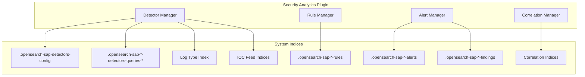

# Security Analytics System Indices

## Summary

Security Analytics uses system indices to store configurations, detectors, rules, alerts, findings, and correlation data. These indices are protected and cannot be modified through the REST API or OpenSearch Dashboards interface. This feature provides standardized index settings for reliability and scalability, with configurable replica settings and optional dedicated query indices per detector.

## Details

### Architecture



### Components

| Component | Index Pattern | Description |
|-----------|---------------|-------------|
| Detector Config | `.opensearch-sap-detectors-config` | Stores detector configurations |
| Query Indices | `.opensearch-sap-{log_type}-detectors-queries-*` | Doc-level monitor queries |
| Alert Indices | `.opensearch-sap-{log_type}-alerts` | Security alerts |
| Findings Indices | `.opensearch-sap-{log_type}-findings` | Detection findings |
| Rule Indices | `.opensearch-sap-{log_type}-rules` | Detection rules |
| Correlation History | `.opensearch-sap-correlation-history-*` | Correlation events |
| Correlation Metadata | `.opensearch-sap-correlation-metadata` | Correlation metadata |
| Correlation Rules | `.opensearch-sap-correlation-rules` | Correlation rule definitions |
| Correlation Alerts | `.opensearch-sap-correlation-alerts` | Correlation alerts |
| Log Type Config | `.opensearch-sap-log-types-config` | Log type configurations |
| Custom Log Types | `.opensearch-sap-custom-log-types` | Custom log type definitions |
| IOC Feeds | `.opensearch-sap-iocs-*` | Threat intelligence IOC data |

### Configuration

| Setting | Description | Default |
|---------|-------------|---------|
| `index.hidden` | Hide system indices from normal index operations | `true` |
| `index.number_of_shards` | Number of primary shards | `1` |
| `index.auto_expand_replicas` | Auto-expand replica range | `1-20` |
| `plugins.security_analytics.enable_detectors_with_dedicated_query_indices` | Enable dedicated query indices per detector | `false` |

### Usage Example

#### Enable Dedicated Query Indices

```json
PUT _cluster/settings
{
  "persistent": {
    "plugins.security_analytics.enable_detectors_with_dedicated_query_indices": true
  }
}
```

#### View System Index Settings

```bash
GET .opensearch-sap-*/_settings?flat_settings=true
```

## Limitations

- System indices can only be accessed by users with TLS admin certificates
- Changing dedicated query index setting requires detector recreation for existing detectors
- System indices are not included in regular snapshot operations by default

## Change History

- **v2.18.0** (2024-10-29): Standardized system index settings (1 primary shard, 1-20 replicas), added dedicated query indices option, fixed correlation alert refresh policy

## References

### Documentation
- [Security Analytics Documentation](https://docs.opensearch.org/latest/security-analytics/)
- [Security Analytics System Indexes](https://docs.opensearch.org/latest/security-analytics/security/)
- [System Indexes Configuration](https://docs.opensearch.org/latest/security/configuration/system-indices/)

### Pull Requests
| Version | PR | Description | Related Issue |
|---------|-----|-------------|---------------|
| v2.18.0 | [#1358](https://github.com/opensearch-project/security-analytics/pull/1358) | Update replicas to 1-20 and primary shards to 1 |   |
| v2.18.0 | [#1364](https://github.com/opensearch-project/security-analytics/pull/1364) | Update min replicas to 0 |   |
| v2.18.0 | [#1365](https://github.com/opensearch-project/security-analytics/pull/1365) | Enable dedicated query index settings |   |
| v2.18.0 | [#1324](https://github.com/opensearch-project/security-analytics/pull/1324) | Separate doc-level monitor query indices |   |
| v2.18.0 | [#1382](https://github.com/opensearch-project/security-analytics/pull/1382) | Set refresh policy to IMMEDIATE for correlation alerts |   |
