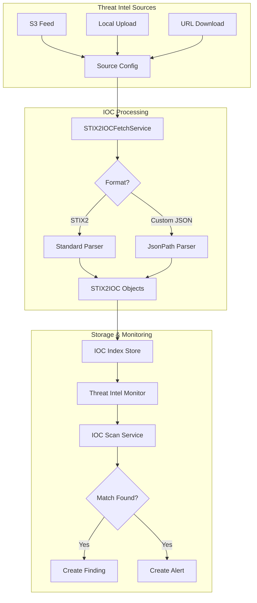
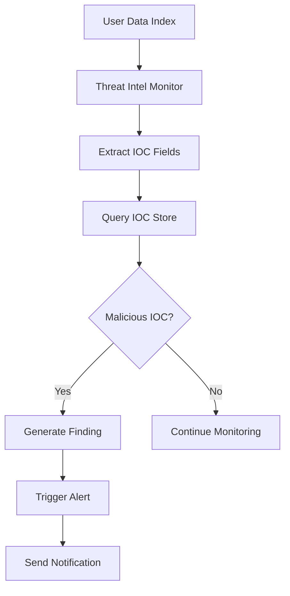

---
tags:
  - security-analytics
---
# Threat Intelligence

## Summary

Threat Intelligence in OpenSearch Security Analytics enables users to detect security threats by scanning their data against known Indicators of Compromise (IOCs). Users can configure threat intelligence sources from various feeds (S3, local file upload, URL download) and set up monitors to automatically scan incoming data for malicious indicators such as IP addresses, domain names, and file hashes.

## Details

### Architecture



### Data Flow



### Components

| Component | Description |
|-----------|-------------|
| `SATIFSourceConfig` | Threat intelligence source configuration model |
| `SATIFSourceConfigDto` | Data transfer object for source configuration |
| `STIX2IOC` | Indicator of Compromise model in STIX2 format |
| `STIX2IOCFetchService` | Service for downloading and indexing IOCs |
| `IoCScanService` | Service for scanning data against IOC store |
| `ThreatIntelMonitor` | Monitor for automated threat detection |
| `JsonPathIocSchema` | Custom JSON schema definition using JSONPath |
| `JsonPathIocSchemaThreatIntelHandler` | Parser for custom format IOCs |

### Configuration

| Setting | Description | Default |
|---------|-------------|---------|
| `type` | Source type: `S3_CUSTOM`, `IOC_UPLOAD`, `URL_DOWNLOAD` | Required |
| `name` | Human-readable name for the source | Required |
| `format` | Data format (e.g., `STIX2`) | Required |
| `enabled` | Enable/disable scheduled refresh | `true` |
| `schedule` | Refresh schedule for S3/URL sources | Optional |
| `ioc_types` | List of IOC types to process | Computed |
| `ioc_schema` | Custom JSONPath schema for parsing | Optional |
| `enabled_for_scan` | Enable source for threat scanning | `true` |

### Supported IOC Types

| IOC Type | Description |
|----------|-------------|
| `ipv4-addr` | IPv4 addresses |
| `ipv6-addr` | IPv6 addresses |
| `domain-name` | Domain names |
| `hashes` | File hashes (MD5, SHA-1, SHA-256) |
| Custom types | User-defined IOC types (v3.0.0+) |

### Usage Example

#### Standard STIX2 Format Upload

```json
POST _plugins/_security_analytics/threat_intel/sources/
{
  "type": "IOC_UPLOAD",
  "name": "my_threat_feed",
  "format": "STIX2",
  "description": "Internal threat intelligence feed",
  "enabled": false,
  "ioc_types": ["ipv4-addr", "domain-name"],
  "source": {
    "ioc_upload": {
      "file_name": "threat_iocs.json",
      "iocs": [
        {
          "id": "1",
          "name": "malicious-ip",
          "type": "ipv4-addr",
          "value": "192.168.1.100",
          "severity": "high",
          "created": "2024-01-01T00:00:00Z",
          "modified": "2024-01-01T00:00:00Z",
          "description": "Known malicious IP"
        }
      ]
    }
  }
}
```

#### Custom JSON Format Upload (v3.0.0+)

```json
POST _plugins/_security_analytics/threat_intel/sources/
{
  "type": "IOC_UPLOAD",
  "name": "custom_format_feed",
  "format": "STIX2",
  "source": {
    "custom_schema_ioc_upload": {
      "iocs": "{\"threats\":[{\"type\":\"ip\",\"indicator\":\"10.0.0.1\"}]}"
    }
  },
  "ioc_schema": {
    "json_path_schema": {
      "type": {"json_path": "$.threats[*].type"},
      "value": {"json_path": "$.threats[*].indicator"}
    }
  }
}
```

#### S3 Source Configuration

```json
POST _plugins/_security_analytics/threat_intel/sources/
{
  "type": "S3_CUSTOM",
  "name": "s3-threat-feed",
  "format": "STIX2",
  "enabled": true,
  "schedule": {
    "interval": {
      "start_time": 1717097122,
      "period": "1",
      "unit": "DAYS"
    }
  },
  "source": {
    "s3": {
      "bucket_name": "threat-intel-bucket",
      "object_key": "iocs.json",
      "region": "us-west-2",
      "role_arn": "arn:aws:iam::123456789012:role/threat_intel_role"
    }
  },
  "ioc_types": ["ipv4-addr", "domain-name"]
}
```

## Limitations

- IOC_UPLOAD sources cannot be refreshed on a schedule; manual re-upload is required
- Custom schema parsing requires both `type` and `value` JSONPath expressions
- Maximum IOC batch size is configurable but defaults to reasonable limits
- Threat intel monitors require at least one enabled source for scanning

## Change History

- **v3.0.0** (2025-05-13): Added custom JSON format support with JSONPath schema, relaxed IOC type validation to support custom types
- **v2.19.0** (2025-02-18): Added source config validation requiring valid name, type, format, source, and ioc_type; Source configs with null values can still be read and deleted
- **v2.18.0** (2024-11-05): Bug fixes - IOC scan null check for multi-indicator types, ListIOCs API count limits removed (total IOCs and findings per IOC no longer capped at 10,000), IOC index exists check to prevent race conditions, notification listener leak fix, duplicate findings prevention, source config validation, improved error handling for partial failures
- **v2.17.0** (2024-09-17): Bug fixes for security (user validation, context stashing), stability (multi-node race conditions, event-driven lock release), and integration with standard detectors
- **v2.16.0** (2024-08-06): List IOC API filter to fetch only from AVAILABLE/REFRESHING sources, null check for IOC index aliases, store config model changes (unique ioc_types, partial IOC downloads), URL_DOWNLOAD source type added
- **v2.15.0**: Initial threat intelligence feature with S3, IOC_UPLOAD, and URL_DOWNLOAD source types


## References

### Documentation
- [Threat Intelligence Documentation](https://docs.opensearch.org/3.0/security-analytics/threat-intelligence/index/): Official documentation
- [Source API](https://docs.opensearch.org/3.0/security-analytics/threat-intelligence/api/source/): API reference
- [Monitor API](https://docs.opensearch.org/3.0/security-analytics/threat-intelligence/api/monitor/): Monitor API reference
- [Getting Started Guide](https://docs.opensearch.org/3.0/security-analytics/threat-intelligence/getting-started/): Setup guide

### Pull Requests
| Version | PR | Description | Related Issue |
|---------|-----|-------------|---------------|
| v3.0.0 | [#1493](https://github.com/opensearch-project/security-analytics/pull/1493) | Custom format IOC upload support |   |
| v3.0.0 | [#1455](https://github.com/opensearch-project/security-analytics/pull/1455) | Custom format implementation (2.x backport) |   |
| v2.19.0 | [#1393](https://github.com/opensearch-project/security-analytics/pull/1393) | Add validation for threat intel source config | [#1366](https://github.com/opensearch-project/security-analytics/issues/1366) |
| v2.18.0 | [#1335](https://github.com/opensearch-project/security-analytics/pull/1335) | Add null check for multi-indicator type scans |   |
| v2.18.0 | [#1373](https://github.com/opensearch-project/security-analytics/pull/1373) | Fix ListIOCs API count limits (total IOCs and findings per IOC) | [#1191](https://github.com/opensearch-project/security-analytics/issues/1191) |
| v2.18.0 | [#1392](https://github.com/opensearch-project/security-analytics/pull/1392) | Add exists check for IOC index creation |   |
| v2.18.0 | [#1356](https://github.com/opensearch-project/security-analytics/pull/1356) | Fix notifications listener leak in threat intel monitor |   |
| v2.18.0 | [#1317](https://github.com/opensearch-project/security-analytics/pull/1317) | Threat intel monitor bug fixes (empty index sort, grouped listener) |   |
| v2.18.0 | [#1383](https://github.com/opensearch-project/security-analytics/pull/1383) | Fix search monitor query in update threat intel alert status API |   |
| v2.18.0 | [#1393](https://github.com/opensearch-project/security-analytics/pull/1393) | Add validation for threat intel source config | [#1366](https://github.com/opensearch-project/security-analytics/issues/1366) |
| v2.18.0 | [#1180](https://github.com/opensearch-project/security-analytics/pull/1180) | Backport of alias resolution and enum fixes |   |
| v2.18.0 | [#1173](https://github.com/opensearch-project/security-analytics/pull/1173) | Fix alias resolution in threat intel monitor |   |
| v2.18.0 | [#1178](https://github.com/opensearch-project/security-analytics/pull/1178) | Fix enum state query for REFRESHING state |   |
| v2.17.0 | [#1207](https://github.com/opensearch-project/security-analytics/pull/1207) | User validation for threat intel transport layer |   |
| v2.17.0 | [#1234](https://github.com/opensearch-project/security-analytics/pull/1234) | Make threat intel run with standard detectors |   |
| v2.17.0 | [#1254](https://github.com/opensearch-project/security-analytics/pull/1254) | Event-driven lock release for source config | [#1224](https://github.com/opensearch-project/security-analytics/issues/1224) |
| v2.17.0 | [#1274](https://github.com/opensearch-project/security-analytics/pull/1274) | Fix threat intel multinode tests |   |
| v2.17.0 | [#1278](https://github.com/opensearch-project/security-analytics/pull/1278) | Stash context for List IOCs API |   |
| v2.16.0 | [#1098](https://github.com/opensearch-project/security-analytics/pull/1098) | Threat Intel Analytics - main feature implementation | [#1117](https://github.com/opensearch-project/security-analytics/issues/1117) |
| v2.16.0 | [#1068](https://github.com/opensearch-project/security-analytics/pull/1068) | Support for URL_Download source type and activate/deactivate logic |   |
| v2.16.0 | [#1071](https://github.com/opensearch-project/security-analytics/pull/1071) | Fetch up to 10k source configs and IOCs under source details |   |
| v2.16.0 | [#1064](https://github.com/opensearch-project/security-analytics/pull/1064) | Show fields for aliases in correlation rule and threat intel monitor |   |
| v2.16.0 | [#1129](https://github.com/opensearch-project/security-analytics/pull/1129) | Error handling for incompatible IOC types from S3 |   |
| v2.16.0 | [#1130](https://github.com/opensearch-project/security-analytics/pull/1130) | Fix findingIds filter on IOC findings search API |   |
| v2.16.0 | [#1156](https://github.com/opensearch-project/security-analytics/pull/1156) | Adjusted IOCTypes usage |   |
| v2.16.0 | [#1157](https://github.com/opensearch-project/security-analytics/pull/1157) | Fix job scheduler parser, action listeners, and multi-node test |   |
| v2.16.0 | [#1163](https://github.com/opensearch-project/security-analytics/pull/1163) | ListIOCs API to return number of findings per IOC |   |
| v2.16.0 | [#1162](https://github.com/opensearch-project/security-analytics/pull/1162) | IOC upload integration tests and fix update |   |
| v2.16.0 | [#1173](https://github.com/opensearch-project/security-analytics/pull/1173) | Resolve aliases in monitor input to concrete indices |   |
| v2.16.0 | [#1178](https://github.com/opensearch-project/security-analytics/pull/1178) | Enum fix for IOC state |   |
| v2.16.0 | [#1184](https://github.com/opensearch-project/security-analytics/pull/1184) | Fix threat intel monitor finding to contain all doc_ids |   |
| v2.16.0 | [#1187](https://github.com/opensearch-project/security-analytics/pull/1187) | Fixed bulk indexing for IOCs |   |
| v2.16.0 | [#1192](https://github.com/opensearch-project/security-analytics/pull/1192) | Fix IOC upload update behavior and error response |   |
| v2.16.0 | [#1198](https://github.com/opensearch-project/security-analytics/pull/1198) | Catch and wrap exceptions |   |
| v2.16.0 | [#1076](https://github.com/opensearch-project/security-analytics/pull/1076) | Updated IOCTypes |   |
| v2.16.0 | [#1080](https://github.com/opensearch-project/security-analytics/pull/1080) | Fixed UI issues |   |
| v2.16.0 | [#1131](https://github.com/opensearch-project/security-analytics/pull/1131) | Add filter to list IOC API for available/refreshing sources |   |
| v2.16.0 | [#1133](https://github.com/opensearch-project/security-analytics/pull/1133) | Changes threat intel default store config model |   |
| v2.16.0 | [#1142](https://github.com/opensearch-project/security-analytics/pull/1142) | Adds new TIF source config type - URL download |   |

### Issues (Design / RFC)
- [Issue #1117](https://github.com/opensearch-project/security-analytics/issues/1117): Threat Intelligence Analytics In OpenSearch (META)
- [Issue #1191](https://github.com/opensearch-project/security-analytics/issues/1191): ListIOCsAPI total hits and findings count per IOC are incorrect
- [Issue #1421](https://github.com/opensearch-project/security-analytics/issues/1421): Custom JSON schema feature request
- [Issue #1224](https://github.com/opensearch-project/security-analytics/issues/1224): Lock release issue
- [Issue #1247](https://github.com/opensearch-project/security-analytics/issues/1247): Job mapping upgrade issue
- [Issue #1319](https://github.com/opensearch-project/security-analytics/issues/1319): Threat intel monitor bug fixes tracking
- [Issue #1366](https://github.com/opensearch-project/security-analytics/issues/1366): Source config validation issue
