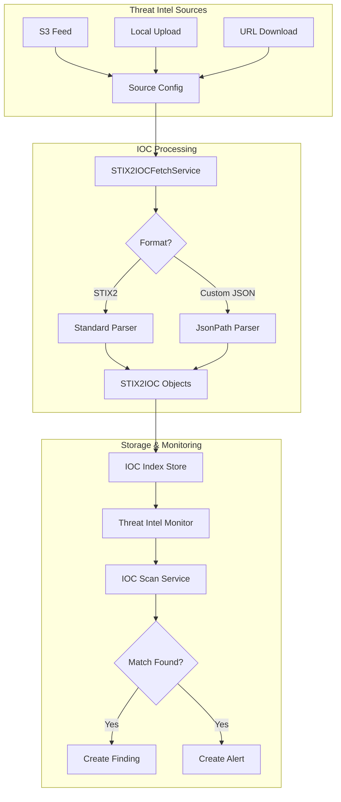
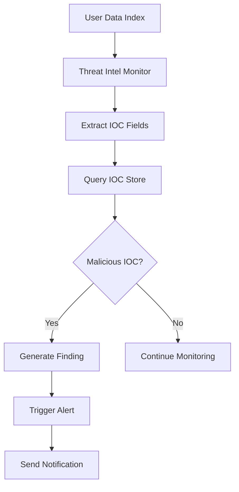

# Threat Intelligence

## Summary

Threat Intelligence in OpenSearch Security Analytics enables users to detect security threats by scanning their data against known Indicators of Compromise (IOCs). Users can configure threat intelligence sources from various feeds (S3, local file upload, URL download) and set up monitors to automatically scan incoming data for malicious indicators such as IP addresses, domain names, and file hashes.

## Details

### Architecture



### Data Flow



### Components

| Component | Description |
|-----------|-------------|
| `SATIFSourceConfig` | Threat intelligence source configuration model |
| `SATIFSourceConfigDto` | Data transfer object for source configuration |
| `STIX2IOC` | Indicator of Compromise model in STIX2 format |
| `STIX2IOCFetchService` | Service for downloading and indexing IOCs |
| `IoCScanService` | Service for scanning data against IOC store |
| `ThreatIntelMonitor` | Monitor for automated threat detection |
| `JsonPathIocSchema` | Custom JSON schema definition using JSONPath |
| `JsonPathIocSchemaThreatIntelHandler` | Parser for custom format IOCs |

### Configuration

| Setting | Description | Default |
|---------|-------------|---------|
| `type` | Source type: `S3_CUSTOM`, `IOC_UPLOAD`, `URL_DOWNLOAD` | Required |
| `name` | Human-readable name for the source | Required |
| `format` | Data format (e.g., `STIX2`) | Required |
| `enabled` | Enable/disable scheduled refresh | `true` |
| `schedule` | Refresh schedule for S3/URL sources | Optional |
| `ioc_types` | List of IOC types to process | Computed |
| `ioc_schema` | Custom JSONPath schema for parsing | Optional |
| `enabled_for_scan` | Enable source for threat scanning | `true` |

### Supported IOC Types

| IOC Type | Description |
|----------|-------------|
| `ipv4-addr` | IPv4 addresses |
| `ipv6-addr` | IPv6 addresses |
| `domain-name` | Domain names |
| `hashes` | File hashes (MD5, SHA-1, SHA-256) |
| Custom types | User-defined IOC types (v3.0.0+) |

### Usage Example

#### Standard STIX2 Format Upload

```json
POST _plugins/_security_analytics/threat_intel/sources/
{
  "type": "IOC_UPLOAD",
  "name": "my_threat_feed",
  "format": "STIX2",
  "description": "Internal threat intelligence feed",
  "enabled": false,
  "ioc_types": ["ipv4-addr", "domain-name"],
  "source": {
    "ioc_upload": {
      "file_name": "threat_iocs.json",
      "iocs": [
        {
          "id": "1",
          "name": "malicious-ip",
          "type": "ipv4-addr",
          "value": "192.168.1.100",
          "severity": "high",
          "created": "2024-01-01T00:00:00Z",
          "modified": "2024-01-01T00:00:00Z",
          "description": "Known malicious IP"
        }
      ]
    }
  }
}
```

#### Custom JSON Format Upload (v3.0.0+)

```json
POST _plugins/_security_analytics/threat_intel/sources/
{
  "type": "IOC_UPLOAD",
  "name": "custom_format_feed",
  "format": "STIX2",
  "source": {
    "custom_schema_ioc_upload": {
      "iocs": "{\"threats\":[{\"type\":\"ip\",\"indicator\":\"10.0.0.1\"}]}"
    }
  },
  "ioc_schema": {
    "json_path_schema": {
      "type": {"json_path": "$.threats[*].type"},
      "value": {"json_path": "$.threats[*].indicator"}
    }
  }
}
```

#### S3 Source Configuration

```json
POST _plugins/_security_analytics/threat_intel/sources/
{
  "type": "S3_CUSTOM",
  "name": "s3-threat-feed",
  "format": "STIX2",
  "enabled": true,
  "schedule": {
    "interval": {
      "start_time": 1717097122,
      "period": "1",
      "unit": "DAYS"
    }
  },
  "source": {
    "s3": {
      "bucket_name": "threat-intel-bucket",
      "object_key": "iocs.json",
      "region": "us-west-2",
      "role_arn": "arn:aws:iam::123456789012:role/threat_intel_role"
    }
  },
  "ioc_types": ["ipv4-addr", "domain-name"]
}
```

## Limitations

- IOC_UPLOAD sources cannot be refreshed on a schedule; manual re-upload is required
- Custom schema parsing requires both `type` and `value` JSONPath expressions
- Maximum IOC batch size is configurable but defaults to reasonable limits
- Threat intel monitors require at least one enabled source for scanning

## Related PRs

| Version | PR | Description |
|---------|-----|-------------|
| v3.0.0 | [#1493](https://github.com/opensearch-project/security-analytics/pull/1493) | Custom format IOC upload support |
| v3.0.0 | [#1455](https://github.com/opensearch-project/security-analytics/pull/1455) | Custom format implementation (2.x backport) |
| v2.18.0 | [#1180](https://github.com/opensearch-project/security-analytics/pull/1180) | Backport of alias resolution and enum fixes |
| v2.18.0 | [#1173](https://github.com/opensearch-project/security-analytics/pull/1173) | Fix alias resolution in threat intel monitor |
| v2.18.0 | [#1178](https://github.com/opensearch-project/security-analytics/pull/1178) | Fix enum state query for REFRESHING state |
| v2.17.0 | [#1207](https://github.com/opensearch-project/security-analytics/pull/1207) | User validation for threat intel transport layer |
| v2.17.0 | [#1234](https://github.com/opensearch-project/security-analytics/pull/1234) | Make threat intel run with standard detectors |
| v2.17.0 | [#1254](https://github.com/opensearch-project/security-analytics/pull/1254) | Event-driven lock release for source config |
| v2.17.0 | [#1274](https://github.com/opensearch-project/security-analytics/pull/1274) | Fix threat intel multinode tests |
| v2.17.0 | [#1278](https://github.com/opensearch-project/security-analytics/pull/1278) | Stash context for List IOCs API |

## References

- [Issue #1421](https://github.com/opensearch-project/security-analytics/issues/1421): Custom JSON schema feature request
- [Issue #1224](https://github.com/opensearch-project/security-analytics/issues/1224): Lock release issue
- [Issue #1247](https://github.com/opensearch-project/security-analytics/issues/1247): Job mapping upgrade issue
- [Threat Intelligence Documentation](https://docs.opensearch.org/3.0/security-analytics/threat-intelligence/index/): Official documentation
- [Source API](https://docs.opensearch.org/3.0/security-analytics/threat-intelligence/api/source/): API reference
- [Monitor API](https://docs.opensearch.org/3.0/security-analytics/threat-intelligence/api/monitor/): Monitor API reference
- [Getting Started Guide](https://docs.opensearch.org/3.0/security-analytics/threat-intelligence/getting-started/): Setup guide

## Change History

- **v3.0.0** (2025-05-13): Added custom JSON format support with JSONPath schema, relaxed IOC type validation to support custom types
- **v2.18.0** (2024-11-05): Bug fixes - threat intel monitors now correctly resolve index aliases to concrete indices; fixed REFRESHING state enum query
- **v2.17.0** (2024-09-17): Bug fixes for security (user validation, context stashing), stability (multi-node race conditions, event-driven lock release), and integration with standard detectors
- **v2.15.0**: Initial threat intelligence feature with S3, IOC_UPLOAD, and URL_DOWNLOAD source types
