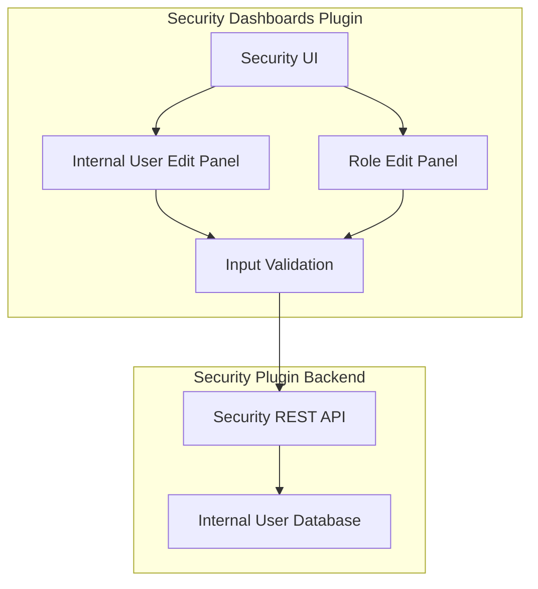

# Security Dashboards Bugfixes

## Summary

This document tracks bug fixes in the Security Dashboards Plugin, which provides the UI for managing OpenSearch security features including internal users, roles, role mappings, and access control.

## Details

### Architecture



### Components

| Component | Description |
|-----------|-------------|
| Internal User Edit | Panel for creating and editing internal users with credentials, backend roles, and attributes |
| Backend Role Panel | UI component for managing backend roles assigned to users |
| Input Validation | Client-side validation for user input before API submission |

### Bug Fixes

#### Filter Blank Backend Roles (v3.4.0)

When creating or editing internal users, blank backend role entries are now filtered out before submission. This prevents empty strings from being stored in user configurations.

**Before fix:**
- Empty backend role fields would be saved as empty strings
- Could cause unexpected behavior in role-based access control

**After fix:**
- Backend roles are filtered using `role.trim() !== ''`
- Only non-empty roles are submitted to the API

```typescript
const updateObject: InternalUserUpdate = {
  backend_roles: backendRoles.filter((role) => role.trim() !== ''),
  attributes: unbuildAttributeState(validAttributes),
};
```

## Limitations

- Client-side validation only; server-side validation should also be implemented for complete protection
- Does not retroactively clean up existing users with blank backend roles

## Related PRs

| Version | PR | Description |
|---------|-----|-------------|
| v3.4.0 | [#2330](https://github.com/opensearch-project/security-dashboards-plugin/pull/2330) | Filter blank backend role before creating internal user |

## References

- [Defining users and roles](https://docs.opensearch.org/3.0/security/access-control/users-roles/): OpenSearch Security documentation
- [Security Dashboards Plugin](https://github.com/opensearch-project/security-dashboards-plugin): GitHub repository

## Change History

- **v3.4.0** (2026-01): Filter blank backend roles before creating internal user
