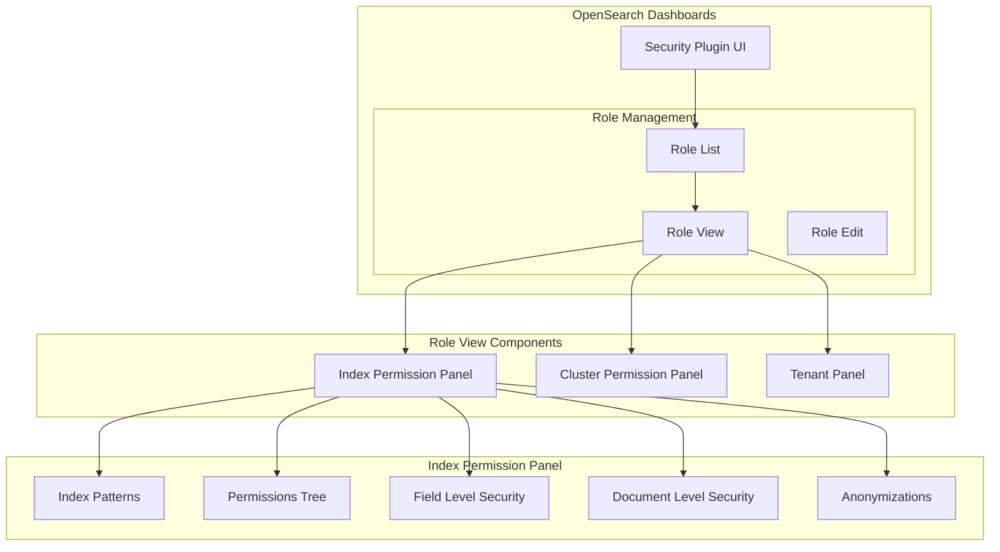

# Security Dashboards Role Management

## Summary

The Security Dashboards plugin provides a web-based interface for managing OpenSearch security configurations, including users, roles, role mappings, and permissions. The role management interface allows administrators to define and view index-level permissions, field-level security, document-level security, and field anonymization settings through an intuitive UI.

## Details

### Architecture



### Components

| Component | Description |
|-----------|-------------|
| `IndexPermissionPanel` | Displays index-level permissions for a role |
| `PermissionTree` | Renders hierarchical view of action groups and permissions |
| `truncatedListView` | Utility for displaying lists (configurable max items) |
| `constants.tsx` | Defines available cluster and index permissions |

### Configuration

The Security Dashboards plugin uses predefined permission lists that can be selected in the UI:

| Permission Category | Examples |
|---------------------|----------|
| Index Read | `indices:data/read/search`, `indices:data/read/get`, `indices:data/read/mget*` |
| Index Write | `indices:data/write/index`, `indices:data/write/delete`, `indices:data/write/bulk*` |
| Index Admin | `indices:admin/create`, `indices:admin/delete`, `indices:admin/mapping/put` |

### Index Permissions Available in UI

```typescript
// Read operations
'indices:data/read/search'
'indices:data/read/search*'
'indices:data/read/get'
'indices:data/read/mget*'
'indices:data/read/msearch'
'indices:data/read/msearch/template'
'indices:data/read/mtv*'
'indices:data/read/scroll'
'indices:data/read/scroll/clear'
'indices:data/read/field_caps'
'indices:data/read/field_caps*'
'indices:data/read/tv'
'indices:data/read/point_in_time/create'
'indices:data/read/point_in_time/delete'
'indices:data/read/point_in_time/readall'
'indices:data/read/search/template'
'indices:data/read/search/template/render'

// Write operations
'indices:data/write/index'
'indices:data/write/delete'
'indices:data/write/delete/byquery'
'indices:data/write/bulk'
'indices:data/write/bulk*'
'indices:data/write/update'
'indices:data/write/update/byquery'
```

### Usage Example

To view role permissions in OpenSearch Dashboards:

1. Navigate to **Security** → **Roles**
2. Select a role to view its details
3. The **Index Permissions** panel displays:
   - Index patterns the role applies to
   - Allowed actions (shown as a permission tree)
   - Field-level security settings
   - Document-level security queries
   - Anonymized fields

## Limitations

- Permission changes require the user to have appropriate admin privileges
- Very large permission lists may impact page rendering performance
- Custom permissions not in the predefined list must be added via API or YAML configuration

## Change History

- **v3.2.0** (2025-06): Added full index pattern display, added missing index permissions (`mget*`, `mtv*`, `bulk*`)

## References

### Documentation
- [Documentation: Defining users and roles](https://docs.opensearch.org/3.2/security/access-control/users-roles/)
- [Documentation: Permissions](https://docs.opensearch.org/3.2/security/access-control/permissions/)

### Pull Requests
| Version | PR | Description |
|---------|-----|-------------|
| v3.2.0 | [#2254](https://github.com/opensearch-project/security-dashboards-plugin/pull/2254) | Show all index patterns in index permission panel |
| v3.2.0 | [#2255](https://github.com/opensearch-project/security-dashboards-plugin/pull/2255) | Add missing index permissions to the list |

### Issues (Design / RFC)
- [Issue #1303](https://github.com/opensearch-project/security-dashboards-plugin/issues/1303): Index permissions view abbreviated with no way to expand
- [Issue #1969](https://github.com/opensearch-project/security-dashboards-plugin/issues/1969): Permissions not displayed in index permissions category
