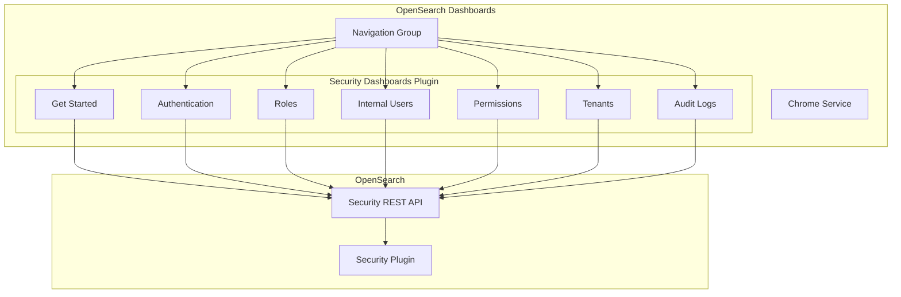

---
tags:
  - security-dashboards
---
# Security Dashboards Plugin

## Summary

The Security Dashboards Plugin provides a user interface for managing OpenSearch security features including internal users, roles, permissions, tenants, and audit logging. It integrates with OpenSearch Dashboards to provide access control management capabilities.

## Details

### Architecture



### Components

| Component | App ID | Description |
|-----------|--------|-------------|
| Get Started | `security-dashboards-plugin_getstarted` | Introduction and setup guide for access control |
| Authentication | `security-dashboards-plugin_auth` | Configure authentication and authorization sequences |
| Roles | `security-dashboards-plugin_roles` | Create and manage permission sets with specific privileges |
| Internal Users | `security-dashboards-plugin_users` | Define users to control access to data |
| Permissions | `security-dashboards-plugin_permissions` | Control access to individual actions and action groups |
| Tenants | `security-dashboards-plugin_tenants` | Manage multi-tenancy (conditional on configuration) |
| Audit Logs | `security-dashboards-plugin_auditlog` | Configure audit logging for system access activities |

### Configuration

| Setting | Description | Default |
|---------|-------------|---------|
| `opensearch_security.multitenancy.enabled` | Enable/disable multi-tenancy feature | `true` |
| `opensearch_security.readonly_mode.roles` | Roles with read-only access | `[]` |

### Navigation Integration

The plugin integrates with OpenSearch Dashboards' navigation system:

- **Classic Navigation**: Single security app with in-app navigation
- **New Left Navigation**: Individual apps registered in the Data Administration nav group

```typescript
// App registration with new navigation
core.chrome.navGroup.addNavLinksToGroup(DEFAULT_NAV_GROUPS.dataAdministration, [
  { id: PLUGIN_GET_STARTED_APP_ID, category: dataAccessUsersCategory, order: 100 },
  { id: PLUGIN_AUTH_APP_ID, category: dataAccessUsersCategory, order: 200 },
  { id: PLUGIN_USERS_APP_ID, category: dataAccessUsersCategory, order: 300 },
  { id: PLUGIN_PERMISSIONS_APP_ID, category: dataAccessUsersCategory, order: 400 },
  { id: PLUGIN_ROLES_APP_ID, category: dataAccessUsersCategory, order: 500 },
  { id: PLUGIN_AUDITLOG_APP_ID, category: dataAccessUsersCategory, order: 600 },
  { id: PLUGIN_TENANTS_APP_ID, category: dataAccessUsersCategory, order: 700 },
]);
```

### URL Validation

The plugin validates `nextUrl` parameters to prevent open redirect vulnerabilities:

```typescript
// server/utils/next_url.ts
export function validateNextUrl(url: string, basePath: string): string | undefined {
  // Validates that nextUrl is a safe internal URL
  // Handles basepath configurations properly
}
```

## Limitations

- Tenants feature requires `opensearch_security.multitenancy.enabled: true`
- New navigation features require the nav group feature flag to be enabled
- Some features depend on the underlying Security plugin configuration

## Change History

- **v2.19.0** (2025-01-21): Fixed OpenID login redirect to preserve query parameters and URL fragments; Fixed tenant defaulting incorrectly based on preferred tenants order instead of default tenant setting
- **v2.17.0** (2024-09-17): UI/UX enhancements including smaller/compressed components, updated page headers, avatar relocation to left nav, consistency and density improvements; Fixed tenancy app registration, basepath URL validation, page header UX, and navigation titles/descriptions


## References

### Documentation
- [OpenSearch Security Documentation](https://docs.opensearch.org/latest/security/)
- [Security Dashboards Plugin Repository](https://github.com/opensearch-project/security-dashboards-plugin)

### Pull Requests
| Version | PR | Description | Related Issue |
|---------|-----|-------------|---------------|
| v2.19.0 | [#2140](https://github.com/opensearch-project/security-dashboards-plugin/pull/2140) | Preserve Query in nextUrl during openid login redirect | [#1823](https://github.com/opensearch-project/security-dashboards-plugin/issues/1823) |
| v2.19.0 | [#2163](https://github.com/opensearch-project/security-dashboards-plugin/pull/2163) | Fix tenant defaulting incorrectly | [#2019](https://github.com/opensearch-project/security-dashboards-plugin/issues/2019) |
| v2.17.0 | [#2079](https://github.com/opensearch-project/security-dashboards-plugin/pull/2079) | Use smaller and compressed variants of buttons and form components |   |
| v2.17.0 | [#2082](https://github.com/opensearch-project/security-dashboards-plugin/pull/2082) | Conditionally change where avatar shows up |   |
| v2.17.0 | [#2083](https://github.com/opensearch-project/security-dashboards-plugin/pull/2083) | Adds page headers for updated UX |   |
| v2.17.0 | [#2101](https://github.com/opensearch-project/security-dashboards-plugin/pull/2101) | Consistency and density improvements |   |
| v2.17.0 | [#2057](https://github.com/opensearch-project/security-dashboards-plugin/pull/2057) | Do not register tenancy app if disabled in yml | [#2056](https://github.com/opensearch-project/security-dashboards-plugin/issues/2056) |
| v2.17.0 | [#2096](https://github.com/opensearch-project/security-dashboards-plugin/pull/2096) | Fix basepath nextUrl validation |   |
| v2.17.0 | [#2108](https://github.com/opensearch-project/security-dashboards-plugin/pull/2108) | UX fixes for page header |   |
| v2.17.0 | [#2084](https://github.com/opensearch-project/security-dashboards-plugin/pull/2084) | Update titles and descriptions |   |

### Issues (Design / RFC)
- [Issue #2056](https://github.com/opensearch-project/security-dashboards-plugin/issues/2056): Tenant link visibility bug
- [Issue #2097](https://github.com/opensearch-project/security-dashboards-plugin/issues/2097): Basepath nextUrl validation bug
- [Issue #1823](https://github.com/opensearch-project/security-dashboards-plugin/issues/1823): Auth redirect resets query
- [Issue #2019](https://github.com/opensearch-project/security-dashboards-plugin/issues/2019): Tenant defaulting incorrectly based on preferred tenants order
