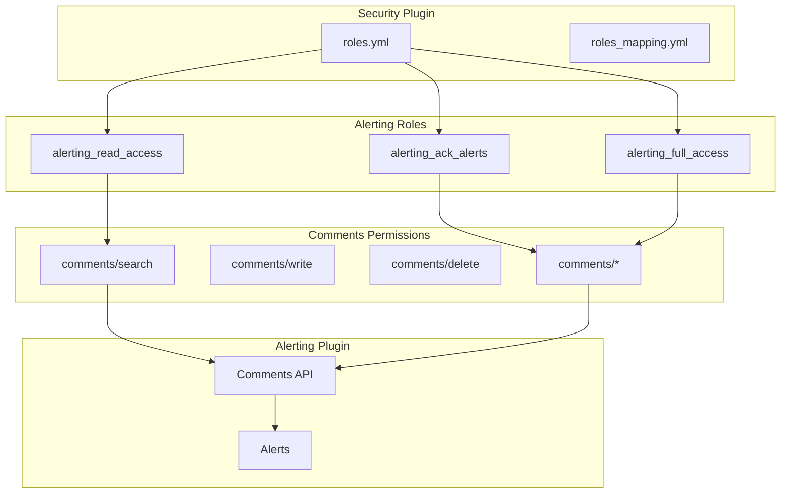

# Alerting Comments Security

## Summary

Alerting Comments Security provides role-based access control for the Alerting Comments feature in OpenSearch. It defines permissions that control who can view, create, edit, and delete comments on alerts, integrating with the Security plugin's predefined alerting roles.

## Details

### Architecture



### Components

| Component | Description |
|-----------|-------------|
| `alerting_read_access` | Role for read-only access to alerting, includes comment search |
| `alerting_ack_alerts` | Role for acknowledging alerts, includes full comment access |
| `alerting_full_access` | Role for full alerting functionality, includes full comment access |
| Comments API | REST API for managing comments on alerts |

### Configuration

| Permission | Description | Roles |
|------------|-------------|-------|
| `cluster:admin/opensearch/alerting/comments/search` | Search/view comments | `alerting_read_access`, `alerting_ack_alerts`, `alerting_full_access` |
| `cluster:admin/opensearch/alerting/comments/write` | Create/update comments | `alerting_ack_alerts`, `alerting_full_access` |
| `cluster:admin/opensearch/alerting/comments/delete` | Delete comments | `alerting_ack_alerts`, `alerting_full_access` |
| `cluster:admin/opensearch/alerting/comments/*` | All comment operations | `alerting_ack_alerts`, `alerting_full_access` |

### Role Permissions Matrix

| Role | View Comments | Create Comments | Edit Comments | Delete Comments |
|------|---------------|-----------------|---------------|-----------------|
| `alerting_read_access` | ✓ | ✗ | ✗ | ✗ |
| `alerting_ack_alerts` | ✓ | ✓ | ✓ | ✓ |
| `alerting_full_access` | ✓ | ✓ | ✓ | ✓ |

### Usage Example

Mapping a user to the `alerting_ack_alerts` role:

```yaml
# roles_mapping.yml
alerting_ack_alerts:
  reserved: false
  users:
    - "ops_user"
  backend_roles:
    - "ops_team"
```

Using the Comments API:

```bash
# Search comments on an alert
GET _plugins/_alerting/comments/_search
{
  "query": {
    "term": {
      "alert_id": "alert-123"
    }
  }
}

# Create a comment
POST _plugins/_alerting/comments
{
  "alert_id": "alert-123",
  "content": "Investigating root cause"
}
```

## Limitations

- Comment permissions are inherited from the monitor's backend roles
- If the Security plugin is not installed, comment authors display as "Unknown"
- Comments feature requires `plugins.alerting.comments_enabled` to be set to `true`

## Related PRs

| Version | PR | Description |
|---------|-----|-------------|
| v2.17.0 | [security#4700](https://github.com/opensearch-project/security/pull/4700) | Adding alerting comments security actions to roles.yml |
| v2.17.0 | [security#4724](https://github.com/opensearch-project/security/pull/4724) | Changing comments permission for alerting_ack_alerts role |
| v2.15.0 | [alerting#1561](https://github.com/opensearch-project/alerting/pull/1561) | Alerting Comments feature (experimental) |

## References

- [Alerting Comments Documentation](https://docs.opensearch.org/2.17/observing-your-data/alerting/comments/): Official documentation
- [Alerting Security Documentation](https://docs.opensearch.org/2.17/observing-your-data/alerting/security/): Security configuration
- [Predefined Roles](https://docs.opensearch.org/2.17/security/access-control/users-roles/): Security plugin predefined roles
- [GitHub Issue #6999](https://github.com/opensearch-project/OpenSearch-Dashboards/issues/6999): Alerting Comments feature tracking

## Change History

- **v2.17.0** (2024-09-17): Added comments search permission to `alerting_read_access`, expanded `alerting_ack_alerts` to full comment access
- **v2.15.0** (2024-06-25): Initial Alerting Comments feature (experimental)
