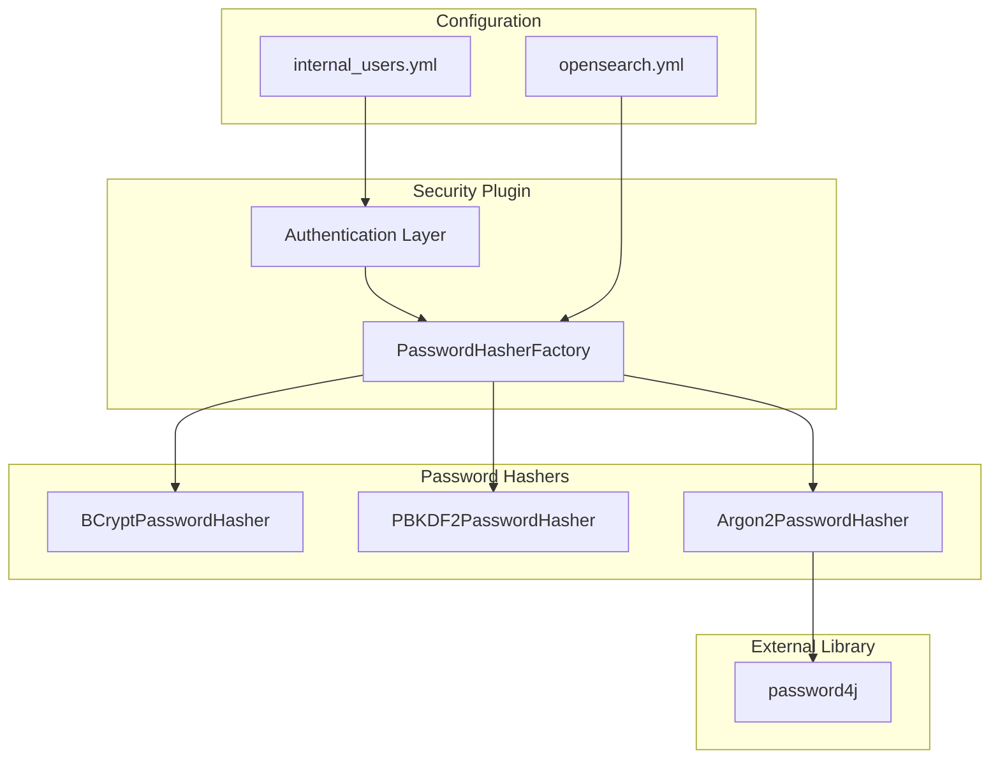
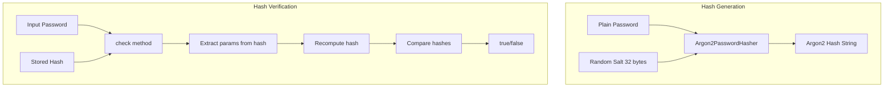

# Argon2 Password Hashing

## Summary

Argon2 is a modern, memory-hard password hashing algorithm available in the OpenSearch Security plugin. It provides enhanced protection against GPU-based and ASIC-based brute-force attacks by requiring significant memory during hash computation. Argon2 won the Password Hashing Competition in 2015 and is recommended by OWASP for password storage.

OpenSearch supports three password hashing algorithms:
- **BCrypt** (default): Traditional, well-established algorithm
- **PBKDF2**: Standards-based algorithm with configurable iterations
- **Argon2**: Modern memory-hard algorithm with maximum configurability

## Details

### Architecture



### Data Flow



### Components

| Component | Description |
|-----------|-------------|
| `Argon2PasswordHasher` | Core hasher implementation using password4j library |
| `PasswordHasherFactory` | Factory that creates appropriate hasher based on configuration |
| `ConfigConstants` | Defines configuration keys and default values |
| `Hasher` | CLI tool for generating password hashes |
| `AuditMessage` | Updated to redact Argon2 hashes in audit logs |

### Configuration

| Setting | Description | Default |
|---------|-------------|---------|
| `plugins.security.password.hashing.algorithm` | Algorithm selection: `bcrypt`, `pbkdf2`, or `argon2` | `bcrypt` |
| `plugins.security.password.hashing.argon2.memory` | Memory usage in KiB | `65536` (64 MiB) |
| `plugins.security.password.hashing.argon2.iterations` | Number of passes over memory | `3` |
| `plugins.security.password.hashing.argon2.parallelism` | Degree of parallelism | `1` |
| `plugins.security.password.hashing.argon2.length` | Output hash length in bytes | `32` |
| `plugins.security.password.hashing.argon2.type` | Variant: `argon2id`, `argon2i`, `argon2d` | `argon2id` |
| `plugins.security.password.hashing.argon2.version` | Algorithm version: `16` or `19` | `19` |

### Argon2 Variants

| Variant | Description | Use Case |
|---------|-------------|----------|
| `argon2id` | Hybrid of argon2i and argon2d | **Recommended** - Best general-purpose choice |
| `argon2i` | Data-independent memory access | Side-channel attack resistance |
| `argon2d` | Data-dependent memory access | Maximum GPU resistance |

### Usage Example

#### Enable Argon2 in opensearch.yml

```yaml
# Select Argon2 as the password hashing algorithm
plugins.security.password.hashing.algorithm: argon2

# Optional: Customize Argon2 parameters
plugins.security.password.hashing.argon2.memory: 65536
plugins.security.password.hashing.argon2.iterations: 3
plugins.security.password.hashing.argon2.parallelism: 1
plugins.security.password.hashing.argon2.length: 32
plugins.security.password.hashing.argon2.type: argon2id
plugins.security.password.hashing.argon2.version: 19
```

#### Generate Hash Using CLI

```bash
# Default Argon2 settings
./plugins/opensearch-security/tools/hash.sh -p "password" -a Argon2

# Custom settings
./plugins/opensearch-security/tools/hash.sh -p "password" -a Argon2 \
  --memory 47104 \
  --iterations 1 \
  --parallelism 2 \
  --length 64 \
  --type argon2d \
  --version 19
```

#### Configure Internal Users

```yaml
# internal_users.yml
admin:
  hash: "$argon2id$v=19$m=65536,t=3,p=1$c29tZXNhbHQ$Kd/lnpB1yuLHOY3qaqb1+T05DtEJFqS1U6tuJZWo8dg"
  reserved: true
  backend_roles:
    - admin
  description: "Admin user"

regular_user:
  hash: "$argon2id$v=19$m=65536,t=3,p=1$c29tZXNhbHQ$yVRXZf42Us8V75OOAivJijZ9g5wqkTE1hMxfG03YMTg"
  reserved: false
  backend_roles: []
  description: "Regular user"
```

### Hash Format

Argon2 hashes follow the PHC (Password Hashing Competition) string format:

```
$argon2id$v=19$m=65536,t=3,p=1$<salt>$<hash>
```

| Component | Description |
|-----------|-------------|
| `argon2id` | Algorithm variant |
| `v=19` | Version number |
| `m=65536` | Memory in KiB |
| `t=3` | Iterations (time cost) |
| `p=1` | Parallelism |
| `<salt>` | Base64-encoded salt |
| `<hash>` | Base64-encoded hash |

## Limitations

- **Memory Requirements**: Argon2 requires significant memory during authentication; ensure adequate RAM
- **Cluster Consistency**: All nodes must use identical password hashing configuration
- **Migration Overhead**: Switching algorithms requires regenerating all password hashes
- **Performance Trade-off**: Higher security settings increase authentication latency
- **Version Compatibility**: Argon2 support requires OpenSearch 3.2.0 or later

## Related PRs

| Version | PR | Description |
|---------|-----|-------------|
| v3.2.0 | [#5441](https://github.com/opensearch-project/security/pull/5441) | Initial Argon2 implementation |

## References

- [Issue #4592](https://github.com/opensearch-project/security/issues/4592): Feature request for Argon2 support
- [Issue #4590](https://github.com/opensearch-project/security/issues/4590): Related BCrypt configuration feature
- [Issue #4524](https://github.com/opensearch-project/security/pull/4524): Password hashing configuration foundation
- [Security Settings Documentation](https://docs.opensearch.org/3.0/install-and-configure/configuring-opensearch/security-settings/): Official configuration reference

## Change History

- **v3.2.0** (2025-07): Initial implementation with full parameter configurability
