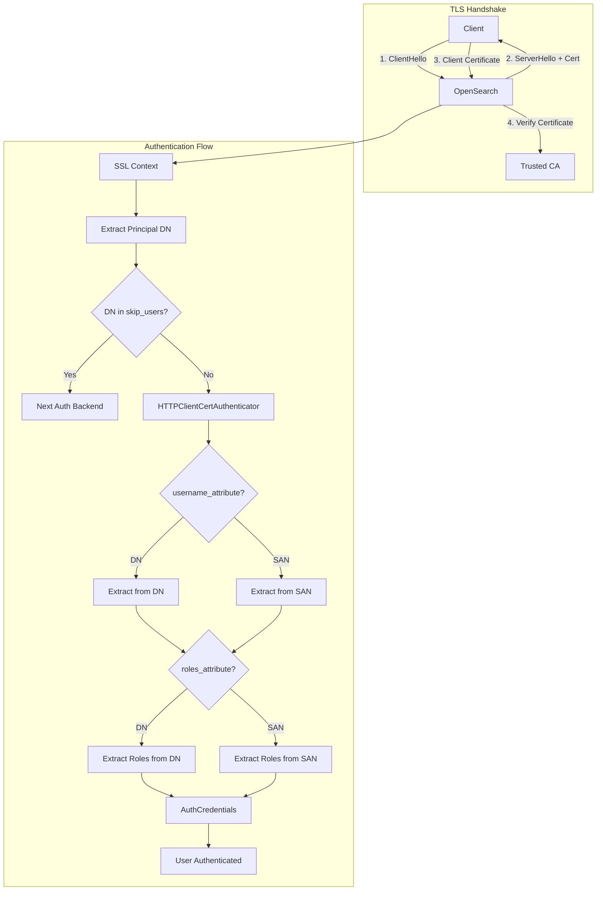
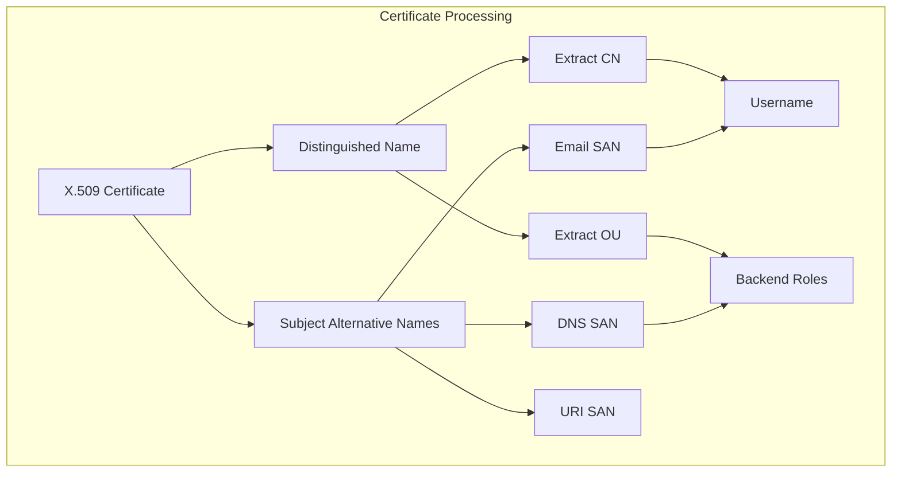

---
tags:
  - security
---

# Client Certificate Authentication

## Summary

Client Certificate Authentication enables users to authenticate to OpenSearch using X.509 client certificates instead of or in addition to username/password credentials. This provides stronger security through mutual TLS (mTLS) authentication, where both the server and client verify each other's identity using certificates. The feature supports extracting usernames and roles from certificate attributes (DN or SAN) and allows selective bypass for specific users via the `skip_users` configuration.

## Details

### Architecture



### Data Flow



### Components

| Component | Description |
|-----------|-------------|
| `HTTPClientCertAuthenticator` | Main authenticator class that extracts credentials from client certificates |
| `WildcardMatcher` | Utility for matching DNs against `skip_users` patterns |
| `ParsedAttribute` | Internal record for parsed username/roles attribute configuration |
| `SANType` | Enum defining supported Subject Alternative Name types |

### Configuration

| Setting | Description | Default |
|---------|-------------|---------|
| `plugins.security.ssl.http.clientauth_mode` | Client authentication mode (`NONE`, `OPTIONAL`, `REQUIRE`) | `OPTIONAL` |
| `username_attribute` | Attribute to extract username from (e.g., `cn`, `san:EMAIL`) | Full DN |
| `roles_attribute` | Attribute to extract roles from (e.g., `ou`, `san:DNS`) | None |
| `skip_users` | List of DNs to skip certificate authentication | `[]` |

### Supported SAN Types

| SAN Type | Config Value | Description |
|----------|--------------|-------------|
| OTHER_NAME | `san:othername` | OtherName (type 0) |
| EMAIL | `san:rfc822name` | RFC822 email address (type 1) |
| DNS | `san:dnsname` | DNS name (type 2) |
| X400_ADDRESS | `san:x400address` | X.400 address (type 3) |
| DIRECTORY_NAME | `san:directoryname` | Directory name (type 4) |
| EDI_PARTY_NAME | `san:edipartyname` | EDI party name (type 5) |
| URI | `san:uniformresourceidentifier` | URI (type 6) |
| IP_ADDRESS | `san:ipaddress` | IP address (type 7) |
| REGISTERED_ID | `san:registeredid` | Registered ID (type 8) |

### Usage Examples

#### Basic Client Certificate Authentication

```yaml
# opensearch.yml
plugins.security.ssl.http.clientauth_mode: OPTIONAL

# config.yml
config:
  dynamic:
    authc:
      clientcert_auth_domain:
        description: "Authenticate via SSL client certificates"
        http_enabled: true
        transport_enabled: true
        order: 1
        http_authenticator:
          type: clientcert
          config:
            username_attribute: cn
          challenge: false
        authentication_backend:
          type: noop
```

#### Using SAN for Username Extraction

```yaml
# config.yml - Extract username from email SAN
config:
  dynamic:
    authc:
      clientcert_auth_domain:
        http_enabled: true
        order: 1
        http_authenticator:
          type: clientcert
          config:
            username_attribute: "san:rfc822name"
            roles_attribute: "san:dnsname:*.admin.example.com"
          challenge: false
        authentication_backend:
          type: noop
```

#### Skip Users for Dashboard Integration

```yaml
# config.yml - Skip certificate auth for dashboard server
config:
  dynamic:
    authc:
      basic_internal_auth_domain:
        authentication_backend:
          type: intern
        http_authenticator:
          challenge: true
          type: basic
        http_enabled: true
        order: 4
        transport_enabled: true
      
      clientcert_auth_domain:
        authentication_backend:
          type: noop
        http_authenticator:
          challenge: false
          type: clientcert
          config:
            username_attribute: cn
            skip_users:
              - "DC=de,L=test,O=users,OU=bridge,CN=dashboard"
        http_enabled: true
        order: 2
        transport_enabled: false
```

#### Python Client Example

```python
import requests

base_url = 'https://localhost:9200/'
cert_file_path = "/path/to/client-cert.pem"
key_file_path = "/path/to/client-cert-key.pem"
root_ca_path = "/path/to/root-ca.pem"

response = requests.get(
    f"{base_url}movies/_search",
    cert=(cert_file_path, key_file_path),
    verify=root_ca_path
)
print(response.json())
```

## Limitations

- Certificate DN must be properly formatted according to RFC 2253
- SAN extraction supports only specific types (see table above)
- Wildcard patterns in `skip_users` use simple glob matching, not regex
- Maximum 16 SAN values are extracted per certificate
- SAN values are truncated at 8192 characters for safety
- When `skip_users` matches, the user must have valid credentials for another auth backend

## Change History

- **v3.3.0** (2026-01-14): Added `skip_users` configuration option
  - Allows specific certificate DNs to bypass client certificate authentication
  - Enables OpenSearch Dashboards with basic auth when client cert is required
  - Uses WildcardMatcher for flexible DN pattern matching

## References

### Documentation
- [Client Certificate Authentication Documentation](https://docs.opensearch.org/3.0/security/authentication-backends/client-auth/): Official documentation
- [Configuring TLS Certificates](https://docs.opensearch.org/3.0/security/configuration/tls/): TLS configuration guide
- [Generating Self-Signed Certificates](https://docs.opensearch.org/3.0/security/configuration/generate-certificates/): Certificate generation guide

### Pull Requests
| Version | PR | Description | Related Issue |
|---------|-----|-------------|---------------|
| v3.3.0 | [#5525](https://github.com/opensearch-project/security/pull/5525) | Added new option skip_users to client cert authenticator | [#4378](https://github.com/opensearch-project/security/issues/4378) |

### Issues (Design / RFC)
- [Issue #4378](https://github.com/opensearch-project/security/issues/4378): Client certificate setting bypasses password requirements
