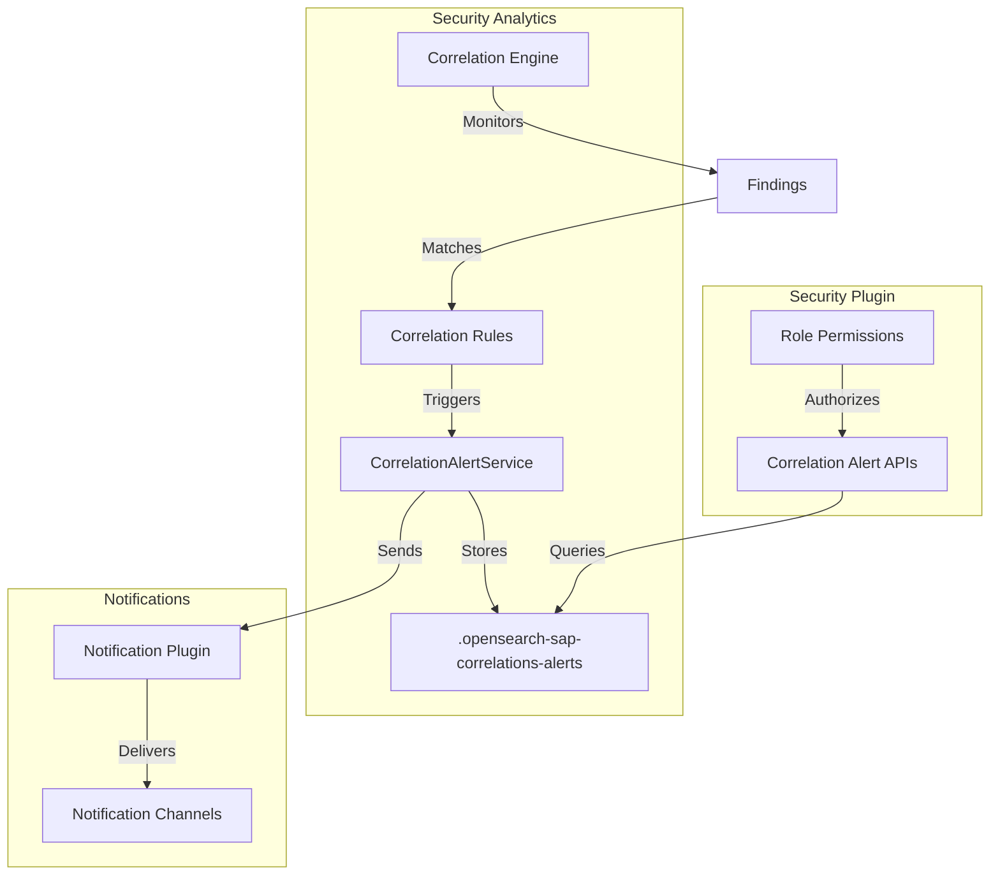
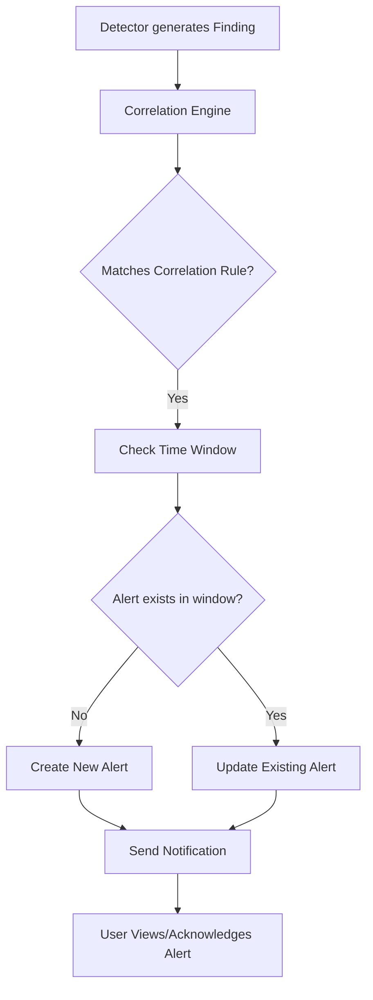

# Correlation Alerts

## Summary

Correlation Alerts is a feature in OpenSearch Security Analytics that enables users to receive notifications when correlations are generated based on correlation rules. This feature bridges the gap between correlation detection and user notification, allowing security teams to respond promptly to correlated security events across different log sources.

## Details

### Architecture



### Data Flow



### Components

| Component | Description |
|-----------|-------------|
| CorrelationAlertService | Handles CRUD operations for correlation alerts |
| CorrelationAlertScheduler | Manages alert generation within time windows |
| `.opensearch-sap-correlations-alerts` | System index storing correlation alerts |
| `.opensearch-sap-correlation-rules-config` | Stores correlation rules with trigger configurations |

### Configuration

Correlation alerts are configured as part of correlation rules. When creating or updating a correlation rule, you can optionally add an alert trigger:

| Setting | Description | Default |
|---------|-------------|---------|
| `trigger` | Alert trigger configuration in correlation rule | None (optional) |
| `time_window` | Time window for alert deduplication | Rule-specific |
| `severity` | Alert severity level | 1 |

### API Endpoints

| Endpoint | Method | Description |
|----------|--------|-------------|
| `/_plugins/_security_analytics/correlationAlerts` | GET | List correlation alerts |
| `/_plugins/_security_analytics/_acknowledge/correlationAlerts` | POST | Acknowledge correlation alerts |

### Permissions

| Role | Permissions |
|------|-------------|
| `security_analytics_read_access` | `correlationAlerts/get` |
| `security_analytics_full_access` | `correlationAlerts/*` |
| `security_analytics_ack_alerts` | `correlationAlerts/*` |

### Usage Example

#### List Correlation Alerts

```bash
GET /_plugins/_security_analytics/correlationAlerts?correlation_rule_id=<rule-id>
```

Response:
```json
{
    "correlationAlerts": [
        {
            "id": "8532c08b-3ab5-4e95-a1c2-5884c4cd41a5",
            "correlation_rule_id": "VjY0MpABPzR_pcEveVRq",
            "correlation_rule_name": "rule-corr",
            "correlated_finding_ids": ["4f867df9-c9cb-4dc1-84bb-6c8b575f1a54"],
            "trigger_name": "trigger1",
            "state": "ACTIVE",
            "severity": "1",
            "start_time": "2024-06-19T20:37:08.257Z",
            "end_time": "2024-06-19T20:42:08.257Z"
        }
    ],
    "total_alerts": 1
}
```

#### Acknowledge Alerts

```bash
POST /_plugins/_security_analytics/_acknowledge/correlationAlerts
{
   "alertIds": ["8532c08b-3ab5-4e95-a1c2-5884c4cd41a5"]
}
```

## Limitations

- Correlation alerts are only generated for rule-based correlations, not auto-correlations (correlated findings generated without rules)
- Within each rule's time window, only one correlation alert is generated; subsequent matches update the existing alert
- Requires the Security Analytics plugin to be installed and configured

## Related PRs

| Version | PR | Description |
|---------|-----|-------------|
| v2.17.0 | [#4689](https://github.com/opensearch-project/security/pull/4689) | Added API roles for correlationAlerts |
| v2.17.0 | [#4704](https://github.com/opensearch-project/security/pull/4704) | Permission changes for correlationAlerts |
| v2.15.0 | [#988](https://github.com/opensearch-project/security-analytics/issues/988) | Feature request - Alerts in Correlations |

## References

- [Issue #988](https://github.com/opensearch-project/security-analytics/issues/988): Original feature request
- [Correlation Engine APIs](https://docs.opensearch.org/2.17/security-analytics/api-tools/correlation-eng/): Official API documentation
- [Working with Alerts](https://docs.opensearch.org/2.17/security-analytics/usage/alerts/): Security Analytics alerts guide
- [Creating Correlation Rules](https://docs.opensearch.org/2.17/security-analytics/sec-analytics-config/correlation-config/): Correlation rule configuration
- [Correlating Security Events](https://opensearch.org/blog/correlating-security-events/): Blog post on correlation engine

## Change History

- **v2.17.0** (2024-09-17): Added API role permissions for correlation alerts in security plugin
- **v2.15.0**: Initial implementation of correlation alerts feature in Security Analytics
