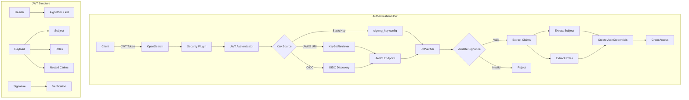
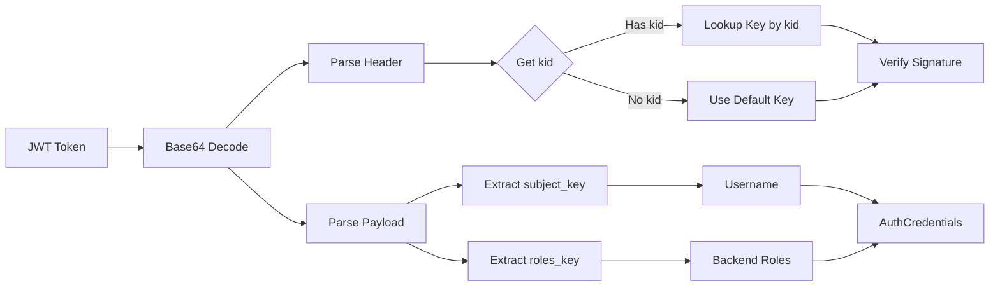

# JWT Authentication

## Summary

JWT (JSON Web Token) authentication in OpenSearch Security allows users to authenticate using signed tokens issued by an identity provider. JWTs are self-contained tokens that carry user identity and role information, enabling single sign-on (SSO) scenarios. The Security plugin validates JWT signatures and extracts user credentials and backend roles from token claims. Starting with v3.3.0, direct JWKS endpoint support enables JWT authentication without requiring full OpenID Connect infrastructure.

## Details

### Architecture



### Data Flow



### Components

| Component | Description |
|-----------|-------------|
| `AbstractHTTPJwtAuthenticator` | Base class providing common JWT authentication logic |
| `HTTPJwtAuthenticator` | Standard JWT authenticator for HTTP requests with static keys |
| `HTTPJwtKeyByJWKSAuthenticator` | JWT authenticator with direct JWKS endpoint support (v3.3.0+) |
| `HTTPJwtKeyByOpenIdConnectAuthenticator` | JWT authenticator using OIDC JWKS endpoint for key retrieval |
| `JwtVerifier` | Validates JWT signatures using configured keys |
| `KeyProvider` | Interface for providing signing keys |
| `KeySetRetriever` | Retrieves and caches JWKS from endpoints |
| `SelfRefreshingKeySet` | Manages automatic key refresh with rate limiting |

### Configuration

#### Core Settings

| Setting | Description | Default |
|---------|-------------|---------|
| `signing_key` | Base64-encoded signing key(s) for signature verification | Required (if no jwks_uri) |
| `jwt_header` | HTTP header containing the JWT token | `Authorization` |
| `jwt_url_parameter` | URL parameter name for JWT (alternative to header) | `null` |
| `subject_key` | Claim path for extracting username | `sub` (subject claim) |
| `roles_key` | Claim path for extracting backend roles (supports nested paths) | `null` |
| `required_audience` | Required audience claim value(s) | `null` |
| `required_issuer` | Required issuer claim value | `null` |
| `jwt_clock_skew_tolerance_seconds` | Clock skew tolerance for token validation | `30` |

#### JWKS Settings (v3.3.0+)

| Setting | Description | Default |
|---------|-------------|---------|
| `jwks_uri` | Direct JWKS endpoint URL | `null` |
| `cache_jwks_endpoint` | Enable caching for JWKS responses | `true` |
| `jwks_request_timeout_ms` | HTTP request timeout for JWKS endpoint | `5000` |
| `jwks_queued_thread_timeout_ms` | Queued thread timeout | `2500` |
| `refresh_rate_limit_time_window_ms` | Rate limit window for key refresh | `10000` |
| `refresh_rate_limit_count` | Max refresh attempts per window | `10` |
| `max_jwks_keys` | Maximum allowed keys in JWKS (hard limit) | `-1` (unlimited) |
| `max_jwks_response_size_bytes` | Maximum HTTP response size | `1048576` (1MB) |

### Usage Example

**Direct JWKS Configuration (v3.3.0+):**
```yaml
jwt_auth_domain:
  http_enabled: true
  transport_enabled: true
  order: 0
  http_authenticator:
    type: jwt
    challenge: false
    config:
      jwks_uri: 'https://your-jwks-endpoint.com/.well-known/jwks.json'
      jwt_header: "Authorization"
      subject_key: "preferred_username"
      roles_key: "roles"
      cache_jwks_endpoint: true
      jwks_request_timeout_ms: 5000
      max_jwks_keys: 10
  authentication_backend:
    type: noop
```

**Static Key Configuration:**
```yaml
jwt_auth_domain:
  http_enabled: true
  transport_enabled: true
  order: 0
  http_authenticator:
    type: jwt
    challenge: false
    config:
      signing_key: "base64 encoded HMAC key or PEM public key"
      jwt_header: "Authorization"
      subject_key: "preferred_username"
      roles_key: "roles"
      required_issuer: "https://idp.example.com"
      required_audience: "opensearch"
  authentication_backend:
    type: noop
```

**Nested Roles Configuration (v3.1.0+):**
```yaml
jwt_auth_domain:
  http_enabled: true
  http_authenticator:
    type: jwt
    config:
      signing_key: "..."
      roles_key:
        - "attributes"
        - "roles"
```

**Example JWT Payload:**
```json
{
  "sub": "user@example.com",
  "preferred_username": "jdoe",
  "iss": "https://idp.example.com",
  "aud": "opensearch",
  "exp": 1700000000,
  "iat": 1699996400,
  "attributes": {
    "roles": "admin,developer"
  }
}
```

## Limitations

- JWT tokens must be signed; unsigned tokens are rejected
- Only symmetric (HMAC) and asymmetric (RSA, ECDSA) algorithms are supported
- Token expiration is enforced; expired tokens are rejected
- Nested claim paths require all intermediate keys to be JSON objects
- JWKS endpoints must return valid JSON Web Key Set format
- SSL/TLS configuration for JWKS endpoints uses the `jwks` prefix in settings

## Related PRs

| Version | PR | Description |
|---------|-----|-------------|
| v3.3.0 | [#5578](https://github.com/opensearch-project/security/pull/5578) | Direct JWKS (JSON Web Key Set) support in the JWT authentication backend |
| v3.1.0 | [#5355](https://github.com/opensearch-project/security/pull/5355) | Handle roles in nested claim for JWT auth backends |

## References

- [Issue #4974](https://github.com/opensearch-project/security/issues/4974): Feature request for JWKS with JWT without OIDC
- [Issue #5343](https://github.com/opensearch-project/security/issues/5343): Support roles in nested JWT claims
- [JWT Authentication Documentation](https://docs.opensearch.org/3.0/security/authentication-backends/jwt/): Official docs
- [OpenID Connect Documentation](https://docs.opensearch.org/3.0/security/authentication-backends/openid-connect/): OIDC integration
- [JSON Web Key (JWK) Specification](https://datatracker.ietf.org/doc/html/rfc7517): RFC 7517

## Change History

- **v3.3.0** (2026-01-11): Added direct JWKS endpoint support with `jwks_uri` configuration, security validation features, and automatic fallback to static key authentication
- **v3.1.0** (2025-06-06): Added support for nested claim paths in `roles_key` configuration
