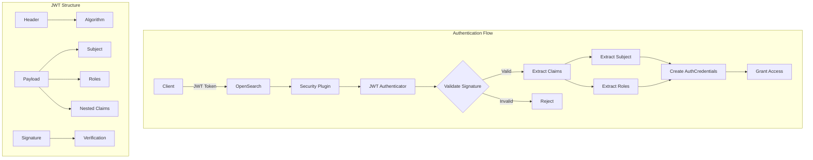
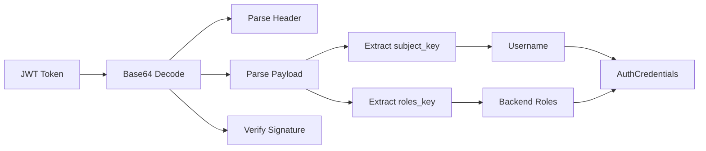

# JWT Authentication

## Summary

JWT (JSON Web Token) authentication in OpenSearch Security allows users to authenticate using signed tokens issued by an identity provider. JWTs are self-contained tokens that carry user identity and role information, enabling single sign-on (SSO) scenarios. The Security plugin validates JWT signatures and extracts user credentials and backend roles from token claims.

## Details

### Architecture



### Data Flow



### Components

| Component | Description |
|-----------|-------------|
| `AbstractHTTPJwtAuthenticator` | Base class providing common JWT authentication logic |
| `HTTPJwtAuthenticator` | Standard JWT authenticator for HTTP requests |
| `HTTPJwtKeyByOpenIdConnectAuthenticator` | JWT authenticator using OIDC JWKS endpoint for key retrieval |
| `JwtVerifier` | Validates JWT signatures using configured keys |
| `KeyProvider` | Interface for providing signing keys |

### Configuration

| Setting | Description | Default |
|---------|-------------|---------|
| `signing_key` | Base64-encoded signing key(s) for signature verification | Required |
| `jwt_header` | HTTP header containing the JWT token | `Authorization` |
| `jwt_url_parameter` | URL parameter name for JWT (alternative to header) | `null` |
| `subject_key` | Claim path for extracting username | `sub` (subject claim) |
| `roles_key` | Claim path for extracting backend roles (supports nested paths) | `null` |
| `required_audience` | Required audience claim value(s) | `null` |
| `required_issuer` | Required issuer claim value | `null` |
| `jwt_clock_skew_tolerance_seconds` | Clock skew tolerance for token validation | `30` |

### Usage Example

**Basic JWT Configuration:**
```yaml
jwt_auth_domain:
  http_enabled: true
  transport_enabled: true
  order: 0
  http_authenticator:
    type: jwt
    challenge: false
    config:
      signing_key: "base64 encoded HMAC key or PEM public key"
      jwt_header: "Authorization"
      subject_key: "preferred_username"
      roles_key: "roles"
      required_issuer: "https://idp.example.com"
      required_audience: "opensearch"
  authentication_backend:
    type: noop
```

**Nested Roles Configuration (v3.1.0+):**
```yaml
jwt_auth_domain:
  http_enabled: true
  http_authenticator:
    type: jwt
    config:
      signing_key: "..."
      roles_key:
        - "attributes"
        - "roles"
```

**Example JWT Payload:**
```json
{
  "sub": "user@example.com",
  "preferred_username": "jdoe",
  "iss": "https://idp.example.com",
  "aud": "opensearch",
  "exp": 1700000000,
  "iat": 1699996400,
  "attributes": {
    "roles": "admin,developer"
  }
}
```

## Limitations

- JWT tokens must be signed; unsigned tokens are rejected
- Only symmetric (HMAC) and asymmetric (RSA, ECDSA) algorithms are supported
- Token expiration is enforced; expired tokens are rejected
- Nested claim paths require all intermediate keys to be JSON objects

## Related PRs

| Version | PR | Description |
|---------|-----|-------------|
| v3.1.0 | [#5355](https://github.com/opensearch-project/security/pull/5355) | Handle roles in nested claim for JWT auth backends |

## References

- [Issue #5343](https://github.com/opensearch-project/security/issues/5343): Support roles in nested JWT claims
- [JWT Authentication Documentation](https://docs.opensearch.org/3.0/security/authentication-backends/jwt/): Official docs
- [OpenID Connect Documentation](https://docs.opensearch.org/3.0/security/authentication-backends/openid-connect/): OIDC integration

## Change History

- **v3.1.0** (2025-06-06): Added support for nested claim paths in `roles_key` configuration
